# Descriptivos de controles: CRS04 + CRS01 (mujeres 18+)

> **Qué es este informe.** Cómo se ve la muestra: edad, área, cuidador, hogar, idioma, y cruces livianos con las 3 Y. También vivienda CRS01 (servicios y activos), que **no** se pega a la alumna.
> **Qué no es.** No decide recodes (eso es [descriptivos_predictores_crs04.md](descriptivos_predictores_crs04.md)). No es el LASSO ni los perfiles. No es el diccionario de preguntas.
> **Tipo.** Descriptivo.
> **Lo escribe.** `scripts/descriptivos/descriptivos_controles.py` (Python → markdown; no es Rmd).

**Sí: CRS01 es el grupo de 18+.** Cuestionario CRS.01, mujeres de 18 y más en vivienda. CRS04 es adolescentes 12–17 en IE; aquí el recorte es mujeres (`SEXO = 1`).

Universo CRS04: mujeres (`SEXO = 1`) · n = 9,608 · N = 1,419,491 con `FACTOR_ALUMNOS` · ENARES 2024.

Universo CRS01 (mujeres 18+): n = 13,826 · N = 10,517,286 con `FACTOR_VIV` (hogar) / `FACTOR_MUJ` (mujer).

Targets 12m: [violencia_crs04_si_no_missing.md](violencia_crs04_si_no_missing.md). Recodes: [../metodologia/metodologia.md](../metodologia/metodologia.md).

---

## CRS01 y CRS04 no se unen

Son muestras distintas. `ID` no es llave común (32 IDs coinciden: ruido de numeración). Electrodomésticos, agua, desagüe y material de la vivienda **no se pueden pegar a la adolescente**.

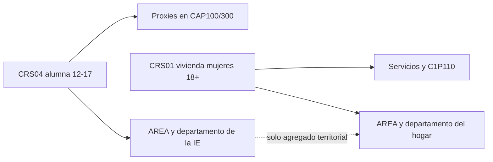

En CRS04, `AREA` y `DEPARTAMENTO` son de la **institución educativa**, no del hogar. Residencia: `C3P104` + `C4P104A_*`. `analisis.ubigeo` sirve para cruces agregados, no para SES individual.

---

## CRS04 — inventario de candidatos

| Variable | Tipo | Niveles / recode | Missing | En LASSO | Prioridad |
| --- | --- | --- | ---: | --- | --- |
| `AREA` (IE) | dummy 2 | Urbano / rural | 0 | Dummy | Alta |
| `DEPARTAMENTO` (IE) | categórica 25 | nombre | 0 | Group lasso o no meter individual | Media (agregación) |
| `C3P104` vive en distrito IE | dummy | sí / no | 0 | Dummy | Media |
| `C4P104B` vivía aquí hace 5 años | dummy | sí / no / NS | 0 | Dummy (común con C1) | Media |
| `C4P104D` madre vivía aquí al nacer | dummy | sí / no / NS | 0 | Dummy (común con C1) | Baja |
| `EDAD` | continua 12–17 | igual a `C3P103EDAD` | 0 | Lineal; probar `edad^2` | Alta |
| `NIED` / `TIEDBA` | constante | todas secundaria regular | 0 | No: no varía | Nula |
| `INED` | dummy | mujeres / mixto (no hay solo hombres) | 0 | Dummy | Baja |
| `TURNO` | dummy | mañana / tarde (noche=0) | 0 | Dummy | Baja |
| `C3ANIO` | ordinal 1–5 | año de estudio | 0 | Numérica o dummies | Media |
| `C3P105` casa vs CAR | dummy | casa / albergue | 0; CAR n=18 | Dummy o excluir CAR | Baja (n chico) |
| `composicion` | categórica 7 | ambos / solo madre / solo padre / padrastro / otros / sola / CAR | 0 (recode cubre skip) | Dummies; group lasso | Alta |
| `C3P114_PERS` | continua 0–20 | personas en el hogar | 18 = CAR | Lineal; probar `pers^2` | Alta |
| `C3P118_12` cuarto sola | dummy | 0/1 | 18 CAR | Dummy | Media (hacinamiento) |
| `C3P119_12` cama sola | dummy | 0/1 | skip si cuarto sola | Cuidado: skip ≠ missing | Baja |
| `cuidador` (`C3P120`) | categórica 5 | madre / padre / abuelos / hermanos / otros | 22 ≈ CAR+ | Dummies; group lasso | Alta |
| `C3P120A` cuidador trabaja | dummy | sí / no / NS | 22 | Dummy | Media |
| `C3P120B` se queda sola | dummy | sí / no | 22 | Dummy | Alta |
| `C3P121` sin comer | dummy | sí / no | 22 | Dummy | Alta (privación) |
| `C3P122` no va al colegio para ayudar | dummy | sí / no | 22 | Dummy | Alta |
| `C3P123` peleas en casa | dummy | sí / no | 22 | Dummy (clima, no SES) | Alta |
| `C3P126` toman en cuenta su opinión | dummy | sí / no | 22 | Dummy | Media |
| `idioma` (`C3P128`) | categórica 5 | castellano / quechua / aimara / otra / NS | 22 | Dummies; group lasso | Alta |
| `etnia` (`C4P129`) | categórica 8 | mestiza / quechua / NS / afro / … | 0 | Group lasso o recode corto | Media |
| `discapacidad` (`C4P130_*`) | dummy | algún sí permanente | 0 | Dummy | Media |
| `quien_dinero` (`C3P302_4`) | categórica 5 | quién da el dinero del hogar | 0 | Dummies | Media (SES blando) |
| `C4P248A_*` tipo agresor | post-hoc | solo si sexual=1 | skip | No entra al modelo de riesgo | Fuera |
| `C1P101`–`C1P110` vivienda CRS01 | otra muestra | agua, luz, activos | 0 en CRS01 | No se pega a CRS04 | Fuera del LASSO de alumnas |

18 CAR (skip del flujo de casa), no no-respuesta. Otras 4 filas missing en 115/120 son `vive sola` o residual.

---

## Distribuciones CRS04

### Territorio y escuela

`AREA` / `DEPARTAMENTO` = de la IE. 79.8% de la N expandida está en IE urbana.

| Nivel | n | % n | N exp. | % N |
| --- | ---: | ---: | ---: | ---: |
| Urbano | 7,990 | 83.2% | 1,133,324 | 79.8% |
| Rural | 1,618 | 16.8% | 286,168 | 20.2% |

`NIED` es constante (todas secundaria) y `TIEDBA` es constante (todas regular). No sirven como control.

| Variable | Qué es | Distribución ponderada |
|---|---|---|
| `INED` | Tipo de IE | IE de mujeres 10.0%, Mixto 90.0% |
| `TURNO` | Turno de la alumna | Mañana 81.0%, Tarde 19.0% |
| `C3P104` | Vive en el distrito de la IE | Sí, vive en el distrito de la IE 87.3%, No 12.7% |

Hace 5 años, ¿vivía en este distrito? (`C4P104B`, misma pregunta que `C1P306_A`):

| Nivel | n | % n | N exp. | % N |
| --- | ---: | ---: | ---: | ---: |
| Sí | 8,177 | 85.1% | 1,220,175 | 86.0% |
| No | 1,410 | 14.7% | 195,668 | 13.8% |
| No sabe / no recuerda | 21 | 0.2% | 3,648 | 0.3% |

Cuando nació, ¿vivía su madre en este distrito? (`C4P104D`, misma pregunta que `C1P306C`):

| Nivel | n | % n | N exp. | % N |
| --- | ---: | ---: | ---: | ---: |
| Sí | 6,959 | 72.4% | 1,023,856 | 72.1% |
| No | 2,513 | 26.2% | 367,027 | 25.9% |
| No sabe / no recuerda | 136 | 1.4% | 28,608 | 2.0% |

Año de estudio (`C3ANIO`):

| Nivel | n | % n | N exp. | % N |
| --- | ---: | ---: | ---: | ---: |
| 1 | 1,930 | 20.1% | 305,020 | 21.5% |
| 2 | 1,915 | 19.9% | 283,625 | 20.0% |
| 3 | 1,938 | 20.2% | 271,990 | 19.2% |
| 4 | 1,930 | 20.1% | 253,293 | 17.8% |
| 5 | 1,895 | 19.7% | 305,563 | 21.5% |

Departamentos con más N expandida (la cola es larga: group lasso o no meter 25 dummies sueltas):

| Departamento | n | % n | N exp. | % N |
| --- | ---: | ---: | ---: | ---: |
| LIMA | 755 | 7.9% | 414,722 | 29.2% |
| PIURA | 362 | 3.8% | 103,358 | 7.3% |
| LA LIBERTAD | 342 | 3.6% | 84,839 | 6.0% |
| JUNIN | 388 | 4.0% | 67,699 | 4.8% |
| CAJAMARCA | 390 | 4.1% | 67,547 | 4.8% |
| LAMBAYEQUE | 344 | 3.6% | 61,546 | 4.3% |
| AREQUIPA | 381 | 4.0% | 60,164 | 4.2% |
| LORETO | 354 | 3.7% | 58,907 | 4.1% |

### Edad

`EDAD` = `C3P103EDAD` en las 9,608 alumnas (cero discordancias). Rango 12–17, sin missing. Candidata a término cuadrático si el cruce no es plano.

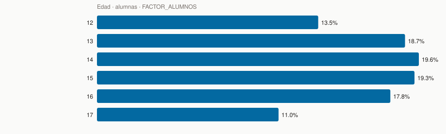

| Nivel | n | % n | N exp. | % N |
| --- | ---: | ---: | ---: | ---: |
| 12 | 1,378 | 14.3% | 191,075 | 13.5% |
| 13 | 1,823 | 19.0% | 266,074 | 18.7% |
| 14 | 1,945 | 20.2% | 277,985 | 19.6% |
| 15 | 1,970 | 20.5% | 274,197 | 19.3% |
| 16 | 1,532 | 15.9% | 253,354 | 17.8% |
| 17 | 960 | 10.0% | 156,807 | 11.0% |

### Tamaño y composición del hogar

`C3P114_PERS`: mín 0, máx 20, media ponderada 5.16. Missing n = 18 (CAR). Solo 4 casos “vivo sola” (`C3P114_VS = 1`).

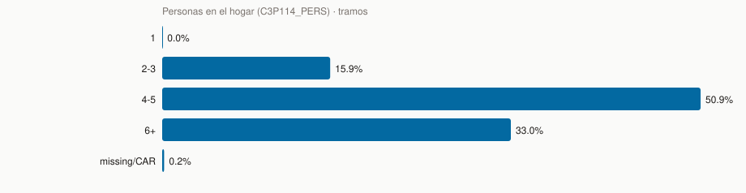

| Nivel | n | % n | N exp. | % N |
| --- | ---: | ---: | ---: | ---: |
| 1 | 4 | 0.0% | 365 | 0.0% |
| 2-3 | 1,578 | 16.4% | 225,571 | 15.9% |
| 4-5 | 4,897 | 51.0% | 722,816 | 50.9% |
| 6+ | 3,111 | 32.4% | 468,125 | 33.0% |
| missing/CAR | 18 | 0.2% | 2,614 | 0.2% |

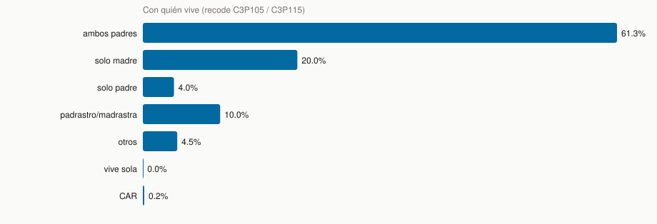

| Nivel | n | % n | N exp. | % N |
| --- | ---: | ---: | ---: | ---: |
| ambos padres | 5,747 | 59.8% | 870,416 | 61.3% |
| solo madre | 2,011 | 20.9% | 283,696 | 20.0% |
| solo padre | 326 | 3.4% | 57,196 | 4.0% |
| padrastro/madrastra | 1,013 | 10.5% | 141,995 | 10.0% |
| otros | 489 | 5.1% | 63,211 | 4.5% |
| vive sola | 4 | 0.0% | 365 | 0.0% |
| CAR | 18 | 0.2% | 2,614 | 0.2% |

Casa vs CAR:

| Nivel | n | % n | N exp. | % N |
| --- | ---: | ---: | ---: | ---: |
| Casa | 9,590 | 99.8% | 1,416,877 | 99.8% |
| CAR / albergue | 18 | 0.2% | 2,614 | 0.2% |

Tiene mamá (`C3P106`):

| Nivel | n | % n | N exp. | % N |
| --- | ---: | ---: | ---: | ---: |
| Sí | 9,429 | 98.1% | 1,395,999 | 98.3% |
| No | 161 | 1.7% | 20,878 | 1.5% |
| missing/skip (CAR) | 18 | 0.2% | 2,614 | 0.2% |

Tiene papá (`C3P110`):

| Nivel | n | % n | N exp. | % N |
| --- | ---: | ---: | ---: | ---: |
| Sí | 9,284 | 96.6% | 1,376,604 | 97.0% |
| No | 306 | 3.2% | 40,273 | 2.8% |
| missing/skip (CAR) | 18 | 0.2% | 2,614 | 0.2% |

Cuarto / cama (proxies de hacinamiento; no hay habitaciones en CRS04):

| Nivel | n | % n | N exp. | % N |
| --- | ---: | ---: | ---: | ---: |
| Comparte cuarto | 4,730 | 49.2% | 695,335 | 49.0% |
| Duerme sola en el cuarto | 4,860 | 50.6% | 721,543 | 50.8% |
| skip (CAR) | 18 | 0.2% | 2,614 | 0.2% |

| Nivel | n | % n | N exp. | % N |
| --- | ---: | ---: | ---: | ---: |
| Comparte cama | 2,027 | 21.1% | 304,473 | 21.4% |
| Duerme sola en la cama | 2,703 | 28.1% | 390,862 | 27.5% |
| skip (CAR o cuarto sola) | 4,878 | 50.8% | 724,157 | 51.0% |

`C3P119_12` NULL = skip si duerme sola en el cuarto (o CAR), no missing de calidad.

### Cuidado, privación y clima

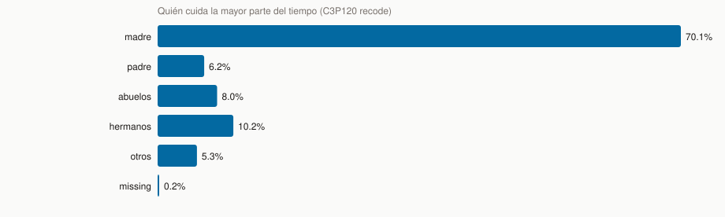

| Nivel | n | % n | N exp. | % N |
| --- | ---: | ---: | ---: | ---: |
| madre | 6,975 | 72.6% | 995,753 | 70.1% |
| padre | 507 | 5.3% | 88,563 | 6.2% |
| abuelos | 731 | 7.6% | 113,163 | 8.0% |
| hermanos | 895 | 9.3% | 144,148 | 10.2% |
| otros | 478 | 5.0% | 74,886 | 5.3% |
| missing | 22 | 0.2% | 2,979 | 0.2% |

Cuidador trabaja (`C3P120A`):

| Nivel | n | % n | N exp. | % N |
| --- | ---: | ---: | ---: | ---: |
| Sí trabaja | 5,364 | 55.8% | 778,486 | 54.8% |
| No | 4,210 | 43.8% | 635,494 | 44.8% |
| No sabe | 12 | 0.1% | 2,534 | 0.2% |
| missing/skip | 22 | 0.2% | 2,979 | 0.2% |

Se queda sola sin adulto (`C3P120B`):

| Nivel | n | % n | N exp. | % N |
| --- | ---: | ---: | ---: | ---: |
| Sí | 5,657 | 58.9% | 831,129 | 58.6% |
| No | 3,929 | 40.9% | 585,383 | 41.2% |
| missing/skip (CAR) | 22 | 0.2% | 2,979 | 0.2% |

Sin comer un día o más (`C3P121`):

| Nivel | n | % n | N exp. | % N |
| --- | ---: | ---: | ---: | ---: |
| Sí | 165 | 1.7% | 20,398 | 1.4% |
| No | 9,421 | 98.1% | 1,396,115 | 98.4% |
| missing/skip (CAR) | 22 | 0.2% | 2,979 | 0.2% |

Le piden no ir al colegio para ayudar (`C3P122`):

| Nivel | n | % n | N exp. | % N |
| --- | ---: | ---: | ---: | ---: |
| Sí | 672 | 7.0% | 97,102 | 6.8% |
| No | 8,914 | 92.8% | 1,319,411 | 92.9% |
| missing/skip (CAR) | 22 | 0.2% | 2,979 | 0.2% |

Peleas o discusiones en casa (`C3P123`):

| Nivel | n | % n | N exp. | % N |
| --- | ---: | ---: | ---: | ---: |
| Sí | 4,755 | 49.5% | 696,384 | 49.1% |
| No | 4,831 | 50.3% | 720,129 | 50.7% |
| missing/skip (CAR) | 22 | 0.2% | 2,979 | 0.2% |

Toman en cuenta lo que dice (`C3P126`):

| Nivel | n | % n | N exp. | % N |
| --- | ---: | ---: | ---: | ---: |
| Sí | 8,456 | 88.0% | 1,263,021 | 89.0% |
| No | 1,130 | 11.8% | 153,492 | 10.8% |
| missing/skip (CAR) | 22 | 0.2% | 2,979 | 0.2% |

Quién da el dinero (`C3P302_4` recode):

| Nivel | n | % n | N exp. | % N |
| --- | ---: | ---: | ---: | ---: |
| madre | 2,680 | 27.9% | 379,164 | 26.7% |
| padre | 5,950 | 61.9% | 903,352 | 63.6% |
| ella | 20 | 0.2% | 2,736 | 0.2% |
| hermanos | 158 | 1.6% | 21,877 | 1.5% |
| otros | 800 | 8.3% | 112,363 | 7.9% |

### Idioma, etnia, discapacidad

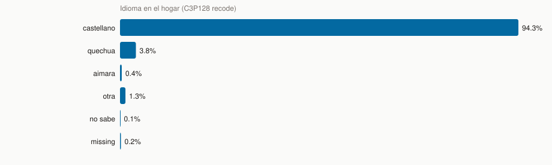

| Nivel | n | % n | N exp. | % N |
| --- | ---: | ---: | ---: | ---: |
| castellano | 8,931 | 93.0% | 1,338,040 | 94.3% |
| quechua | 442 | 4.6% | 53,308 | 3.8% |
| aimara | 55 | 0.6% | 5,845 | 0.4% |
| otra | 150 | 1.6% | 18,316 | 1.3% |
| no sabe | 8 | 0.1% | 1,004 | 0.1% |
| missing | 22 | 0.2% | 2,979 | 0.2% |

Autoidentificación (`C4P129` recode):

| Nivel | n | % n | N exp. | % N |
| --- | ---: | ---: | ---: | ---: |
| mestiza | 3,789 | 39.4% | 616,241 | 43.4% |
| quechua | 2,410 | 25.1% | 295,589 | 20.8% |
| no sabe | 1,344 | 14.0% | 201,507 | 14.2% |
| afroperuana | 771 | 8.0% | 120,591 | 8.5% |
| blanca | 545 | 5.7% | 87,932 | 6.2% |
| otro | 204 | 2.1% | 37,596 | 2.6% |
| amazonia/otro pueblo | 226 | 2.4% | 32,773 | 2.3% |
| aimara | 319 | 3.3% | 27,263 | 1.9% |

Alguna limitación permanente (`C4P130_1`…`_6` = 1):

| Nivel | n | % n | N exp. | % N |
| --- | ---: | ---: | ---: | ---: |
| No | 8,515 | 88.6% | 1,243,826 | 87.6% |
| Sí | 1,093 | 11.4% | 175,665 | 12.4% |

---

## Cruce liviano con violencia 12m

Misma construcción que el QC: ámbitos con OR, NULL del filtro 12m = 0. Ponderado `FACTOR_ALUMNOS`. Sirve para ver **señal**, no para causalidad.

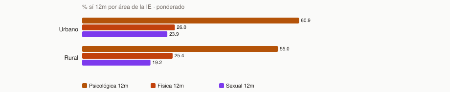

| Grupo | n | N exp. | % psic 12m | % fís 12m | % sexual 12m |
| --- | ---: | ---: | ---: | ---: | ---: |
| Rural | 1,618 | 286,168 | 55.0% | 25.4% | 19.2% |
| Urbano | 7,990 | 1,133,324 | 60.9% | 26.0% | 23.9% |

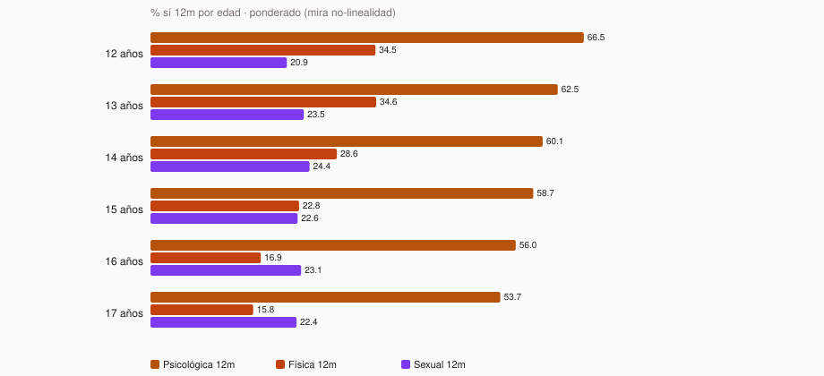

| Grupo | n | N exp. | % psic 12m | % fís 12m | % sexual 12m |
| --- | ---: | ---: | ---: | ---: | ---: |
| 12 años | 1,378 | 191,075 | 66.5% | 34.5% | 20.9% |
| 13 años | 1,823 | 266,074 | 62.5% | 34.6% | 23.5% |
| 14 años | 1,945 | 277,985 | 60.1% | 28.6% | 24.4% |
| 15 años | 1,970 | 274,197 | 58.7% | 22.8% | 22.6% |
| 16 años | 1,532 | 253,354 | 56.0% | 16.9% | 23.1% |
| 17 años | 960 | 156,807 | 53.7% | 15.8% | 22.4% |

Si sexual (u otro target) no es monótono en la edad, `edad^2` tiene sentido de probar. Si es casi lineal, no hace falta.

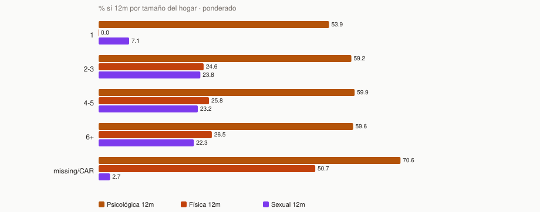

| Grupo | n | N exp. | % psic 12m | % fís 12m | % sexual 12m |
| --- | ---: | ---: | ---: | ---: | ---: |
| 1 | 4 | 365 | 53.9% | 0.0% | 7.1% |
| 2-3 | 1,578 | 225,571 | 59.2% | 24.6% | 23.8% |
| 4-5 | 4,897 | 722,816 | 59.9% | 25.8% | 23.2% |
| 6+ | 3,111 | 468,125 | 59.6% | 26.5% | 22.3% |
| missing/CAR | 18 | 2,614 | 70.6% | 50.7% | 2.7% |

Cuidador:

| Grupo | n | N exp. | % psic 12m | % fís 12m | % sexual 12m |
| --- | ---: | ---: | ---: | ---: | ---: |
| abuelos | 731 | 113,163 | 62.4% | 27.9% | 25.1% |
| hermanos | 895 | 144,148 | 66.9% | 29.0% | 25.5% |
| madre | 6,975 | 995,753 | 58.1% | 24.7% | 21.6% |
| missing | 22 | 2,979 | 68.6% | 44.5% | 3.2% |
| otros | 478 | 74,886 | 61.5% | 30.9% | 26.5% |
| padre | 507 | 88,563 | 60.9% | 26.5% | 28.7% |

Idioma:

| Grupo | n | N exp. | % psic 12m | % fís 12m | % sexual 12m |
| --- | ---: | ---: | ---: | ---: | ---: |
| aimara | 55 | 5,845 | 67.8% | 36.6% | 17.0% |
| castellano | 8,931 | 1,338,040 | 59.9% | 25.9% | 23.2% |
| missing | 22 | 2,979 | 68.6% | 44.5% | 3.2% |
| no sabe | 8 | 1,004 | 42.3% | 20.1% | 23.9% |
| otra | 150 | 18,316 | 55.3% | 21.0% | 28.3% |
| quechua | 442 | 53,308 | 54.4% | 26.2% | 16.7% |

Sin comer (`C3P121`):

| Grupo | n | N exp. | % psic 12m | % fís 12m | % sexual 12m |
| --- | ---: | ---: | ---: | ---: | ---: |
| Sí | 165 | 20,398 | 79.5% | 60.2% | 50.4% |
| No | 9,421 | 1,396,115 | 59.4% | 25.4% | 22.6% |
| missing/skip (CAR) | 22 | 2,979 | 68.6% | 44.5% | 3.2% |

Peleas en casa (`C3P123`):

| Grupo | n | N exp. | % psic 12m | % fís 12m | % sexual 12m |
| --- | ---: | ---: | ---: | ---: | ---: |
| Sí | 4,755 | 696,384 | 73.0% | 36.4% | 29.2% |
| No | 4,831 | 720,129 | 46.8% | 15.7% | 17.0% |
| missing/skip (CAR) | 22 | 2,979 | 68.6% | 44.5% | 3.2% |

---

## CRS01 — servicios y activos (no se pegan a CRS04)

Missing en `C1P101`–`C1P110_*` = 0. Peso: `FACTOR_VIV`.

Promedio ponderado de habitaciones (`C1P108`) = 3.29; dormitorios (`C1P109`) = 2.20. Missing habitaciones = 0; dormitorios = 0.

Tipo de vivienda (`C1P101`):

| Tipo | n | % n | N exp. | % N |
| --- | ---: | ---: | ---: | ---: |
| Casa independiente | 13,170 | 95.3% | 9,634,157 | 91.6% |
| Departamento | 417 | 3.0% | 685,692 | 6.5% |
| Quinta | 94 | 0.7% | 120,689 | 1.1% |
| Casa de vecindad | 91 | 0.7% | 56,112 | 0.5% |
| Choza o cabaña | 48 | 0.3% | 15,353 | 0.1% |
| Improvisada | 6 | 0.0% | 5,282 | 0.1% |

### Servicios por área

Adecuado = electricidad (`C1P105=1`), agua red dentro (`C1P106=1`), desagüe red dentro o en la edificación (`C1P107 IN (1,2)`). Índice de activos = suma de `C1P110_1`…`_20` (sí=1), media ponderada.

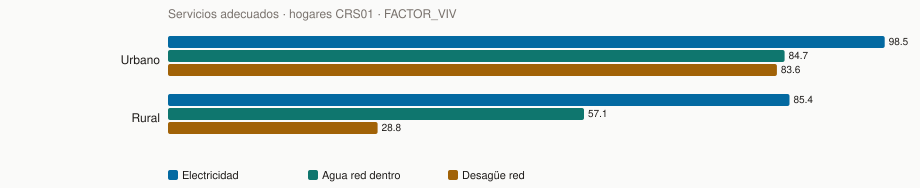

| Área | n | N exp. | % electricidad | % agua red dentro | % desagüe red | Índice activos (0–20) |
| --- | ---: | ---: | ---: | ---: | ---: | ---: |
| Urbano | 9,669 | 8,663,321 | 98.5% | 84.7% | 83.6% | 7.8 |
| Rural | 4,157 | 1,853,965 | 85.4% | 57.1% | 28.8% | 3.5 |

Departamentos con más N de hogares (muestra el gradiente territorial; no lo copies al LASSO de alumnas):

| Departamento | n | N exp. | % electricidad | % agua red | % desagüe red | Índice |
| --- | ---: | ---: | ---: | ---: | ---: | ---: |
| LIMA | 1,424 | 3,129,232 | 98.7% | 85.5% | 87.3% | 8.8 |
| PUNO | 662 | 607,725 | 88.4% | 62.4% | 52.4% | 5.0 |
| AREQUIPA | 657 | 593,199 | 96.7% | 73.1% | 68.1% | 8.0 |
| LA LIBERTAD | 620 | 583,872 | 97.1% | 88.9% | 85.2% | 6.8 |
| PIURA | 638 | 578,823 | 98.2% | 75.0% | 65.2% | 6.4 |
| CAJAMARCA | 612 | 505,601 | 96.3% | 62.2% | 55.6% | 4.3 |

### Activos del hogar (`C1P110`)

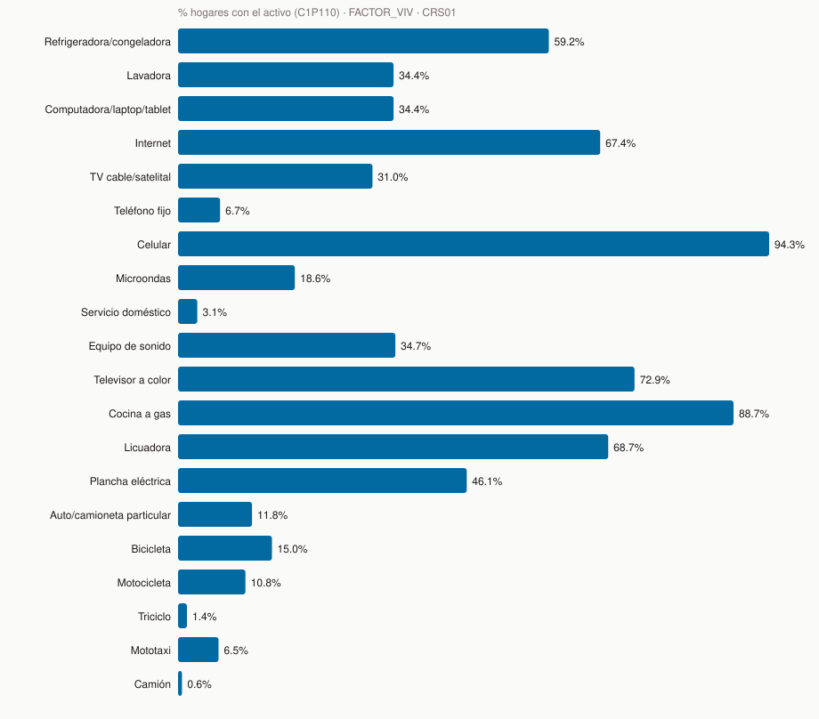

| Activo | n sí | N sí | % N |
| --- | ---: | ---: | ---: |
| Refrigeradora/congeladora | 6,888 | 6,223,864 | 59.2% |
| Lavadora | 3,488 | 3,617,438 | 34.4% |
| Computadora/laptop/tablet | 3,666 | 3,617,613 | 34.4% |
| Internet | 8,473 | 7,086,021 | 67.4% |
| TV cable/satelital | 3,582 | 3,263,400 | 31.0% |
| Teléfono fijo | 608 | 705,667 | 6.7% |
| Celular | 12,806 | 9,922,560 | 94.3% |
| Microondas | 1,629 | 1,960,916 | 18.6% |
| Servicio doméstico | 248 | 322,217 | 3.1% |
| Equipo de sonido | 4,458 | 3,648,363 | 34.7% |
| Televisor a color | 8,976 | 7,663,202 | 72.9% |
| Cocina a gas | 11,732 | 9,324,666 | 88.7% |
| Licuadora | 8,439 | 7,221,416 | 68.7% |
| Plancha eléctrica | 5,413 | 4,846,757 | 46.1% |
| Auto/camioneta particular | 1,252 | 1,242,231 | 11.8% |
| Bicicleta | 1,768 | 1,576,802 | 15.0% |
| Motocicleta | 1,906 | 1,130,832 | 10.8% |
| Triciclo | 192 | 150,091 | 1.4% |
| Mototaxi | 1,064 | 679,234 | 6.5% |
| Camión | 74 | 65,749 | 0.6% |
| Otro | 537 | 428,335 | 4.1% |

Estas variables **no existen en CRS04**. No las metas como dummies del LASSO de adolescentes.

### Cómo pegar contexto regional (sí se puede)

Los 25 departamentos están en CRS01 y CRS04. Calculas en CRS01, con `FACTOR_VIV`, promedios por `DEPARTAMENTO × AREA` (electricidad, agua red dentro, desagüe red, índice de activos 0–20) y se los pegas a la alumna por el departamento y área **de su IE**.

Eso es un rasgo del **lugar**, no de su casa. El 12.7% no vive en el distrito de la IE: distrito es frágil; departamento × área aguanta. No le asignes “tiene refrigeradora” a una fila.

---

## Dónde está el resto

Diccionario de preguntas: [inventario_crs04.md](inventario_crs04.md) y [inventario_crs01.md](inventario_crs01.md).

Qué se pregunta a ambas (y qué no): [descriptivos_crs01_vs_crs04.md](descriptivos_crs01_vs_crs04.md).

Qué recode entra al modelo: [../metodologia/metodologia.md](../metodologia/metodologia.md).
