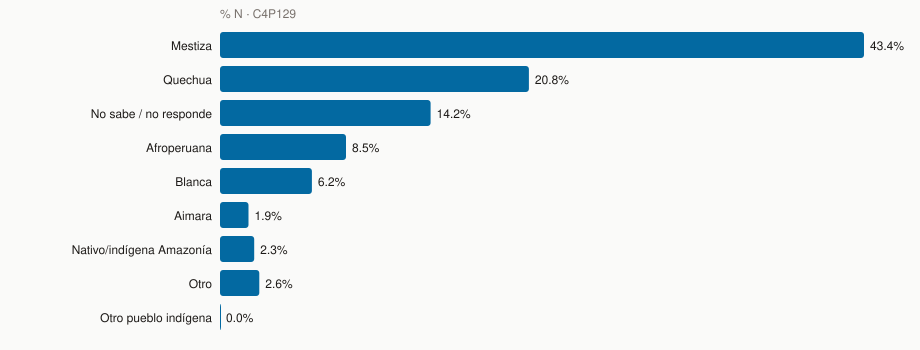
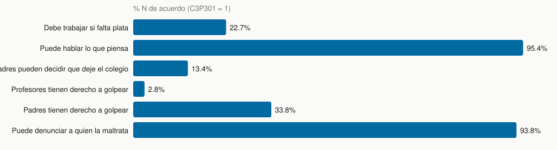
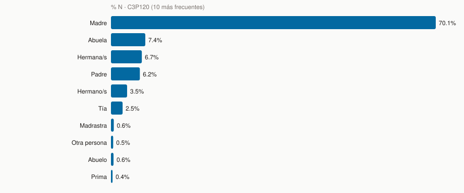
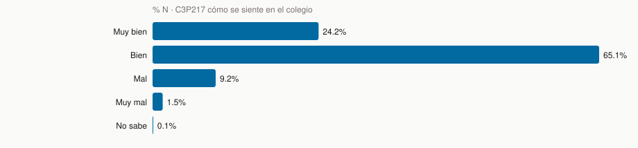

# Descriptivos de predictores candidatos — CRS04

> **Qué es este informe.** Cada X candidata: distribución, cruce con las 3 Y, y **tratamiento** (dummy, lineal, o fuera). Es el cuaderno de trabajo para armar la matriz.
> **Qué no es.** No es el resultado del LASSO. No es cómo se ve la muestra en general (eso es [descriptivos_controles.md](descriptivos_controles.md)). La lista cerrada de recodes está en [../metodologia/metodologia.md](../metodologia/metodologia.md).
> **Tipo.** Descriptivo.
> **Lo escribe.** `scripts/descriptivos/informe_muestral_predictores.py` (Python → markdown; no es Rmd).

Universo: mujeres (`SEXO = 1`) · n = 9,608 · N = 1,419,491 · `FACTOR_ALUMNOS` · ENARES 2024.

Lista cerrada de recodes: [../metodologia/metodologia.md](../metodologia/metodologia.md). Diseño: [../metodologia/diseno_muestral.md](../metodologia/diseno_muestral.md). Targets 12m: [violencia_crs04_si_no_missing.md](violencia_crs04_si_no_missing.md).

Códigos de sí/no: **1 = sí, 2 = no**. En multi-respuesta (`C3P115`, `C3P118`, `C4P130`) **1 = marcado, 0/NULL = no**. `C3P301`: **1 = de acuerdo, 2 = no, 3 = no sabe**.

---

## Individual

### `EDAD` / `C3P103EDAD`

Continua, 6 valores (12–17). Media ponderada 14.42. Discordancias `EDAD` vs `C3P103EDAD`: 0. Missing = 0.

| Nivel | n | % n | N exp. | % N |
| --- | ---: | ---: | ---: | ---: |
| 12 | 1,378 | 14.3% | 191,075 | 13.5% |
| 13 | 1,823 | 19.0% | 266,074 | 18.7% |
| 14 | 1,945 | 20.2% | 277,985 | 19.6% |
| 15 | 1,970 | 20.5% | 274,197 | 19.3% |
| 16 | 1,532 | 15.9% | 253,354 | 17.8% |
| 17 | 960 | 10.0% | 156,807 | 11.0% |

Cruce con violencia 12m (ya en controles; se repite porque aquí se decide el cuadrático):

| Grupo | n | N exp. | % psic 12m | % fís 12m | % sexual 12m |
| --- | ---: | ---: | ---: | ---: | ---: |
| 12 | 1,378 | 191,075 | 66.5% | 34.5% | 20.9% |
| 13 | 1,823 | 266,074 | 62.5% | 34.6% | 23.5% |
| 14 | 1,945 | 277,985 | 60.1% | 28.6% | 24.4% |
| 15 | 1,970 | 274,197 | 58.7% | 22.8% | 22.6% |
| 16 | 1,532 | 253,354 | 56.0% | 16.9% | 23.1% |
| 17 | 960 | 156,807 | 53.7% | 15.8% | 22.4% |

**Tratamiento:** 6 puntos. Física baja casi lineal (34.5% → 16.9% de 12 a 16). Sexual es plana (~21–24%). `EDAD²` no aporta forma de U. **Primero dummies por año o `EDAD` lineal. Cuadrático solo si el jurado pide no-linealidad.** No hace falta estandarizar para el LASSO si penalizas; sí si comparas coeficientes.

### `C4P129` autoidentificación étnica (9 cat.)

Missing = 0.

| Nivel | n | % n | N exp. | % N |
| --- | ---: | ---: | ---: | ---: |
| Mestiza | 3,789 | 39.4% | 616,241 | 43.4% |
| Quechua | 2,410 | 25.1% | 295,589 | 20.8% |
| No sabe / no responde | 1,344 | 14.0% | 201,507 | 14.2% |
| Afroperuana | 771 | 8.0% | 120,591 | 8.5% |
| Blanca | 545 | 5.7% | 87,932 | 6.2% |
| Aimara | 319 | 3.3% | 27,263 | 1.9% |
| Nativo/indígena Amazonía | 225 | 2.3% | 32,725 | 2.3% |
| Otro | 204 | 2.1% | 37,596 | 2.6% |
| Otro pueblo indígena | 1 | 0.0% | 48 | 0.0% |

**Tratamiento:** dummies, referencia **Mestiza** (mayoría, 43.4%). Cola chica (Aimara, Amazonía, otro pueblo, otro): recode a “otra indígena / otro” o **group lasso**. No 8 dummies sueltas en LASSO normal.

### `C3P128` idioma del hogar (6 cat.)

22 missing ≈ CAR. **No es lengua materna** (en CRS01 `C1P306_F` sí lo es).

| Nivel | n | % n | N exp. | % N |
| --- | ---: | ---: | ---: | ---: |
| Castellano | 8,931 | 93.0% | 1,338,040 | 94.3% |
| Quechua | 442 | 4.6% | 53,308 | 3.8% |
| Aimara | 55 | 0.6% | 5,845 | 0.4% |
| Otra lengua nativa | 143 | 1.5% | 17,562 | 1.2% |
| Idioma extranjero | 7 | 0.1% | 754 | 0.1% |
| No sabe | 8 | 0.1% | 1,004 | 0.1% |
| missing | 22 | 0.2% | 2,979 | 0.2% |

**Tratamiento:** dummies, referencia **Castellano**. Colapsar extranjero + otra nativa + NS si n ponderado < 2%.

### `C4P130_1`–`_6` discapacidad permanente

| Variable | Ítem | n sí | % N sí | n null |
| --- | --- | ---: | ---: | ---: |
| `C4P130_1` | Moverse / caminar | 56 | 0.6% | 0 |
| `C4P130_2` | Ver (aun con anteojos) | 256 | 2.3% | 0 |
| `C4P130_3` | Hablar / comunicarse | 50 | 0.4% | 0 |
| `C4P130_4` | Oír (aun con audífonos) | 38 | 0.6% | 0 |
| `C4P130_5` | Entender / aprender | 594 | 7.0% | 0 |
| `C4P130_6` | Relacionarse | 537 | 6.2% | 0 |

Índice “alguna” (`OR` de las seis):

| Nivel | n | % n | N exp. | % N |
| --- | ---: | ---: | ---: | ---: |
| Ninguna | 8,515 | 88.6% | 1,243,826 | 87.6% |
| Alguna limitación | 1,093 | 11.4% | 175,665 | 12.4% |

**Tratamiento:** las seis sueltas gastan gl y varias están < 3%. **Mejor un dummy `alguna_discapacidad` (12.4% N).** Si el jurado quiere tipo de limitación, deja ver/entender y tira el resto a “otra”.

### `C3P126` / `C3P127` toman en cuenta su opinión

| Nivel | n | % n | N exp. | % N |
| --- | ---: | ---: | ---: | ---: |
| Sí | 8,456 | 88.0% | 1,263,021 | 89.0% |
| No | 1,130 | 11.8% | 153,492 | 10.8% |
| missing | 22 | 0.2% | 2,979 | 0.2% |

Frecuencia (`C3P127`) solo si 126 = sí. Null = skip, no missing:

| Nivel | n | % n | N exp. | % N |
| --- | ---: | ---: | ---: | ---: |
| Casi nunca | 333 | 3.5% | 46,464 | 3.3% |
| Algunas veces | 4,568 | 47.5% | 653,661 | 46.0% |
| Siempre/casi siempre | 3,536 | 36.8% | 560,803 | 39.5% |
| No sabe | 19 | 0.2% | 2,093 | 0.1% |
| missing | 1,152 | 12.0% | 156,471 | 11.0% |

**Tratamiento:** dummy de `C3P126`. `C3P127` como ordinal 1–3 (tirar NS) **o** no meterla: está definida solo en el sí y se pisa con 126.

### `C3P301_1`–`_6` actitudes (de acuerdo / no / NS)

| Variable | Oración | n de acuerdo | % N de acuerdo | n no | n NS |
| --- | --- | ---: | ---: | ---: | ---: |
| `C3P301_1` | Debe trabajar si falta plata | 2,462 | 22.7% | 7,000 | 146 |
| `C3P301_2` | Puede hablar lo que piensa | 9,126 | 95.4% | 444 | 38 |
| `C3P301_3` | Padres pueden decidir que deje el colegio | 1,276 | 13.4% | 8,211 | 121 |
| `C3P301_4` | Profesores tienen derecho a golpear | 375 | 2.8% | 9,171 | 62 |
| `C3P301_5` | Padres tienen derecho a golpear | 3,781 | 33.8% | 5,574 | 253 |
| `C3P301_6` | Puede denunciar a quien la maltrata | 8,982 | 93.8% | 511 | 115 |

Ítems 2 y 6 son “pro derechos”; 1, 3, 4 y 5 son punitivos / restrictivos. **No sumes crudo.** Si quieres un índice: invierte 2 y 6 (o invierte 1/3/4/5) y suma. 4 y 5 tienen muy poco “de acuerdo” (~4% y ~9%): poca varianza para LASSO.

**Tratamiento:** 4 dummies de los ítems con varianza (1, 2, 3, 6) **o** un índice de 0–6 ya invertido. No seis dummies + NS.

---

## Relacional

### `C3P106` / `C3P110` tiene mamá / papá

| Nivel | n | % n | N exp. | % N |
| --- | ---: | ---: | ---: | ---: |
| Sí | 9,429 | 98.1% | 1,395,999 | 98.3% |
| No | 161 | 1.7% | 20,878 | 1.5% |
| missing | 18 | 0.2% | 2,614 | 0.2% |

| Nivel | n | % n | N exp. | % N |
| --- | ---: | ---: | ---: | ---: |
| Sí | 9,284 | 96.6% | 1,376,604 | 97.0% |
| No | 306 | 3.2% | 40,273 | 2.8% |
| missing | 18 | 0.2% | 2,614 | 0.2% |

**Tratamiento:** 0/1 (sí=1). Missing = CAR. No hace falta dummy de referencia.

### `C3P114_PERS` tamaño del hogar

Incluyéndola. n null = 18 (CAR). `C3P114_VS = 1` (vive sola): 4. Valores 0 (raro; la pregunta pide incluirla): 4. Rango 0–20. Media ponderada 5.16. DE muestral 1.97.

| Nivel | n | % n | N exp. | % N |
| --- | ---: | ---: | ---: | ---: |
| 1 / sola | 4 | 0.0% | 365 | 0.0% |
| 2-3 | 1,578 | 16.4% | 225,571 | 15.9% |
| 4-5 | 4,897 | 51.0% | 722,816 | 50.9% |
| 6-8 | 2,576 | 26.8% | 386,413 | 27.2% |
| 9+ | 535 | 5.6% | 81,712 | 5.8% |
| missing | 18 | 0.2% | 2,614 | 0.2% |

| Grupo | n | N exp. | % psic 12m | % fís 12m | % sexual 12m |
| --- | ---: | ---: | ---: | ---: | ---: |
| 1 / sola | 4 | 365 | 53.9% | 0.0% | 7.1% |
| 2-3 | 1,578 | 225,571 | 59.2% | 24.6% | 23.8% |
| 4-5 | 4,897 | 722,816 | 59.9% | 25.8% | 23.2% |
| 6-8 | 2,576 | 386,413 | 57.5% | 25.6% | 21.3% |
| 9+ | 535 | 81,712 | 69.3% | 30.6% | 27.1% |
| missing | 18 | 2,614 | 70.6% | 50.7% | 2.7% |

El cruce es **plano** en los tres targets. Hay variación real (0–20, DE ~2), pero no hay U ni J.

**Tratamiento:** lineal + estandarizar si comparas betas. **`PERS²` se puede probar, pero el cruce no lo pide.** No es el caso de `EDAD` (ahí la física sí es monótona).

### `C3P115_1`–`_17` con quién vive (multi-respuesta)

No son mutuamente excluyentes. 0/1 propias. Null ≈ CAR.

| Variable | Ítem | n sí | % N sí | n null |
| --- | --- | ---: | ---: | ---: |
| `C3P115_1` | Madre | 8,647 | 90.1% | 22 |
| `C3P115_2` | Padre | 6,201 | 66.5% | 22 |
| `C3P115_3` | Madrastra | 119 | 1.1% | 22 |
| `C3P115_4` | Padrastro | 894 | 8.9% | 22 |
| `C3P115_5` | Hermana/s | 5,296 | 56.4% | 22 |
| `C3P115_6` | Hermano/s | 5,442 | 57.6% | 22 |
| `C3P115_7` | Abuela/s | 1,503 | 16.9% | 22 |
| `C3P115_8` | Abuelo/s | 900 | 10.8% | 22 |
| `C3P115_9` | Tía/s | 937 | 9.7% | 22 |
| `C3P115_10` | Tío/s | 866 | 9.2% | 22 |
| `C3P115_11` | Prima/s | 573 | 5.7% | 22 |
| `C3P115_12` | Primo/s | 534 | 5.2% | 22 |
| `C3P115_13` | Otros parientes | 662 | 6.5% | 22 |
| `C3P115_14` | Otra persona | 535 | 5.6% | 22 |
| `C3P115_15` | Hija/o del padrastro | 48 | 0.4% | 22 |
| `C3P115_16` | Hija/o de la madrastra | 28 | 0.2% | 22 |
| `C3P115_17` | Trabajadora del hogar | 19 | 0.3% | 22 |

**Tratamiento:** cada ítem ya es dummy. **No pongas referencia.** Tira o agrupa los < 2% N (hija/o de padrastro/madrastra, trabajadora del hogar). Madre+padre juntos se pisan con `C3P106`/`110`: o usas 115 o usas 106/110, no los dos bloques enteros.

### `C3P118` / `C3P119` comparte cuarto / cama

`C3P119` **no es missing al 50.8%**. Es skip: si `C3P118_12 = 1` (duerme sola en el cuarto) no preguntan la cama. En los datos: 4,860 alumnas con `C3P118_12=1` tienen `C3P119_*` NULL al 100%. No es evidencia de hacinamiento heterogéneo.

| Variable | Ítem | n sí | % N sí | n null |
| --- | --- | ---: | ---: | ---: |
| `C3P118_1` | Madre | 1,418 | 14.3% | 18 |
| `C3P118_2` | Padre | 401 | 4.0% | 18 |
| `C3P118_3` | Madrastra | 2 | 0.0% | 18 |
| `C3P118_4` | Padrastro | 45 | 0.7% | 18 |
| `C3P118_5` | Hermana/s | 2,740 | 28.9% | 18 |
| `C3P118_6` | Hermano/s | 1,079 | 11.0% | 18 |
| `C3P118_7` | Abuela | 180 | 1.7% | 18 |
| `C3P118_8` | Abuelo | 25 | 0.3% | 18 |
| `C3P118_9` | Tía | 64 | 0.7% | 18 |
| `C3P118_10` | Tío | 13 | 0.1% | 18 |
| `C3P118_11` | Otra persona | 178 | 1.7% | 18 |
| `C3P118_12` | Nadie (duerme sola) | 4,860 | 50.8% | 18 |
| `C3P118_13` | Hija/o del padrastro | 10 | 0.1% | 18 |
| `C3P118_14` | Hija/o de la madrastra | 5 | 0.0% | 18 |
| `C3P118_15` | Trabajadora del hogar | 0 | 0.0% | 18 |

**Tratamiento:** un dummy `duerme_sola_cuarto` = `C3P118_12`. Opcional: número de personas con quien comparte cuarto (suma de 118 excepto 12). **No metas las 15 + las 15 de cama.** `C3P119` solo como derivado “comparte cama” entre quienes no duermen solas en el cuarto.

### `C3P120` quién te cuida (17 cat., mutuamente excluyente)

22 missing ≈ CAR. Referencia natural = Madre.

| Nivel | n | % n | N exp. | % N |
| --- | ---: | ---: | ---: | ---: |
| Madre | 6,975 | 72.6% | 995,753 | 70.1% |
| Abuela | 685 | 7.1% | 105,346 | 7.4% |
| Hermana/s | 623 | 6.5% | 94,657 | 6.7% |
| Padre | 507 | 5.3% | 88,563 | 6.2% |
| Hermano/s | 272 | 2.8% | 49,490 | 3.5% |
| Tía | 237 | 2.5% | 35,667 | 2.5% |
| Madrastra | 65 | 0.7% | 8,608 | 0.6% |
| Otra persona | 47 | 0.5% | 6,793 | 0.5% |
| Abuelo | 46 | 0.5% | 7,817 | 0.6% |
| Prima | 30 | 0.3% | 5,008 | 0.4% |
| Trabajadora del hogar | 29 | 0.3% | 5,207 | 0.4% |
| Padrastro | 28 | 0.3% | 8,038 | 0.6% |
| missing | 22 | 0.2% | 2,979 | 0.2% |
| Tío | 21 | 0.2% | 2,978 | 0.2% |
| Primo | 8 | 0.1% | 968 | 0.1% |
| Otro pariente | 8 | 0.1% | 977 | 0.1% |
| Hija/o de la madrastra | 4 | 0.0% | 521 | 0.0% |
| Hija/o del padrastro | 1 | 0.0% | 120 | 0.0% |

**Tratamiento:** **no 16 dummies.** Recode a madre / padre / abuelos / hermanos / otros (como en controles) **o** group lasso sobre el bloque. Cola (tía, tío, prima, trabajador/a, hijastra) se va a “otros”.

### `C3P120B` se queda sola · `C3P121` sin comer · `C3P122` falta al colegio

`C3P120B` se queda sola sin adulto:

| Nivel | n | % n | N exp. | % N |
| --- | ---: | ---: | ---: | ---: |
| Sí | 5,657 | 58.9% | 831,129 | 58.6% |
| No | 3,929 | 40.9% | 585,383 | 41.2% |
| missing | 22 | 0.2% | 2,979 | 0.2% |

`C3P121` la dejaron sin comer un día o más:

| Nivel | n | % n | N exp. | % N |
| --- | ---: | ---: | ---: | ---: |
| Sí | 165 | 1.7% | 20,398 | 1.4% |
| No | 9,421 | 98.1% | 1,396,115 | 98.4% |
| missing | 22 | 0.2% | 2,979 | 0.2% |

`C3P122` le pidieron no ir al colegio para ayudar en casa:

| Nivel | n | % n | N exp. | % N |
| --- | ---: | ---: | ---: | ---: |
| Sí | 672 | 7.0% | 97,102 | 6.8% |
| No | 8,914 | 92.8% | 1,319,411 | 92.9% |
| missing | 22 | 0.2% | 2,979 | 0.2% |

**Tratamiento:** 0/1 directo. Las tres tienen señal en el cruce de controles (`C3P121` y `C3P123` son de las más fuertes). Meterlas.

### `C3P123` / `C3P124` peleas en casa

| Nivel | n | % n | N exp. | % N |
| --- | ---: | ---: | ---: | ---: |
| Sí | 4,755 | 49.5% | 696,384 | 49.1% |
| No | 4,831 | 50.3% | 720,129 | 50.7% |
| missing | 22 | 0.2% | 2,979 | 0.2% |

`C3P124` solo si 123 = sí:

| Nivel | n | % n | N exp. | % N |
| --- | ---: | ---: | ---: | ---: |
| Casi nunca | 936 | 9.7% | 145,637 | 10.3% |
| Algunas veces | 3,236 | 33.7% | 464,151 | 32.7% |
| Siempre/casi siempre | 578 | 6.0% | 85,968 | 6.1% |
| No sabe | 5 | 0.1% | 629 | 0.0% |
| missing | 4,853 | 50.5% | 723,107 | 50.9% |

**Tratamiento:** dummy de `C3P123` (alta). Frecuencia ordinal 1–3 si quieres intensidad; no las dos a la vez sin pensar el skip.

---

## Comunitario / escuela

`AREA`, `INED`, `TURNO`, `DEPARTAMENTO` son de la **IE**.

### `AREA`

| Nivel | n | % n | N exp. | % N |
| --- | ---: | ---: | ---: | ---: |
| Urbano | 7,990 | 83.2% | 1,133,324 | 79.8% |
| Rural | 1,618 | 16.8% | 286,168 | 20.2% |

**Tratamiento:** 0/1 (p. ej. rural=1). No dummy de referencia extra.

### `INED` tipo de IE

| Nivel | n | % n | N exp. | % N |
| --- | ---: | ---: | ---: | ---: |
| Mujeres | 955 | 9.9% | 141,566 | 10.0% |
| Mixto | 8,653 | 90.1% | 1,277,925 | 90.0% |

**No hay IE solo de hombres** en este recorte (son alumnas). **Tratamiento:** un dummy mujeres vs mixto. No tres niveles.

### `TURNO`

| Nivel | n | % n | N exp. | % N |
| --- | ---: | ---: | ---: | ---: |
| Mañana | 7,442 | 77.5% | 1,149,295 | 81.0% |
| Tarde | 2,166 | 22.5% | 270,196 | 19.0% |

**Noche = 0 alumnas.** **Tratamiento:** un dummy tarde vs mañana. No tres.

### `C3P217` cómo se siente en el colegio

| Nivel | n | % n | N exp. | % N |
| --- | ---: | ---: | ---: | ---: |
| Muy bien | 2,307 | 24.0% | 343,315 | 24.2% |
| Bien | 6,231 | 64.9% | 923,582 | 65.1% |
| Mal | 944 | 9.8% | 130,537 | 9.2% |
| Muy mal | 115 | 1.2% | 20,928 | 1.5% |
| No sabe | 11 | 0.1% | 1,130 | 0.1% |

**Tratamiento:** ordinal 1–4 (tirar NS, n=11) **o** dummy mal/muy mal vs el resto. No asumas linealidad si dejas 4 dummies: “muy mal” es el 1.3% N.

### `C3P218` jaló curso · `C3P219` repitió · `C3P220` expulsión · `C3P221` amigos · `C3P222` lugares con miedo

`C3P218` jaló / desaprobó un curso (2023):

| Nivel | n | % n | N exp. | % N |
| --- | ---: | ---: | ---: | ---: |
| Sí | 2,279 | 23.7% | 377,216 | 26.6% |
| No | 7,329 | 76.3% | 1,042,275 | 73.4% |

`C3P219` repitió de grado:

| Nivel | n | % n | N exp. | % N |
| --- | ---: | ---: | ---: | ---: |
| Sí | 443 | 4.6% | 81,820 | 5.8% |
| No | 9,165 | 95.4% | 1,337,671 | 94.2% |

`C3P220` la expulsaron:

| Nivel | n | % n | N exp. | % N |
| --- | ---: | ---: | ---: | ---: |
| Sí | 109 | 1.1% | 15,369 | 1.1% |
| No | 9,499 | 98.9% | 1,404,122 | 98.9% |

`C3P221` mejores amigos en este colegio:

| Nivel | n | % n | N exp. | % N |
| --- | ---: | ---: | ---: | ---: |
| Sí | 7,051 | 73.4% | 1,062,408 | 74.8% |
| No | 2,557 | 26.6% | 357,084 | 25.2% |

`C3P222` hay lugares del colegio a los que no va por miedo:

| Nivel | n | % n | N exp. | % N |
| --- | ---: | ---: | ---: | ---: |
| Sí | 503 | 5.2% | 77,652 | 5.5% |
| No | 9,105 | 94.8% | 1,341,840 | 94.5% |

**Tratamiento:** 0/1. `C3P220` expulsión es rarísima: poca varianza, candidata a caerse sola en el LASSO. `C3P222` (miedo a lugares del colegio) puede ser **circular** con bullying: es casi un síntoma de violencia escolar. Yo la dejaría fuera del LASSO de riesgo y la usaría después para caracterizar clusters.

### `DEPARTAMENTO` (25 niveles)

**No entra al LASSO** como 25 dummies. Es estrato del diseño y llave del dashboard. Si se insiste en “controlar territorio”, usa el proxy CRS01 (`DEPARTAMENTO`×`AREA`: electricidad, agua, activos), no 24 dummies de nombre.

---

## Fuera del LASSO: circularidad / leakage

Estas columnas **solo existen o solo se preguntan si ya hubo violencia** (o son consecuencias). Si entran como predictores, el modelo “adivina” el target con información posterior.

| Variable | Qué es | n skip/null | % n skip | % sí entre preguntadas |
| --- | --- | ---: | ---: | ---: |
| `C3P209` | Pidió ayuda (violencia en casa) | 2,720 | 28.3% | 40.2% |
| `C3P236` | Pidió ayuda (violencia en colegio) | 3,283 | 34.2% | 54.5% |
| `C3P216A_1` | Autolesión con objeto (lifetime) | 0 | 0.0% | 17.8% |
| `C3P216A_2` | Sustancia para hacerse daño | 0 | 0.0% | 6.0% |
| `C3P216A_3` | Durmió fuera sin permiso | 0 | 0.0% | 3.4% |
| `C3P216A_4` | Se fue de casa >1 día | 0 | 0.0% | 2.6% |
| `C3P216A_5` | Consumió licor | 0 | 0.0% | 17.7% |
| `C4P248C_1` | Sexual 12m (ítem 1; skip si C4P248_1 ≠ sí) | 8,758 | 91.2% | 55.6% |

Bloques enteros a **excluir** del X del LASSO:

| Bloque | Por qué |
| --- | --- |
| `C3P209`–`C3P215` | Ayuda / institución **después** de insultos o golpes en casa. Skip si no reportó. |
| `C3P216A_1`–`_6` (+ sufijo `C` 12m) | Autolesión, fuga, licor. Consecuencia o comorbilidad, no factor previo. |
| `C3P236`–`C3P247` | Ayuda y lesiones **después** de violencia escolar. |
| `C4P248A_*_*`, `C4P248B_*` | Quién agredió y edad de inicio. Llenos solo si `C4P248_i = 1`. `C4P248A` tiene n no-null ≈ 850 en el primer ítem. Sirven **después** para describir el cluster, no para predecir `viol_sexual_12m`. |
| `C4P251`–`C4P260` | Ayuda por violencia sexual. Mismo patrón. |

Los 58 ítems madre (`C3P201_*`, `205_*`, `223_*`, `227_*`, `C4P248_*`) **son el target**, no controles.

---

## Qué sí meter, y cómo (resumen)

| Variable | ¿Entra? | Cómo | ¿Dummy / cuadrático? |
| --- | --- | --- | --- |
| `EDAD` | Sí | Lineal o 5 dummies (ref. 12) | Cuadrático: no primero |
| `C4P129` | Sí, recodificada | Dummies, ref. mestiza | Group lasso o cola colapsada |
| `C3P128` | Sí | Dummies, ref. castellano | Colapsar cola |
| `C4P130_*` | Sí | 1 dummy “alguna” | No 6 dummies |
| `C3P126` | Sí | 0/1 | `C3P127` opcional |
| `C3P301_*` | Probar | Índice invertido o 4 ítems | No 6 + NS |
| `C3P106` / `110` | Sí, o `C3P115` | 0/1 | No ambos bloques |
| `C3P114_PERS` | Sí | Lineal (CAR = missing) | `PERS²` opcional; el cruce es plano |
| `C3P115_*` | Sí, recorte | Multi 0/1, sin referencia | Tira < 2% N |
| `C3P118_12` | Sí | Duerme sola en el cuarto | No las 15+15 |
| `C3P120` | Sí, recode 5 | Dummies, ref. madre | Group lasso si dejas 17 |
| `C3P120B` `121` `122` `123` | Sí | 0/1 | Alta prioridad |
| `AREA` | Sí | Rural=1 | — |
| `INED` | Baja | Mujeres vs mixto | No 3 niveles |
| `TURNO` | Baja | Tarde vs mañana | No hay noche |
| `C3P217` | Probar | Ordinal 1–4 o dummy mal | — |
| `C3P218` `219` `221` | Probar | 0/1 | `220` casi no varía |
| `C3P222` | No (circular suave) | Post-cluster | — |
| `DEPARTAMENTO` | No en X | Estrato + dashboard | — |
| Bloques 209–215, 216A, 236–247, 248A/B | **No** | Leakage | — |

Próximo paso natural: script que arme la matriz `X` con estos recodes, lista para `glmnet` / group lasso, **sin** las circulares.
