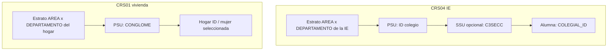

# Diseño muestral: CRS04 (12–17) y CRS01 (mujeres 18+)

> **Qué es este informe.** Números del diseño: qué es el PSU, el estrato, el peso, y qué tan flacos quedan los estratos. Sirve para `svydesign` y para no tratar a las alumnas como independientes.
> **Qué no es.** No es la matriz X ni los recodes (eso es [metodologia.md](metodologia.md)). No es el LASSO. No es un descriptivo de las preguntas.
> **Tipo.** Metodológico.
> **Lo escribe.** `scripts/descriptivos/informe_muestral_predictores.py` (Python → markdown; no es Rmd).

ENARES 2024. Este doc fija **estrato, conglomerado y peso** de las dos encuestas. Las dos muestras **no se unen** a nivel persona (`ID` no es llave común).

Universo de trabajo CRS04: `analisis.crs04_adolescentes`, `SEXO = 1` · n = 9,608 · N = 1,419,491 (`FACTOR_ALUMNOS`).

Universo CRS01: `analisis.crs01_mujeres` · n = 13,826 · N mujer = 12,401,665 (`FACTOR_MUJ`) · N hogar = 10,517,286 (`FACTOR_VIV`).

---

## Qué es cada cosa (las dos encuestas)

| Pieza | CRS04 alumnas 12–17 | CRS01 mujeres 18+ |
| --- | --- | --- |
| Marco | Institución educativa (secundaria regular) | Vivienda / hogar |
| Fila | Alumna | Mujer seleccionada (1 por hogar) |
| Llave de la fila | `ID` + `COLEGIAL_ID` | `ID` (= hogar) · `PERSONA_ID` de la seleccionada |
| **PSU / conglomerado** | **`ID` = la IE**. No existe `CONGLOME` (0 columnas con ese nombre). | **`CONGLOME`** (sí viene explícito). Varios hogares por conglomerado. |
| SSU (opcional) | `C3SECC` (sección dentro de la IE) | No hace falta: 1 mujer por `ID` |
| **Estrato** | `AREA` × `DEPARTAMENTO` de la **IE** (49 celdas; Callao no tiene rural) | `AREA` × `DEPARTAMENTO` del **hogar** (también 49; Callao solo urbano) |
| Peso | `FACTOR_ALUMNOS` (mín 2.12, máx 5,194) | `FACTOR_MUJ` (análisis de la mujer) · `FACTOR_VIV` (vivienda / activos) |
| `AREA` / `DEPARTAMENTO` | De la IE, no de la casa. El 12.7% no vive en el distrito de la IE. | Del hogar |



---

## CRS04 — el colegio es el conglomerado

No hay columna `CONGLOME`. La estructura de llaves alcanza: varias alumnas comparten el mismo `ID` y **no son independientes**.

| Estadístico | Valor |
| --- | ---: |
| IEs (`ID` distintos) | 1,086 |
| Alumnas por IE: mín / mediana / máx / media | 3 / 10 / 20 / 8.8 |
| Secciones distintas (`ID`+`C3SECC`) | 1,794 |
| Secciones por IE: mín / mediana / máx / media | 1 / 2 / 5 / 1.65 |
| Alumnas por sección: mín / mediana / máx / media | 1 / 5 / 20 / 5.4 |
| Estratos `AREA`×`DEPARTAMENTO` | 49 (de 25 × 2 = 50; falta Callao rural) |
| PSU por estrato: mín / mediana / máx | 2 / 25 / 70 |
| Estratos con 1 PSU | **0** |
| Estratos con exactamente 2 PSU | 1 |

`svydesign` exige ≥2 PSU por estrato. Aquí **cero singletons**. Los estratos flacos (≤4 IE):

| Departamento | Área | IE (PSU) | n alumnas |
| --- | --- | ---: | ---: |
| TACNA | Rural | 2 | 10 |
| AREQUIPA | Rural | 4 | 21 |
| ICA | Rural | 4 | 20 |
| MOQUEGUA | Rural | 4 | 20 |
| TUMBES | Rural | 4 | 20 |

Tacna rural es el más delicado: 2 colegios, 10 alumnas. `nest = TRUE` evita que `survey` cruce mal IEs homónimas entre estratos.

`C3SECC` es un segundo nivel real (mediana 2 secciones por IE; alumnas de la misma sección se parecen más). Un multinivel alumna → sección → colegio es defendible. **Para el LASSO con `survey::svydesign` alcanza `ids = ~ID`.** Si más adelante se quiere dos etapas: `ids = ~ID + seccion_uid` con `seccion_uid = paste(ID, C3SECC)`.

```r
library(survey)
diseno_crs04 <- svydesign(
  ids     = ~ID,
  strata  = ~interaction(AREA, DEPARTAMENTO),
  weights = ~FACTOR_ALUMNOS,
  data    = alumnas,   # SEXO == 1
  nest    = TRUE
)
```

---

## CRS01 — sí hay `CONGLOME`

Una mujer seleccionada por hogar: n = hogares = 13,826. El PSU no es el hogar; es el conglomerado censal.

| Estadístico | Valor |
| --- | ---: |
| Conglomerados | 1,750 |
| Mujeres (= hogares) por `CONGLOME`: mín / mediana / máx / media | 1 / 8 / 12 / 7.9 |
| Estratos `AREA`×`DEPARTAMENTO` | 49 |
| PSU por estrato: mín / mediana / máx | 2 / 27 / 262 |
| Estratos con 1 PSU | **0** |
| Estratos con exactamente 2 PSU | 1 |

Estratos flacos (≤4 conglomerados):

| Departamento | Área | CONGLOME (PSU) | n mujeres |
| --- | --- | ---: | ---: |
| TUMBES | Rural | 2 | 24 |
| ICA | Rural | 4 | 48 |

Tumbes rural: 2 conglomerados, 24 mujeres. Mismo recaudo que Tacna rural en CRS04.

```r
diseno_crs01_mujer <- svydesign(
  ids     = ~CONGLOME,
  strata  = ~interaction(AREA, DEPARTAMENTO),
  weights = ~FACTOR_MUJ,
  data    = mujeres18,
  nest    = TRUE
)

# Solo si el análisis es de la vivienda (agua, C1P110):
diseno_crs01_viv <- svydesign(
  ids     = ~CONGLOME,
  strata  = ~interaction(AREA, DEPARTAMENTO),
  weights = ~FACTOR_VIV,
  data    = mujeres18,
  nest    = TRUE
)
```

`FACTOR_NIÑOS` no se usa en este recorte (80% null: no hay NNA en el hogar). `FACTOR_POBLACION` es del padrón, no de la seleccionada.

---

## Cómo las vamos a usar juntas

1. **Modelo de riesgo / LASSO / clusters de alumnas:** solo CRS04, `diseno_crs04`. PSU = `ID`. Estrato = `AREA`×`DEPARTAMENTO` de la IE.
2. **SES de vivienda (agua, desagüe, activos `C1P110`):** solo CRS01, `diseno_crs01_viv`. **No se pega a la fila de la alumna.** Si se quiere contexto territorial, se agregan medias por `DEPARTAMENTO`×`AREA` en CRS01 y se unen a la alumna por el depto/área **de su IE**. Eso es un rasgo del lugar, no de su casa.
3. **No** se usa `DEPARTAMENTO` como 25 dummies dentro del LASSO de alumnas (sobreajuste, sin interpretación). Sí se usa como estrato del diseño y como llave del dashboard.

---

## Lo que este diseño no arregla

- `RFINAL = 2` (encuesta incompleta) en CRS04: 12.4% de casos, 21.6% de la N. Los ítems de violencia están llenos; el peso de las incompletas es más alto.
- En CRS04, `AREA` urbana es de la IE. No es “vive en zona urbana”.
- 18 filas CAR (`C3P105 = 2`) se saltan el flujo de casa: missing de `C3P114`/`C3P115`/`C3P120` no es no-respuesta.

Especificación formal de la matriz X (tratamiento, referencia, prioridad y exclusiones por leakage): [metodologia.md](metodologia.md).

Descriptivos de las candidatas (distribuciones y cruces): [../descriptivos/descriptivos_predictores_crs04.md](../descriptivos/descriptivos_predictores_crs04.md).
