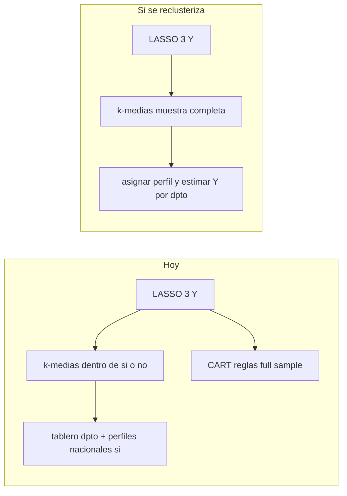

# Viabilidad del backlog de desfases

> **Qué es este informe.** Qué hay hoy, qué pedía cada desfase del mock MIMP y **qué se decide**. En cada bloque hay un ejemplo de cómo se lee hoy y cómo se leería después.
> **Qué no es.** No es el recetario para levantar el tablero (eso está en el README de la raíz). No son coeficientes ni clusters corridos de nuevo.
> **Tipo.** Metodológico.
> **Lo escribe.** Texto a mano (no sale de un script).

**Pipeline (decisión fija):** LASSO elige las X. El k-medias y el CART leen ese resultado. No hay k-medias sobre el menú entero de preguntas.

---

## 1. Clústeres y ranking de la misma violencia

**Hay.** k-medias **filter-first**: se parte sí/no de cada Y y se agrupa adentro. k=3. X = intersección LASSO 3/3 (13 variables). Y no entra al fit. El #1 del tablero es carga de X + superposición de las *otras* violencias. CART ya corre en muestra completa y da reglas, no tipos. n=9,575 / N=1,415,383.

**Pedido.** Formar clústeres en la muestra completa con X pertinentes; estimar las tres prevalencias por perfil; entregar perfil, tipo de violencia, n, N e incertidumbre. Mantener CART como complemento.

**Decisión.**

- LASSO **sigue primero**. El k-medias no reabre preguntas.
- El ranking “por riesgo” de la *misma* Y solo es válido si se reclusteriza en muestra completa. El filter-first actual **no** se vende como ese ranking.
- Si se reclusteriza: un solo k, etiquetas nuevas (no reciclar `alguna_si-1`), reescribir [../resultados/perfiles_kmeans_crs04.md](../resultados/perfiles_kmeans_crs04.md) y `web/data/perfiles.json`. CART se queda, rotulado aparte.
- n y N ponderada sí. Intervalos de encuesta por perfil hoy no existen; si se publican cifras, hay que estimarlos con PSU=`ID` y estrato `AREA×DEPARTAMENTO`. Sin eso, el entregable de “incertidumbre” queda incompleto.

**Ejemplo de lectura** (Junín, todas las violencias).

Hoy:

> #1 Actitudes de castigo y trabajo, casa en tensión
> Adolescentes 12–17. Tipos nacionales; en Junín se leen como hipótesis.
> Superposición: psicológica 92,5 % · física 54,5 % · sexual 39,3 %

Eso no dice “este grupo tiene más violencia que el #3”. Las tres ya reportaron alguna. El #1 solo tiene más de las otras encima.

Después, si se reclusteriza a todas (después del mismo LASSO):

> #1 Casa en tensión
> De cada 100 alumnas de este tipo, 78 reportaron alguna violencia 12m
> (n = 2 100 · N = 280 000). Nacional: 66 %.
> En Junín: 4 de cada 10 son de este tipo. Violencia de este tipo en Junín: 81 % (n = 180).
> Si n es chico: “sin cifra; el tipo existe en el mapa”.

CART se queda en otra caja:

> Si hay peleas en casa y no la toman en cuenta → 78 % reportó física.

---

## 2. Método vs texto (Gower / unión-intersección)

**Hay.** Código = k-medias euclídeo + `StandardScaler`. Gower / k-prototypes **no están** en el repo. k-medias usa intersección 3/3 (13 X). CART usa unión ≥1 (36 X).

**Pedido.** Elegir y documentar el método realmente aplicado. Comparar métodos mixtos y estabilidad. Definir unión o intersección; no tratar coef LASSO ≠ 0 como señal robusta.

**Decisión.**

- El método oficial es **k-medias + LASSO previo**. Se documenta eso. No se narra Gower/k-prototypes.
- Intersección 3/3 para k-medias; unión para CART. Se nombra así; no se mezclan.
- Comparar Gower/k-prototypes o bootstrap de estabilidad **no es entregable de este paso**. Si algún día se hace, se predefine qué se publica si no coinciden.
- Coef ≠ 0 del LASSO no se interpreta como hallazgo causal ni como “variable obligatoria de política”.

**Ejemplo de lectura.**

Hoy (texto viejo de propuesta): “k-prototypes / Gower”. Lo que corre: k-medias, 13 X del LASSO 3/3; CART con 36 X.

Después, una línea en informe o pie del tablero:

> Perfiles: k-medias, k=3, 13 preguntas del LASSO (las 3 violencias).
> Reglas: CART, otras 36 preguntas. No son el mismo recorte.

---

## 3. Ranking departamental

**Hay.** Modelos nacionales. `data/tablas/perfiles_kmeans_asig.csv` asigna perfil a la alumna. `web/data/enares.json` tiene dpto × edad (`todas` / `12_14` / `15_17`) **sin** cruzar perfil. El tablero no reclusteriza por departamento.

**Pedido.** Aprender perfiles nacionales y estimar distribución y violencia por departamento. Evaluar n efectivo, intervalos y CV. Si falta precisión, agrupar edades, estimar parcial o **suprimir la cifra** y dejar el territorio. No reclusterizar cada dpto.

**Decisión.**

- Perfil **nacional** asignado a cada alumna; agregar por `DEPARTAMENTO` de la IE.
- No hay k-medias por departamento.
- Primero cruce con edad `todas`. 12–14 / 15–17 × perfil × dpto no se publica hasta validar n / N / CV.
- Regla de supresión: si la celda es chica, el mapa conserva el departamento y el texto dice “sin precisión”. No se rellena.

**Ejemplo de lectura.**

Hoy:

> Junín · alguna violencia · 12–17 años · 72,4 %
> 11 CEM
> (abajo) tres perfiles nacionales, “en Junín se leen como hipótesis”

No hay “en Junín el 40 % es el tipo 1”.

Después, edad 12–17 junta:

> En Junín, alumnas de IE:
> tipo 1: 38 % · violencia 81 % (n = 210)
> tipo 2: 15 % · sin cifra (n = 40)
> tipo 3: 47 % · violencia 61 % (n = 290)

---

## 4. Actitudes CRS04 vs normas CRS02

**Hay.** El panel ya muestra actitudes de la **alumna** (CRS04, ponderadas) por recorte. CRS02 está en DuckDB (`analisis.crs02_adultos`: `C2P401_*` 22, `C2P401A_*` 15, `C2P402_*` 10) y **no entra** al tablero. CRS04 = alumnas 12–17 en IE. CRS02 = adultos 18+ (mujeres y hombres) en vivienda. `ID` no es llave común.

**Pedido.** Dos bloques departamentales (alumnas vs adultas/os), cada uno con universo, peso, n y precisión. Vincular agregados por territorio. No unir personas.

**Decisión.**

- Elegir **4–8 ítems** CRS02 y un recode (sí/no o % de acuerdo). No se meten 22+15+10 opiniones crudas al mapa ni al panel.
- Pegar el agregado por `DEPARTAMENTO` (o `DEPARTAMENTO×AREA` si el n lo aguanta) como **contexto**, al lado de las actitudes CRS04.
- Rotular universo, año, peso, n y N de **cada** bloque. No mezclar denominadores.
- No hay join persona. No hay índice opaco “normas del territorio” sin listar los ítems.

**Ejemplo de lectura.**

Hoy (solo alumna):

> Actitud: padres pueden golpear · Junín 42 % · Nacional 34 %
> Actitud: deje el colegio · Junín 15 % · Nacional 13 %

Después, dos cajas (4–8 ítems CRS02, no 47):

> Lo que dicen las alumnas (ENARES 2024, CRS04, IE, n = 380 en Junín)
> Padres pueden golpear: 42 %
>
> Lo que dicen adultas/os del mismo departamento (ENARES 2024, CRS02, vivienda, n = 520)
> Justifican el castigo físico a hijas/os: 28 %

No: “Junín es un territorio tolerante 35 %” mezclando las dos.

---

## 5. Saneamiento CRS01 y redes de apoyo

**Hay.** Medias CRS01 de agua/desagüe por departamento en [../descriptivos/descriptivos_controles.md](../descriptivos/descriptivos_controles.md) (`C1P106`, `C1P107`). No hay JSON ni capa en el tablero. El panel ya muestra por separado `se_queda_sola` y `toma_en_cuenta`. El 12,7 % no vive en el distrito de la IE.

**Pedido.** Indicadores territoriales de agua/saneamiento con fuente y año; contexto departamental. Definir cada proxy de apoyo aparte. No mostrar “saneamiento asociado” antes de estimarlo. No atribuir CRS01 al hogar de la adolescente.

**Decisión.**

- Exportar agua/desagüe CRS01 por `DEPARTAMENTO` (o `DEPARTAMENTO×AREA`) y pegarlos a la **IE**, no a la casa.
- Título: “vivienda CRS01 en el mismo departamento (y área) de la escuela”.
- `se_queda_sola` y `toma_en_cuenta` se quedan como están; no se llaman “redes de apoyo”.
- No se muestra “saneamiento asociado a violencia” hasta tener el agregado y su n.

**Ejemplo de lectura.**

Hoy:

> Se queda sola · Junín 59 %
> La toman en cuenta · Junín 91 %

Después, esas dos igual, más:

> Vivienda de adultas 18+ en el departamento de esta escuela (CRS01, no es la casa de la alumna)
> Agua por red: 71 % · Desagüe: 48 % · n = …

---

## 6. Universo y geografía

**Hay.** UI y docs: alumnas 12–17, SEXO=1, departamento = IE. CEM por `COD_DPTO`. 7 dptos sin CEM REGULAR. No hay tabla UBIGEO escuela–residencia–servicio.

**Pedido.** Rotular universo; distinguir escuela, residencia y servicio; UBIGEO y correspondencias; no añadir otros universos sin análisis propio; 12–17 como corte base; validar 12–14 y 15–17.

**Decisión.**

- Se mantiene el rotulado actual (alumnas, IE, no varones, no toda la adolescencia).
- No se añade CRS03 ni otros universos al tablero.
- 12–14 / 15–17 siguen como filtro de la misma muestra; no son cifra “publicable” por dpto hasta validar.
- Homologar edades de SALUD/MP por regla de tres: no. Esas bases no son microdato de alumnas.
- Completar UBIGEO fino o directorio CEM de otras modalidades: fuera de alcance sin archivo nuevo.

**Ejemplo de lectura.**

Hoy (ya está bien):

> Alumnas de 12–17 cuya IE está en Junín. El departamento es el de la escuela, no de la casa.

Después, lo mismo más un pie:

> Escuela: Junín (ENARES). Residencia: no está en el mapa. CEM: 11 regulares 2025; no es la casa ni el colegio.

Si el n de 12–14 en Tacna es 12, no se publica ese %.

---

## 7. Incertidumbre y temporalidad

**Hay.** Punto ponderado. Silueta k-medias 0.11–0.16. Sin IC, sin CV, sin bootstrap de clústeres, sin CV agrupado por IE. CART no escribe assignment. El tablero ya dice que no es predicción.

**Pedido.** Validación por escuela/conglomerado, calibración, estabilidad; documentar diseño y no respuesta. Leer como violencia reportada a 12 meses y asociaciones contemporáneas, no como predicción ni efecto de intervención. Malestar escolar puede ser consecuencia.

**Decisión.**

- Copy: asociación contemporánea, no causa, no predicción. Malestar escolar no se vende como factor “previo”.
- IC / CV / estabilidad: solo si se va a publicar el ranking territorial o el perfil nuevo. El LASSO actual no es `svyglm`; eso es trabajo extra, no un parche de UI.
- Validación por `ID` (colegio) se anota como mejora del LASSO; no se hace en este mismo paso salvo que se reabra el modelo.

**Ejemplo de lectura.**

Hoy:

> 72,4 %
> Cifras ponderadas. No es predicción ni ranking de colegios.

Después, si hay intervalo:

> 72 % (IC 66–78)
> Violencia reportada en los últimos 12 meses. No es “va a pasar”.
> “Se siente mal en el colegio” puede ser efecto, no causa.

---

## 8. CEM, SALUD, MP, INEI, nombre y años

**Hay.** CEM 175 REGULAR, ENE–FEB 2025, join por `COD_DPTO`, “sin registros” posible. SALUD/MP/INEI en tablas laterales, no en la coropleta. Y “alguna” = al menos un tipo, no suma de %.

**Pedido.** Completar directorio CEM; confirmar SALUD/MP con la fuente; sacar INEI ITS hasta tener ficha; mostrar año y universo por bloque; ENARES = Encuesta Nacional sobre Relaciones Sociales 2024.

**Decisión.**

- CEM: se mantiene lo que el archivo permite (conteo de centros ≠ casos `CAC_*` ≠ cobertura). No se afirma 24 h ni oferta total. Otras modalidades, horarios y capacidad no se inventan.
- SALUD: cuarentena de la fila 143+306≠1 449. Vacío = desconocido. Sin territorio, no va al mapa.
- MP: no se extrapola Cañete. Denuncias ≠ prevalencia ENARES.
- INEI Sheet1: **fuera** del perfil.
- Nombre y año: ENARES 2024. CEM 2025 y MP 2026 se rotulan como otra unidad.

**Ejemplo de lectura.**

Hoy:

> 11 CEM · ENE–FEB 2025 · solo REGULAR
> Tacna: sin registros en esta base
> Abajo, tablas MINSA y MP. INEI ITS: “no entra al perfil”

Después, casi igual, más limpio:

> ENARES 2024 (Encuesta Nacional sobre Relaciones Sociales) · alumnas
> CEM regulares 2025 · 11 centros · no es cobertura 24 h
> Casos atendidos del archivo: otro número, no se suma al 72 %
> MINSA: fila 143+306≠1 449 · en cuarentena · sin mapa
> MP 2026: varias filas en Cañete · no es el país
> ITS: fuera

---

## Orden si se implementa después

1. Copy (ENARES 2024, universos, no causalidad, cuarentena SALUD/MP, CEM ≠ casos).
2. Documentar k-medias + LASSO previo e intersección 3/3; no narrar Gower.
3. Elegir: filter-first sin llamarlo ranking de riesgo, **o** k-medias en muestra completa **después del mismo LASSO**. No las dos etiquetas a la vez.
4. Distribución del perfil nacional por dpto + supresión; edad `todas` primero.
5. CRS02: 4–8 ítems recodificados por departamento, junto a CRS04, con n propio. CRS01 agua/desagüe igual.
6. SEs solo si se publica.

Fuera de alcance sin datos nuevos: directorio CEM completo, aclarar MINSA/MP con la fuente, ITS, recluster por dpto.

---

## Decisiones que no se mueven

- LASSO antes del k-medias, siempre.
- CRS02 = 4–8 ítems + recode, contexto por departamento, al lado de las actitudes de la alumna.
- No join persona entre CRS01 / CRS02 / CRS04.
- No k-medias por departamento.
- INEI Sheet1 fuera. SALUD/MP no se suman a ENARES.
