# CART CRS04 (reglas de riesgo)

> **Qué es este informe.** Reglas SI–ENTONCES: combinación de X → % de violencia. Un árbol por Y (alguna, física, sexual). No se filtra; entran todas.
> **Qué no es.** No arma tipos de persona (eso es [perfiles_kmeans_crs04.md](perfiles_kmeans_crs04.md)). No es el LASSO: usa la unión de X que el L1 dejó vivas.
> **Tipo.** Resultado del modelo.
> **Lo escribe.** `scripts/modelos/perfiles_cart_crs04.py` (Python → markdown; no es Rmd).

El k-medias ([perfiles_kmeans_crs04.md](perfiles_kmeans_crs04.md)) arma **tipos de alumna**. Este CART arma **reglas**.

No se filtra. Entran todas (sin 18 CAR). n = 9,575 · N = 1,415,383.
Profundidad 3, hojas gordas (`min_samples_leaf` ≈ n/40), peso `FACTOR_ALUMNOS`.

**X:** unión de las que el LASSO no apagó en los 3 a la vez (36 variables), no el núcleo 3/3.
`edad`, `pers`, `alguna_discapacidad`, `toma_en_cuenta`, `act_trabajar`, `act_deje_colegio`, `act_padres_golpear`, `vive_padrastro`, `vive_hermana`, `vive_hermano`, `vive_abuela`, `vive_abuelo`, `vive_tia`, `vive_tio`, `vive_prima`, `vive_otros_parientes`, `vive_otra_persona`, `duerme_sola_cuarto`, `se_queda_sola`, `sin_comer`, `falta_colegio`, `peleas_casa`, `rural`, `ie_mujeres`, `turno_tarde`, `se_siente_mal`, `jalo_curso`, `repitio`, `amigos_colegio`, `etnia_quechua`, `etnia_afroperuana`, `etnia_blanca`, `etnia_no_sabe`, `cuidador_padre`, `cuidador_hermanos`, `cuidador_otros`.

## Cómo se lee (sin jerga)

El CART no junta alumnas “parecidas”. **Corta** la muestra con preguntas sí/no hasta separar, lo más que puede, a las que reportaron violencia de las que no.

Cada camino es una frase: *si hay peleas en casa y no la toman en cuenta → 78 % reporta esta violencia*. Eso es el perfil-regla. No es un “tipo de persona” (eso era el k-medias).

**X que usa:** todas las que el LASSO dejó vivas en **al menos un** target (unión), no solo las 13 del 3/3. La violencia **sí entra**: es lo que el árbol trata de separar. El peso de la encuesta entra al fit.

**Por qué tres árboles.** “Alguna” la empuja la psicológica (~60 %): el primer corte suele ser el de esa Y tan frecuente. Física y sexual son más raras; las reglas cambian.

### Qué vas a ver en cada árbol

1. **El árbol dibujado.** Arriba la primera pregunta (la que más parte). Izquierda = no / menor; derecha = sí / mayor. Las cajas de abajo son las **hojas**: ahí ya no corta. El color más rojo = más % de violencia en esa hoja.
2. **Barras de las hojas.** Cada barra es un camino. La línea punteada es el % promedio de esa violencia en todas las alumnas. Naranja = por encima del promedio; azul = por debajo. Esa es la visualización que más se lee: “esta combinación queda 15 puntos por encima”.
3. **Las dos cajas (más vs menos riesgo).** La hoja más alta y la más baja, en una frase.
4. **Importancia.** Qué preguntas usó más el árbol. Si una X del LASSO no aparece, el árbol no la necesitó con profundidad 3.

**n** = alumnas en la encuesta. **N** = chicas del país (peso). **pp** = puntos porcentuales contra el promedio.

No es causal. Una hoja chica (n bajo) no se cuenta como hallazgo robusto.

---

## Alguna violencia (psic o fís o sexual)

Promedio ponderado de esta Y: **65.8 %**. Hojas = 7. X que el árbol llegó a usar: `toma_en_cuenta`, `se_queda_sola`, `peleas_casa`, `se_siente_mal`, `amigos_colegio`.

### Árbol

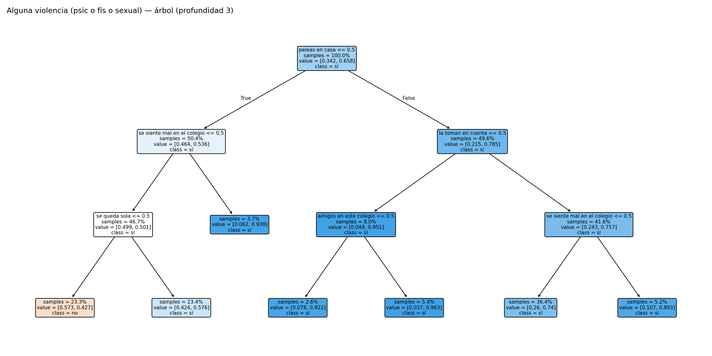

Primera pregunta = la que más parte. Izquierda ≈ no / menor; derecha ≈ sí / mayor. Cajas de abajo = hojas. Más rojo = más % de esta violencia.

### Hojas (la visualización principal)

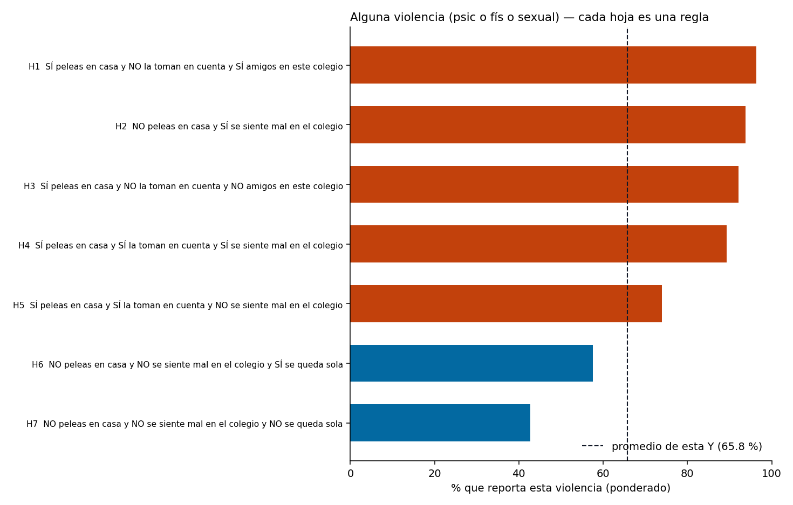

Naranja = por encima del 65.8 % promedio. Azul = por debajo. Cada etiqueta es el SI–ENTONCES completo.

| Hoja | Regla (SI…) | n | N | % esta Y | % psic. | % fís. | % sexual | vs promedio |
| --- | --- | ---: | ---: | ---: | ---: | ---: | ---: | --- |
| `H1` | SÍ peleas en casa y NO la toman en cuenta y SÍ amigos en este colegio | 518 | 69,033 | 96.3% | 94.4% | 57.9% | 39.6% | +30.5 pp |
| `H2` | NO peleas en casa y SÍ se siente mal en el colegio | 357 | 56,570 | 93.8% | 88.1% | 37.1% | 36.9% | +28.0 pp |
| `H3` | SÍ peleas en casa y NO la toman en cuenta y NO amigos en este colegio | 246 | 30,361 | 92.2% | 89.8% | 60.7% | 36.6% | +26.4 pp |
| `H4` | SÍ peleas en casa y SÍ la toman en cuenta y SÍ se siente mal en el colegio | 497 | 66,192 | 89.3% | 87.5% | 47.5% | 27.8% | +23.5 pp |
| `H5` | SÍ peleas en casa y SÍ la toman en cuenta y NO se siente mal en el colegio | 3,490 | 530,524 | 74.0% | 67.4% | 30.8% | 27.5% | +8.2 pp |
| `H6` | NO peleas en casa y NO se siente mal en el colegio y SÍ se queda sola | 2,239 | 331,944 | 57.6% | 50.6% | 17.4% | 18.6% | -8.3 pp |
| `H7` | NO peleas en casa y NO se siente mal en el colegio y NO se queda sola | 2,228 | 330,760 | 42.7% | 35.8% | 10.2% | 12.1% | -23.1 pp |

### Más riesgo vs menos riesgo

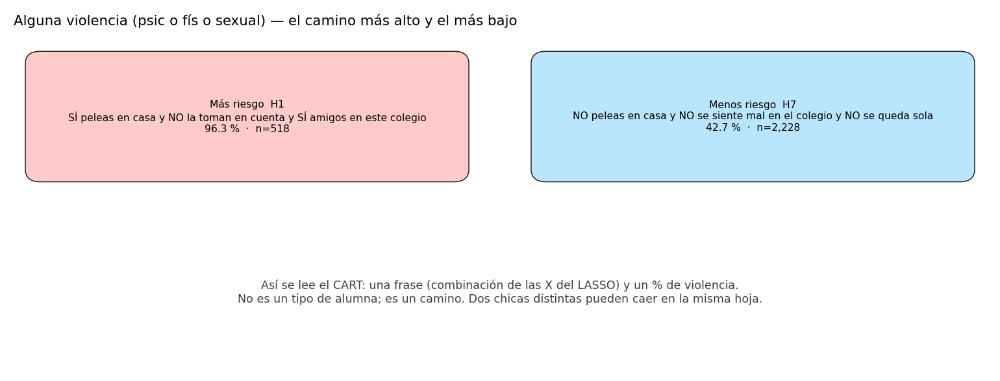

### Qué X pesaron

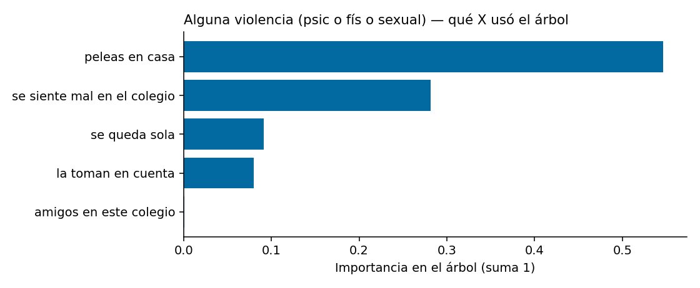

## Violencia física 12m

Promedio ponderado de esta Y: **25.8 %**. Hojas = 7. X que el árbol llegó a usar: `edad`, `toma_en_cuenta`, `se_queda_sola`, `peleas_casa`, `se_siente_mal`.

### Árbol

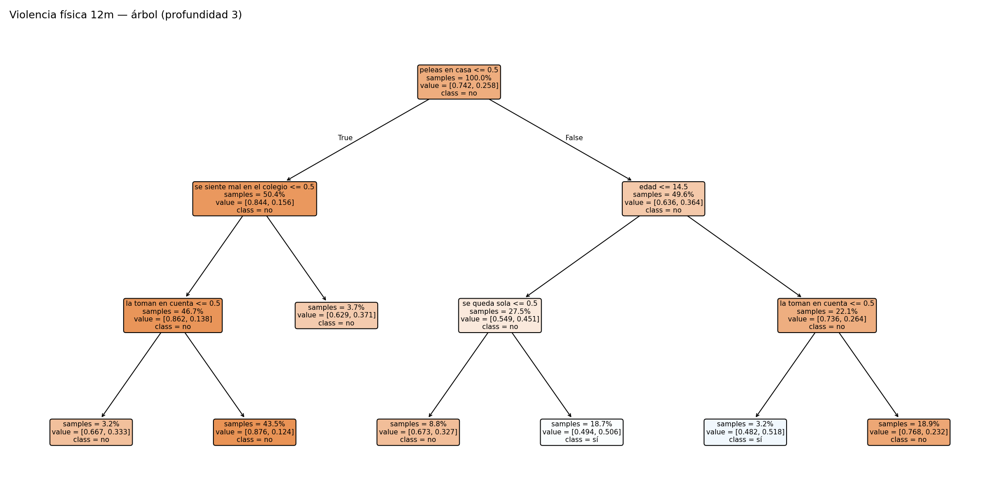

Primera pregunta = la que más parte. Izquierda ≈ no / menor; derecha ≈ sí / mayor. Cajas de abajo = hojas. Más rojo = más % de esta violencia.

### Hojas (la visualización principal)

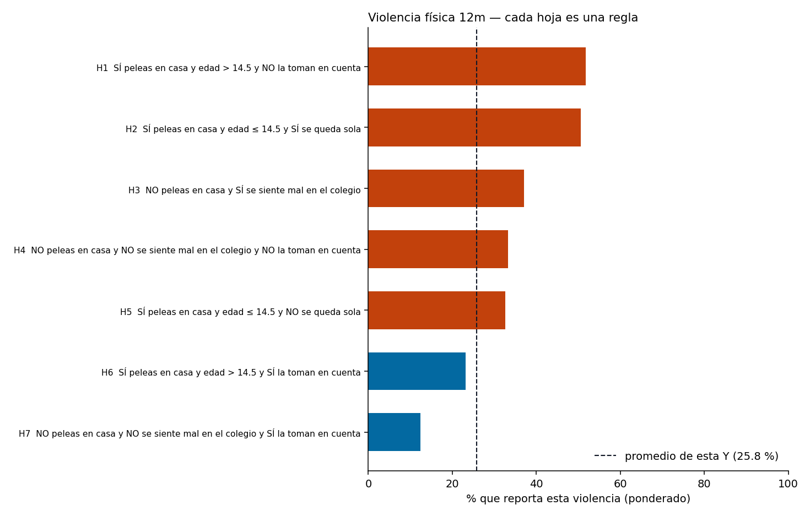

Naranja = por encima del 25.8 % promedio. Azul = por debajo. Cada etiqueta es el SI–ENTONCES completo.

| Hoja | Regla (SI…) | n | N | % esta Y | % psic. | % fís. | % sexual | vs promedio |
| --- | --- | ---: | ---: | ---: | ---: | ---: | ---: | --- |
| `H1` | SÍ peleas en casa y edad > 14.5 y NO la toman en cuenta | 304 | 36,593 | 51.8% | 91.5% | 51.8% | 32.4% | +26.0 pp |
| `H2` | SÍ peleas en casa y edad ≤ 14.5 y SÍ se queda sola | 1,794 | 256,864 | 50.6% | 80.7% | 50.6% | 32.5% | +24.8 pp |
| `H3` | NO peleas en casa y SÍ se siente mal en el colegio | 357 | 56,570 | 37.1% | 88.1% | 37.1% | 36.9% | +11.2 pp |
| `H4` | NO peleas en casa y NO se siente mal en el colegio y NO la toman en cuenta | 302 | 42,956 | 33.3% | 62.7% | 33.3% | 28.6% | +7.5 pp |
| `H5` | SÍ peleas en casa y edad ≤ 14.5 y NO se queda sola | 839 | 113,036 | 32.7% | 68.5% | 32.7% | 28.0% | +6.8 pp |
| `H6` | SÍ peleas en casa y edad > 14.5 y SÍ la toman en cuenta | 1,814 | 289,617 | 23.2% | 65.6% | 23.2% | 26.2% | -2.6 pp |
| `H7` | NO peleas en casa y NO se siente mal en el colegio y SÍ la toman en cuenta | 4,165 | 619,747 | 12.4% | 41.9% | 12.4% | 14.4% | -13.4 pp |

### Más riesgo vs menos riesgo

### Qué X pesaron

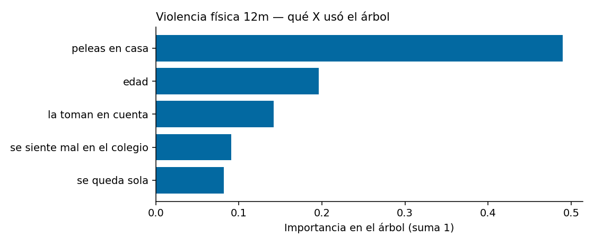

## Violencia sexual 12m

Promedio ponderado de esta Y: **23.0 %**. Hojas = 7. X que el árbol llegó a usar: `edad`, `toma_en_cuenta`, `act_deje_colegio`, `peleas_casa`, `se_siente_mal`.

### Árbol

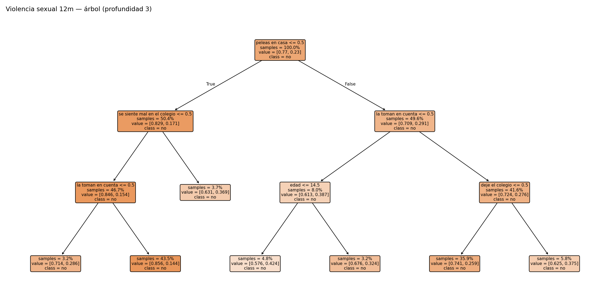

Primera pregunta = la que más parte. Izquierda ≈ no / menor; derecha ≈ sí / mayor. Cajas de abajo = hojas. Más rojo = más % de esta violencia.

### Hojas (la visualización principal)

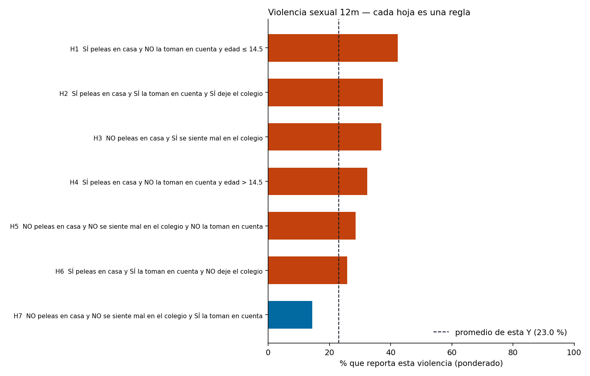

Naranja = por encima del 23.0 % promedio. Azul = por debajo. Cada etiqueta es el SI–ENTONCES completo.

| Hoja | Regla (SI…) | n | N | % esta Y | % psic. | % fís. | % sexual | vs promedio |
| --- | --- | ---: | ---: | ---: | ---: | ---: | ---: | --- |
| `H1` | SÍ peleas en casa y NO la toman en cuenta y edad ≤ 14.5 | 460 | 62,800 | 42.4% | 93.8% | 62.9% | 42.4% | +19.4 pp |
| `H2` | SÍ peleas en casa y SÍ la toman en cuenta y SÍ deje el colegio | 554 | 87,207 | 37.5% | 77.0% | 42.2% | 37.5% | +14.5 pp |
| `H3` | NO peleas en casa y SÍ se siente mal en el colegio | 357 | 56,570 | 36.9% | 88.1% | 37.1% | 36.9% | +13.9 pp |
| `H4` | SÍ peleas en casa y NO la toman en cuenta y edad > 14.5 | 304 | 36,593 | 32.4% | 91.5% | 51.8% | 32.4% | +9.4 pp |
| `H5` | NO peleas en casa y NO se siente mal en el colegio y NO la toman en cuenta | 302 | 42,956 | 28.6% | 62.7% | 33.3% | 28.6% | +5.6 pp |
| `H6` | SÍ peleas en casa y SÍ la toman en cuenta y NO deje el colegio | 3,433 | 509,509 | 25.9% | 68.4% | 31.0% | 25.9% | +2.9 pp |
| `H7` | NO peleas en casa y NO se siente mal en el colegio y SÍ la toman en cuenta | 4,165 | 619,747 | 14.4% | 41.9% | 12.4% | 14.4% | -8.6 pp |

### Más riesgo vs menos riesgo

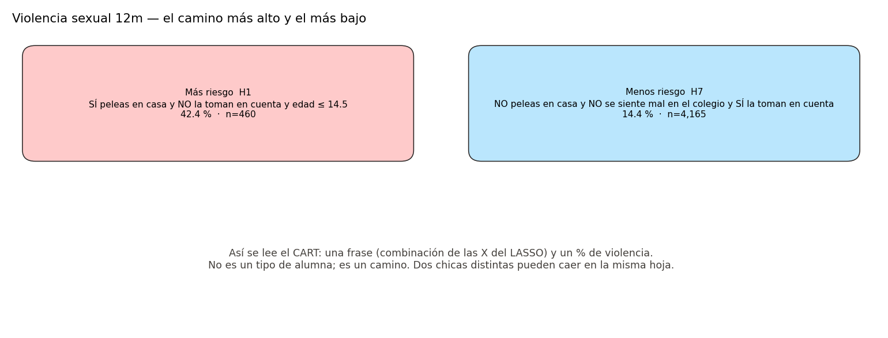

### Qué X pesaron

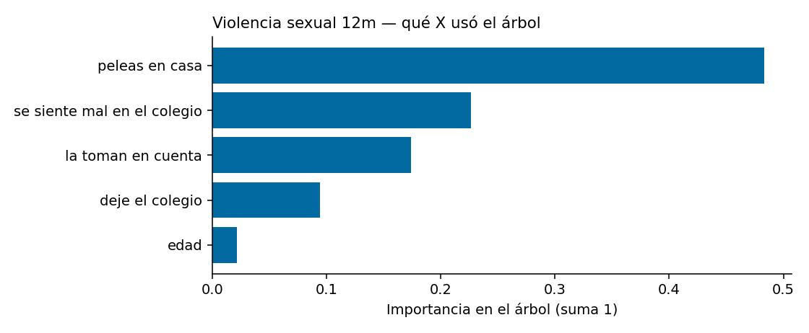

No mezclar `H1` de este doc con `si-1` del k-medias: no son lo mismo.
