# k-medias CRS04 por tipo de violencia

> **Qué es este informe.** Tipos de alumna **dentro** de las que sí reportaron una violencia y **dentro** de las que no. Primero se filtra; después se agrupa. X = las 13 del LASSO 3/3.
> **Qué no es.** No predice quién va a sufrir violencia. No son reglas SI–ENTONCES (eso es [perfiles_cart_crs04.md](perfiles_cart_crs04.md)). No es el LASSO.
> **Tipo.** Resultado del modelo.
> **Lo escribe.** `scripts/modelos/perfiles_kmeans_crs04.py` (Python → markdown; no es Rmd).

## Guía de lectura (para quien no arma el modelo)

Este informe no predice quién va a sufrir violencia. **Agrupa alumnas que se parecen en la casa, las actitudes y el colegio**, y *después* mira cuánta violencia hay en cada grupo.

Piénsalo como ordenar fichas por color y tamaño, y al final preguntar: “en este montón, ¿cuántas reportaron violencia?”. El color y el tamaño son las 13 preguntas. La violencia es lo que se cuenta al cierre. **No se usó la violencia para armar los montones.**

### De dónde salen las 13 preguntas

Antes hubo un LASSO: un modelo que, de muchas preguntas, se quedó con las que servían para las tres violencias a la vez (psicológica, física y sexual). Esas 13 son las únicas que entran aquí. Edad, si la toman en cuenta, si hay peleas en casa, si se queda sola, si se siente mal en el colegio, etc. No entran etnia, idioma, ni “tiene mamá”, porque el LASSO las apagó en al menos un tipo.

### Qué se hizo, en orden

1. Se toma a las alumnas de 12 a 17 (cuestionario del colegio). Hay 9,575 en estas tablas; representan a 1,415,383 chicas en el país (eso es la **N**: cada alumna “pesa” distinto según el diseño de la encuesta).
2. Se **parte** la muestra: las que sí reportaron una violencia y las que no. Eso se hace **cuatro veces**: alguna (cualquiera de las tres), solo psicológica, solo física, solo sexual.
3. **Adentro** de las que sí, se arman 3 tipos. **Adentro** de las que no, otros 3 tipos. No se mezclan. El “sí” de física no se compara en el mismo cluster con el “no” de física.
4. Recién ahí se mira: en este tipo, ¿cuánta psicológica / física / sexual hay?

Si el filtro es “física = no”, esa chica **igual puede** haber reportado psicológica o sexual. Por eso las tablas siempre muestran las tres. Solo cuando el filtro es *alguna violencia = no* las tres quedan en 0 %.

### Palabras que aparecen

| Lo que ves | En cristiano |
| --- | --- |
| **n** | Cuántas alumnas hay en la encuesta en ese grupo. |
| **N** | A cuántas chicas del país equivale ese grupo (con el peso de la encuesta). Es el número que importa para decir “este tipo es grande”. |
| **%** | Salvo la edad, casi todo es “de cada 100 de este grupo, cuántas dijeron que sí”. |
| **Cluster** o `psic_si-1` | Un tipo. El nombre: *qué filtro* + *sí o no* + *número*. El 1 suele ser el de más “carga” (más peleas / más otras violencias). |
| **k = 3** | Pedimos tres tipos por lado. No es que existan solo tres en la vida real; es un recorte para poder contarlos. |
| **Silueta** | Nota de 0 a 1 de “qué tan nítidos quedaron los tipos”. Cerca de 0.1–0.15, como aquí, significa que se parecen entre sí: los grupos **no** son islas. Sirve igual para describir, no para decir “descubrimos tres especies”. |
| **X** | Las 13 preguntas. |
| **Y** | La violencia (lo que se mira después). |

### Cómo leer cada gráfico (el mismo orden en todas las secciones)

**1. Barra del filtro (sí vs no).**  
Qué es: cuántas están de un lado y del otro *antes* de agrupar.  
Cómo se lee: “el 26 % reportó física”.  
Qué no implica: no es un perfil. Es solo el tamaño del cajón.

**2. El mapa con puntos de colores (PCA).**  
Qué es: cada puntito es una alumna. El color es el tipo que le tocó. Las **cruces** son el centro de cada tipo.  
El problema: las 13 preguntas no caben en una hoja. Entonces se inventan 2 ejes resumen, **PC1** y **PC2**, y se dibuja a las chicas en ese plano.  
Cómo se lee: si un color se junta a la derecha y otro a la izquierda, esos tipos se distinguen en lo que mide PC1. Si todos los colores están revueltos, el dibujo no alcanza (pasa mucho: el plano solo muestra ~20 % de las diferencias).  
Qué implica: **no** es que el agrupamiento haya fallado. Es que estás viendo un croquis. La violencia no está en este mapa.

**3. PC1 y PC2, sin jerga.**

- **PC** = “componente principal” = un **eje resumen**. Mezcla las 13 preguntas en una sola dirección, como una nota que junta “peleas + se siente mal + no la escuchan”.
- **PC1** (izquierda ↔ derecha) = el resumen que **más** diferencia a *estas* chicas. Quien está a la **derecha** se parece más a las preguntas que el biplot tira a la derecha (muchas veces: “debe trabajar”, “padres pueden golpear”). Quien está a la **izquierda**, a las del otro lado (muchas veces: “la toman en cuenta”).
- **PC2** (abajo ↔ arriba) = el **segundo** resumen, otra cosa, para no repetir PC1. A veces es edad o “colegio de mujeres” vs “se queda sola”.
- El **porcentaje** al lado de PC1 (p. ej. 12 %) = cuánto de “en qué se distinguen estas 13 respuestas” cabe en ese eje. 12 % implica que el **88 % no se ve** en el ancho de la figura.
- **PC1 + PC2 ≈ 20 %** implica que el mapa es un dibujo pobre a propósito. Úsalo para intuir, no para decidir.

**4. El biplot (flechas).**  
Qué es: cada flecha es **una** pregunta. Si la alumna dijo que sí (o es mayor, en el caso de la edad), su puntito se mueve hacia esa flecha.  
Cómo se lee: flechas **juntas** = esas cosas suelen ir a la par (peleas y se queda sola). Flechas **opuestas** = contrastan (la toman en cuenta vs peleas).  
Qué implica: te dice **qué significa** “derecha” e “izquierda” en el mapa de arriba. Sin el biplot, PC1 es un número hueco.

**5. Los 13 cuadritos (una barra por pregunta).**  
Qué es: para cada pregunta, el % de cada tipo que la tiene (la edad va en años).  
Cómo se lee: “en el tipo 1, el 74 % se queda sola; en el tipo 3, el 59 %”.  
Qué implica: **así se nombra el perfil**. Si un tipo sale 100 % “colegio de mujeres” o 100 % “vive con tío”, el algoritmo encontró esa sola pregunta, no un “tipo de hogar” rico. Trátalo como corte flaco, no como hallazgo profundo.

**6. Las barras largas de las 13 juntas.**  
Es lo mismo que los cuadritos, en una sola figura. Misma lectura.

**7. La edad.**  
Media de años de cada tipo. Si la brecha es 0.2 años, **no implica** nada útil. Si un tipo es más joven y además tiene más física, eso se confirma en el gráfico de las tres violencias, no aquí.

**8. El gráfico de las tres violencias.**  
Qué es: **después** de armar el grupo, qué % reportó psicológica, física y sexual.  
Cómo se lee, lado **sí**: todas ya tienen la violencia del filtro (p. ej. todas física = 100 %). Lo que cambia es si **además** tienen las otras. Un tipo con 45 % sexual vs otro con 38 % implica más superposición, no “más física” (ya es 100 %).  
Cómo se lee, lado **no**: nadie tiene la del filtro. Si ves 9 % física en “no psicológica”, son chicas **sin** psicológica **con** física.  
Qué no implica: no es causa. “Este tipo tiene más peleas y más física” no prueba que las peleas produzcan la física. Es que esas cosas se juntan.

### Cómo se nombra un tipo (receta)

Mira los 13 cuadritos: qué barras están más altas que en los otros tipos. Eso es el nombre (“casa en pelea, no la escuchan, se queda sola”). Luego mira las tres violencias: “y en este tipo hay más física superpuesta”. No nombres el tipo “las violentadas”: todas las del lado sí ya lo son, por el filtro.

### Lo que este informe no es

- No es un ranking de colegios ni de departamentos.
- No es “estas 13 preguntas causan violencia”.
- No es un árbol de “si peleas entonces…”. Eso es el CART: [perfiles_cart_crs04.md](perfiles_cart_crs04.md).
- Un tipo con n = 120 alumnas no se cuenta en un discurso público como si fuera un tercio del país.

Detalle LASSO (cómo se eligieron las 13): [lasso_crs04.md](lasso_crs04.md).

## Qué X usó (primer filtro LASSO)

Coef ≠ 0 en los tres targets. Son 13: `edad`, `toma_en_cuenta`, `act_trabajar`, `act_deje_colegio`, `act_padres_golpear`, `vive_hermana`, `vive_tio`, `se_queda_sola`, `falta_colegio`, `peleas_casa`, `ie_mujeres`, `se_siente_mal`, `jalo_curso`.

### Entran (13)

| Variable | Qué es | En cuántos LASSO | ¿Entra al k-medias? |
| --- | --- | ---: | --- |
| `edad` | Edad (lineal) | 3/3 | sí (3/3) |
| `toma_en_cuenta` | Toman en cuenta su opinión | 3/3 | sí (3/3) |
| `act_trabajar` | Actitud: debe trabajar si falta plata | 3/3 | sí (3/3) |
| `act_deje_colegio` | Actitud: padres deciden que deje el colegio | 3/3 | sí (3/3) |
| `act_padres_golpear` | Actitud: padres tienen derecho a golpear | 3/3 | sí (3/3) |
| `vive_hermana` | Vive con hermana/s | 3/3 | sí (3/3) |
| `vive_tio` | Vive con tío | 3/3 | sí (3/3) |
| `se_queda_sola` | Se queda sola sin adulto | 3/3 | sí (3/3) |
| `falta_colegio` | Falta al colegio para ayudar | 3/3 | sí (3/3) |
| `peleas_casa` | Peleas en casa | 3/3 | sí (3/3) |
| `ie_mujeres` | IE de mujeres | 3/3 | sí (3/3) |
| `se_siente_mal` | Se siente mal/muy mal en el colegio | 3/3 | sí (3/3) |
| `jalo_curso` | Jaló un curso (2023) | 3/3 | sí (3/3) |

### No entran

| Variable | Qué es | En cuántos LASSO | ¿Entra al k-medias? |
| --- | --- | ---: | --- |
| `pers` | Tamaño del hogar | 2/3 | no |
| `alguna_discapacidad` | Alguna discapacidad | 2/3 | no |
| `tiene_mama` | Tiene mamá | 0/3 | no |
| `tiene_papa` | Tiene papá | 0/3 | no |
| `vive_madrastra` | Vive con madrastra | 0/3 | no |
| `vive_padrastro` | Vive con padrastro | 1/3 | no |
| `vive_hermano` | Vive con hermano/s | 2/3 | no |
| `vive_abuela` | Vive con abuela | 2/3 | no |
| `vive_abuelo` | Vive con abuelo | 1/3 | no |
| `vive_tia` | Vive con tía | 1/3 | no |
| `vive_prima` | Vive con prima | 1/3 | no |
| `vive_primo` | Vive con primo | 0/3 | no |
| `vive_otros_parientes` | Vive con otros parientes | 1/3 | no |
| `vive_otra_persona` | Vive con otra persona | 2/3 | no |
| `duerme_sola_cuarto` | Duerme sola en el cuarto | 2/3 | no |
| `sin_comer` | La dejaron sin comer | 2/3 | no |
| `rural` | IE rural | 2/3 | no |
| `turno_tarde` | Turno tarde | 1/3 | no |
| `repitio` | Repitió de grado | 2/3 | no |
| `amigos_colegio` | Mejores amigos en este colegio | 2/3 | no |
| `etnia_quechua` | Etnia: quechua (ref. mestiza) | 2/3 | no |
| `etnia_afroperuana` | Etnia: afroperuana | 2/3 | no |
| `etnia_blanca` | Etnia: blanca | 1/3 | no |
| `etnia_no_sabe` | Etnia: no sabe | 1/3 | no |
| `etnia_otra_indigena_otro` | Etnia: otra indígena / otro | 0/3 | no |
| `idioma_quechua` | Idioma: quechua (ref. castellano) | 0/3 | no |
| `idioma_otro` | Idioma: otro | 0/3 | no |
| `cuidador_padre` | Cuidador: padre (ref. madre) | 1/3 | no |
| `cuidador_abuelos` | Cuidador: abuelos | 0/3 | no |
| `cuidador_hermanos` | Cuidador: hermanos | 2/3 | no |
| `cuidador_otros` | Cuidador: otros | 1/3 | no |

---

## Alguna violencia (psic o fís o sexual)

**Qué es.** Esta barra parte la muestra *antes* del k-medias. Sí = reportó `alguna_violencia`; no = no la reportó.

**Qué implica.** El 65.8% de la N (n=6,339) entra al cluster de las que sí; el 34.2% (n=3,236) al de las que no. El algoritmo **no usa** esta Y para juntar: solo las 13 X. Si el filtro es un tipo (p. ej. física), las del “no” igual pueden tener psicológica o sexual.

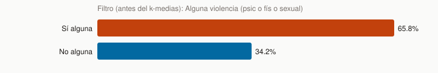

### Las que sí — Alguna violencia (psic o fís o sexual)

n = 6,339 · N = 931,427 · silueta k=3: **0.134**

| k | Silueta (sin peso) |
| ---: | ---: |
| 2 | 0.088 |
| 3 | 0.134 ← usado |
| 4 | 0.119 |

| Cluster | n | N | % psic. | % fís. | % sexual | Edad (lineal) | Toman en cuenta su opinión | Actitud: debe trabajar si falta plata | Actitud: padres deciden que deje el colegio | Actitud: padres tienen derecho a golpear | Vive con hermana/s | Vive con tío | Se queda sola sin adulto | Falta al colegio para ayudar | Peleas en casa | IE de mujeres | Se siente mal/muy mal en el colegio | Jaló un curso (2023) |
| --- | --- | --- | ---: | ---: | ---: | ---: | ---: | ---: | ---: | ---: | ---: | ---: | ---: | ---: | ---: | ---: | ---: | ---: |
| `alguna_si-1` | 2,145 | 287,403 | 92.5% | 54.5% | 39.3% | 13.94 | 67.1% | 58.9% | 28.2% | 66.3% | 59.9% | 13.1% | 74.4% | 19.4% | 73.5% | 0.0% | 31.0% | 43.5% |
| `alguna_si-2` | 603 | 84,089 | 91.0% | 38.6% | 30.2% | 14.37 | 86.6% | 17.6% | 17.6% | 31.1% | 51.6% | 6.5% | 63.7% | 7.1% | 60.6% | 100.0% | 12.1% | 26.0% |
| `alguna_si-3` | 3,591 | 559,934 | 89.7% | 31.5% | 33.4% | 14.57 | 94.7% | 8.3% | 7.8% | 21.6% | 54.8% | 8.8% | 59.4% | 3.4% | 50.7% | 0.0% | 7.3% | 20.3% |

#### Mapa PCA

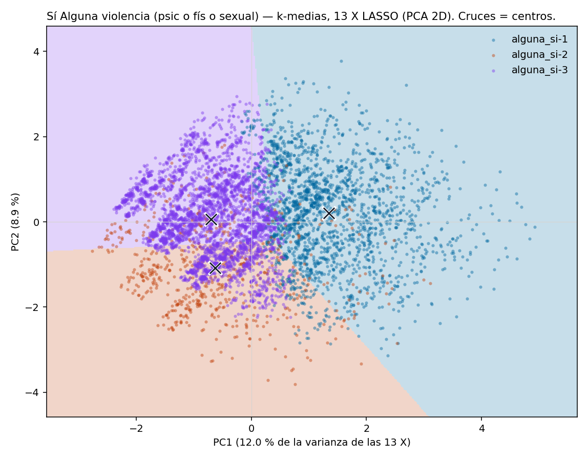

**Qué es.** Cada punto = una alumna. El k-medias las agrupó con las 13 X a la vez. Este dibujo **aplasta** esas 13 dimensiones a 2 ejes para que se vea. PC = componente principal = un eje resumen (un combo de las 13 X). No es violencia: es un resumen de casa / actitudes / colegio.

**PC1 (eje de lado a lado) significa** el combo que más diferencia a estas chicas (12 % de toda la variación de las 13 X). A la **derecha** tiende a haber más: debe trabajar, padres golpear. A la **izquierda**, más: la toman en cuenta.

**PC2 (eje de abajo a arriba) significa** el segundo combo, distinto del primero (9 %). Arriba: padres golpear. Abajo: peleas casa, se queda sola.

**Qué implica.** PC1+PC2 solo muestran 21 % de cómo se distinguen las X. El otro 79 % no cabe en el plano: por eso los colores se mezclan. No quiere decir que los grupos no existan; quiere decir que 2D no alcanza. La cruz blanca es el centro de cada tipo. `alguna_si-3` es el más grande (n=3,591).

#### Biplot (cada variable)

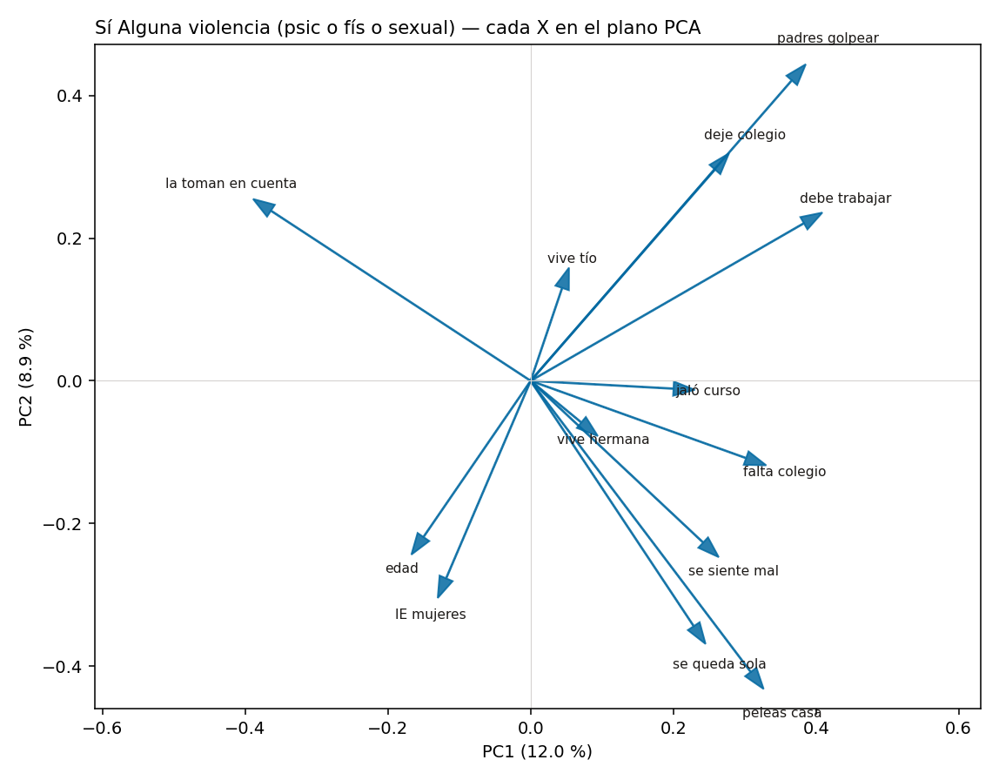

**Qué es.** Cada flecha es **una** de las 13 X. Si la alumna tiene esa X (sí = 1, o más edad), el punto se mueve hacia la flecha. Flechas juntas = esas X suelen ir a la par. Flechas opuestas = contrastan.

**PC1 implica:** un eje “debe trabajar, padres golpear vs la toman en cuenta”. Las que más pesan: debe trabajar (suma al PC1), la toman en cuenta (resta al PC1), padres golpear (suma al PC1). Ejemplo: si “la toman en cuenta” apunta al revés de “peleas / se siente mal”, tener voz en casa y vivir peleas no tiran para el mismo lado.

**PC2 implica:** un segundo eje “padres golpear vs peleas casa, se queda sola”. Pesan: padres golpear (suma al PC2), peleas casa (resta al PC2), se queda sola (resta al PC2).

#### Una barra por variable

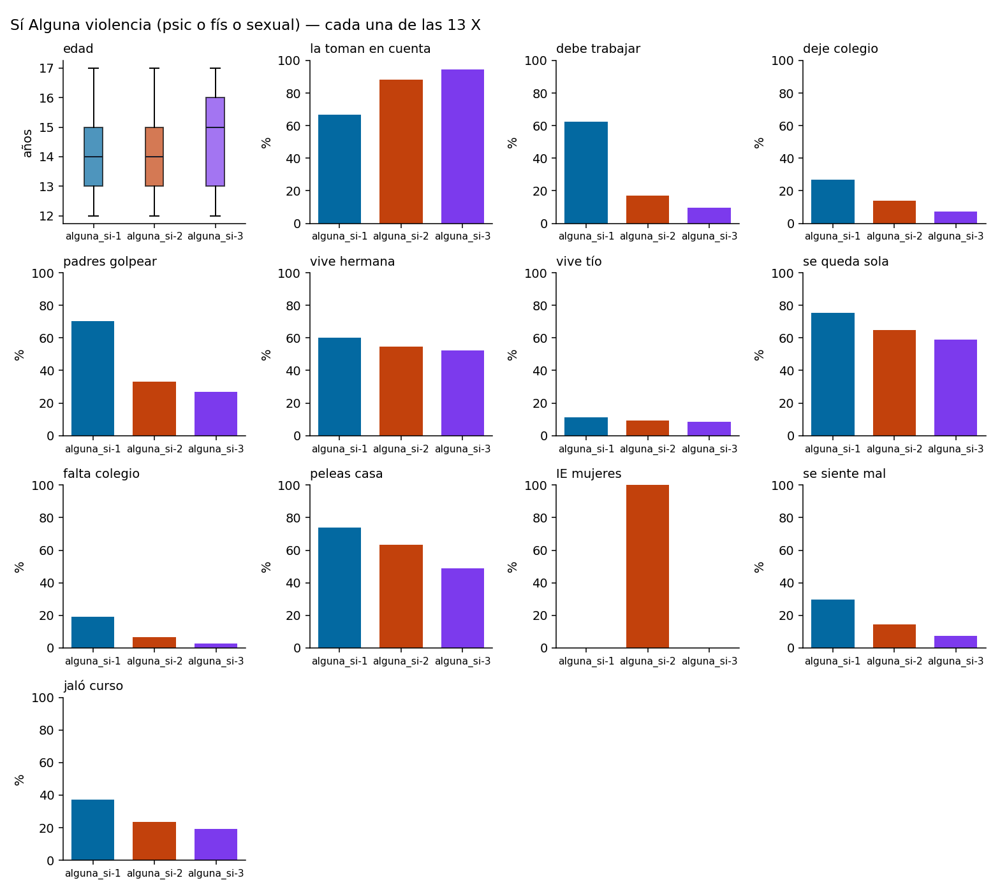

**Qué es.** Un panel por cada X del LASSO. Edad en años; el resto = % del cluster que tiene esa X.

**IE mujeres:** `alguna_si-2` tiene 100.0% y `alguna_si-1` 0.0%. Eso implica que el k-medias usó esta X para apartar esos dos tipos.

**edad:** `alguna_si-3` tiene 14.6 años y `alguna_si-1` 13.9 años. Eso implica que el k-medias usó esta X para apartar esos dos tipos.

**debe trabajar:** `alguna_si-1` tiene 58.9% y `alguna_si-3` 8.3%. Eso implica que el k-medias usó esta X para apartar esos dos tipos.

**padres golpear:** `alguna_si-1` tiene 66.3% y `alguna_si-3` 21.6%. Eso implica que el k-medias usó esta X para apartar esos dos tipos.

`alguna_si-2` es casi 100 % IE de mujeres: el algoritmo encontró el colegio de señoritas, no un “tipo de casa”.

#### Barras de las 13 X juntas

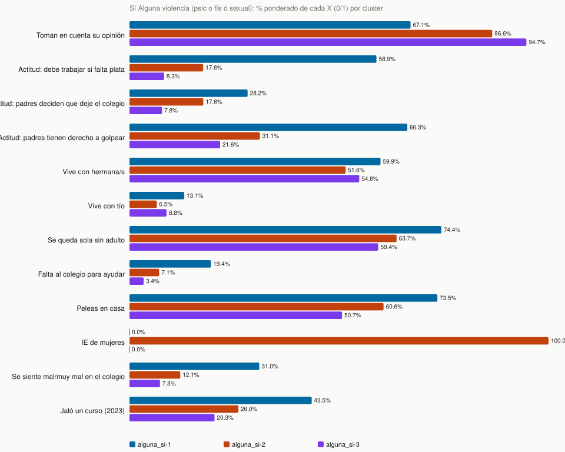

**Qué es.** Un panel por cada X del LASSO. Edad en años; el resto = % del cluster que tiene esa X.

**IE mujeres:** `alguna_si-2` tiene 100.0% y `alguna_si-1` 0.0%. Eso implica que el k-medias usó esta X para apartar esos dos tipos.

**edad:** `alguna_si-3` tiene 14.6 años y `alguna_si-1` 13.9 años. Eso implica que el k-medias usó esta X para apartar esos dos tipos.

**debe trabajar:** `alguna_si-1` tiene 58.9% y `alguna_si-3` 8.3%. Eso implica que el k-medias usó esta X para apartar esos dos tipos.

**padres golpear:** `alguna_si-1` tiene 66.3% y `alguna_si-3` 21.6%. Eso implica que el k-medias usó esta X para apartar esos dos tipos.

`alguna_si-2` es casi 100 % IE de mujeres: el algoritmo encontró el colegio de señoritas, no un “tipo de casa”.

#### Edad

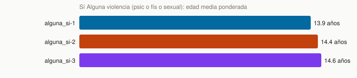

**Qué es.** Edad media de cada tipo (años). El k-medias sí usó `edad` (estandarizada).

`alguna_si-1` = 13.94 años; `alguna_si-3` = 14.57 (brecha 0.64). Implica que `alguna_si-1` es un poco más joven. Eso no es automáticamente “más violencia”: mira el gráfico de las tres Y.

#### Cruce con los tres tipos de violencia

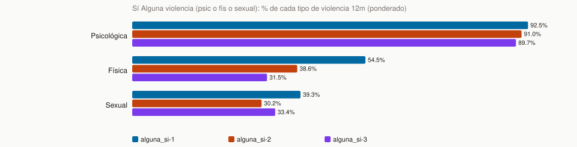

**Qué es.** Violencia 12m **después** de armar el grupo. No se usó para clusterizar.

`alguna_si-1` (n=2,145): psicológica 92.5%, física 54.5%, sexual 39.3%.
`alguna_si-2` (n=603): psicológica 91.0%, física 38.6%, sexual 30.2%.
`alguna_si-3` (n=3,591): psicológica 89.7%, física 31.5%, sexual 33.4%.

**Qué implica.** Aquí **todas** ya tienen `alguna_violencia` = 1 (por el filtro). Si un grupo tiene más física o más sexual que otro, ese tipo de casa/actitud se junta más con violencia **superpuesta**, no con “descubrir” el filtro.

### Las que no — Alguna violencia (psic o fís o sexual)

n = 3,236 · N = 483,956 · silueta k=3: **0.133**

| k | Silueta (sin peso) |
| ---: | ---: |
| 2 | 0.120 |
| 3 | 0.133 ← usado |
| 4 | 0.171 |

| Cluster | n | N | % psic. | % fís. | % sexual | Edad (lineal) | Toman en cuenta su opinión | Actitud: debe trabajar si falta plata | Actitud: padres deciden que deje el colegio | Actitud: padres tienen derecho a golpear | Vive con hermana/s | Vive con tío | Se queda sola sin adulto | Falta al colegio para ayudar | Peleas en casa | IE de mujeres | Se siente mal/muy mal en el colegio | Jaló un curso (2023) |
| --- | --- | --- | ---: | ---: | ---: | ---: | ---: | ---: | ---: | ---: | ---: | ---: | ---: | ---: | ---: | ---: | ---: | ---: |
| `alguna_no-1` | 120 | 16,002 | 0.0% | 0.0% | 0.0% | 14.63 | 96.2% | 27.7% | 10.4% | 35.2% | 52.0% | 3.8% | 56.9% | 100.0% | 37.5% | 5.4% | 1.2% | 22.1% |
| `alguna_no-2` | 1,040 | 135,801 | 0.0% | 0.0% | 0.0% | 14.46 | 94.5% | 34.8% | 14.7% | 100.0% | 63.9% | 7.6% | 47.4% | 0.0% | 32.0% | 8.7% | 3.5% | 23.8% |
| `alguna_no-3` | 2,076 | 332,154 | 0.0% | 0.0% | 0.0% | 14.59 | 97.1% | 11.7% | 8.7% | 0.0% | 54.9% | 8.1% | 47.3% | 0.0% | 30.3% | 13.4% | 1.8% | 24.0% |

#### Mapa PCA

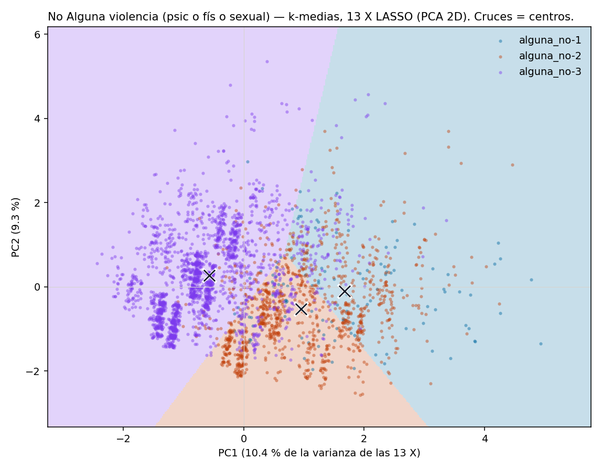

**Qué es.** Cada punto = una alumna. El k-medias las agrupó con las 13 X a la vez. Este dibujo **aplasta** esas 13 dimensiones a 2 ejes para que se vea. PC = componente principal = un eje resumen (un combo de las 13 X). No es violencia: es un resumen de casa / actitudes / colegio.

**PC1 (eje de lado a lado) significa** el combo que más diferencia a estas chicas (10 % de toda la variación de las 13 X). A la **derecha** tiende a haber más: debe trabajar, padres golpear, se queda sola. A la **izquierda**, más: esas X de la izquierda.

**PC2 (eje de abajo a arriba) significa** el segundo combo, distinto del primero (9 %). Arriba: peleas casa, se queda sola, se siente mal. Abajo: —.

**Qué implica.** PC1+PC2 solo muestran 20 % de cómo se distinguen las X. El otro 80 % no cabe en el plano: por eso los colores se mezclan. No quiere decir que los grupos no existan; quiere decir que 2D no alcanza. La cruz blanca es el centro de cada tipo. `alguna_no-3` es el más grande (n=2,076). `alguna_no-1` tiene n=120: es un cajón chico, no un perfil para armar política.

#### Biplot (cada variable)

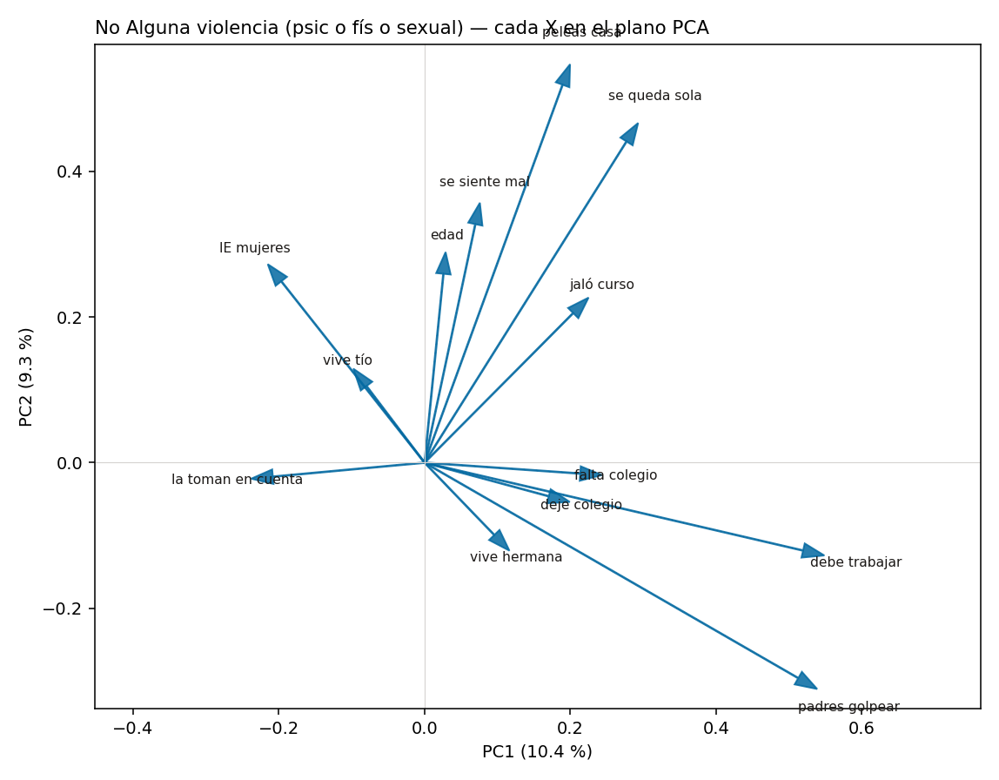

**Qué es.** Cada flecha es **una** de las 13 X. Si la alumna tiene esa X (sí = 1, o más edad), el punto se mueve hacia la flecha. Flechas juntas = esas X suelen ir a la par. Flechas opuestas = contrastan.

**PC1 implica:** un eje “debe trabajar, padres golpear, se queda sola vs —”. Las que más pesan: debe trabajar (suma al PC1), padres golpear (suma al PC1), se queda sola (suma al PC1). Ejemplo: si “la toman en cuenta” apunta al revés de “peleas / se siente mal”, tener voz en casa y vivir peleas no tiran para el mismo lado.

**PC2 implica:** un segundo eje “peleas casa, se queda sola, se siente mal vs —”. Pesan: peleas casa (suma al PC2), se queda sola (suma al PC2), se siente mal (suma al PC2).

#### Una barra por variable

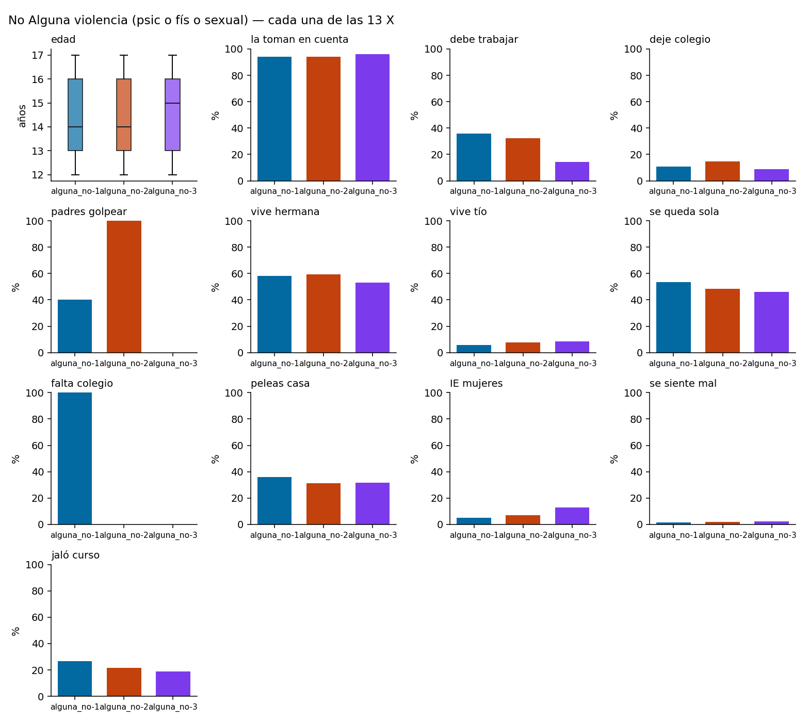

**Qué es.** Un panel por cada X del LASSO. Edad en años; el resto = % del cluster que tiene esa X.

**padres golpear:** `alguna_no-2` tiene 100.0% y `alguna_no-3` 0.0%. Eso implica que el k-medias usó esta X para apartar esos dos tipos.

**falta colegio:** `alguna_no-1` tiene 100.0% y `alguna_no-2` 0.0%. Eso implica que el k-medias usó esta X para apartar esos dos tipos.

**debe trabajar:** `alguna_no-2` tiene 34.8% y `alguna_no-3` 11.7%. Eso implica que el k-medias usó esta X para apartar esos dos tipos.

**edad:** `alguna_no-1` tiene 14.6 años y `alguna_no-2` 14.5 años. Eso implica que el k-medias usó esta X para apartar esos dos tipos.

`alguna_no-1` es casi 100 % “falta al colegio”: grupo flaco definido por una sola X. `alguna_no-2` es casi 100 % “padres tienen derecho a golpear”: otra vez un corte por una dummy, no un perfil mixto.

#### Barras de las 13 X juntas

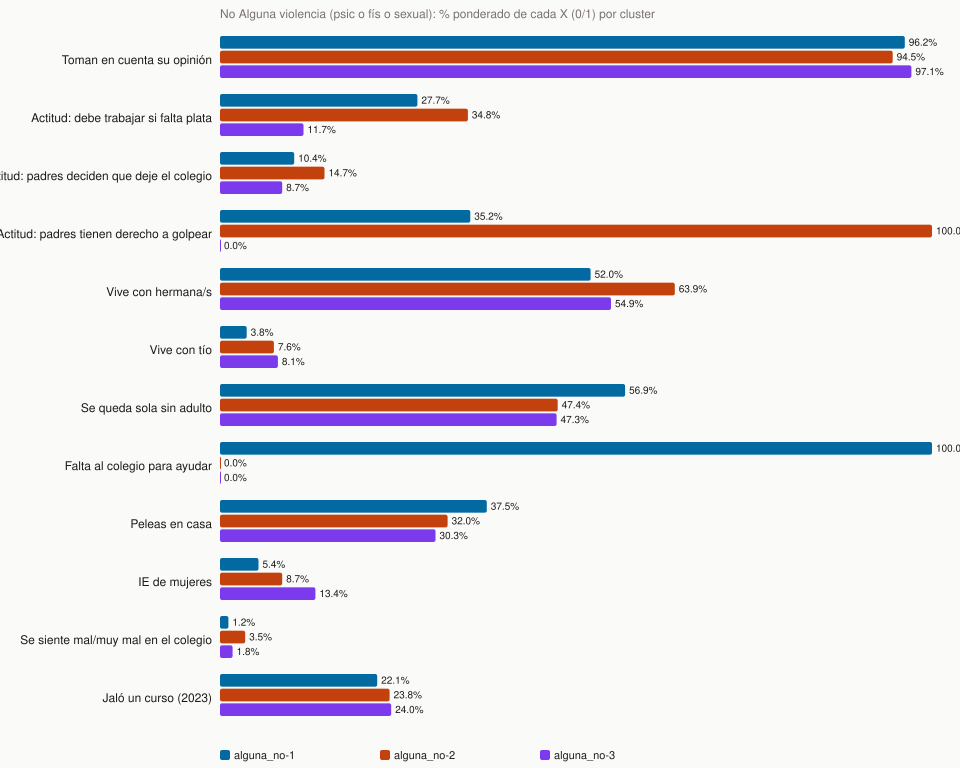

**Qué es.** Un panel por cada X del LASSO. Edad en años; el resto = % del cluster que tiene esa X.

**padres golpear:** `alguna_no-2` tiene 100.0% y `alguna_no-3` 0.0%. Eso implica que el k-medias usó esta X para apartar esos dos tipos.

**falta colegio:** `alguna_no-1` tiene 100.0% y `alguna_no-2` 0.0%. Eso implica que el k-medias usó esta X para apartar esos dos tipos.

**debe trabajar:** `alguna_no-2` tiene 34.8% y `alguna_no-3` 11.7%. Eso implica que el k-medias usó esta X para apartar esos dos tipos.

**edad:** `alguna_no-1` tiene 14.6 años y `alguna_no-2` 14.5 años. Eso implica que el k-medias usó esta X para apartar esos dos tipos.

`alguna_no-1` es casi 100 % “falta al colegio”: grupo flaco definido por una sola X. `alguna_no-2` es casi 100 % “padres tienen derecho a golpear”: otra vez un corte por una dummy, no un perfil mixto.

#### Edad

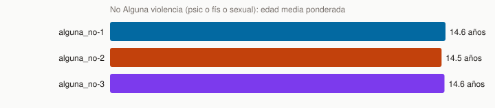

**Qué es.** Edad media de cada tipo (años). El k-medias sí usó `edad` (estandarizada).

`alguna_no-2` = 14.46 años; `alguna_no-1` = 14.63 (brecha 0.17). Casi no implica nada: la edad no es lo que parte estos tipos.

#### Cruce con los tres tipos de violencia

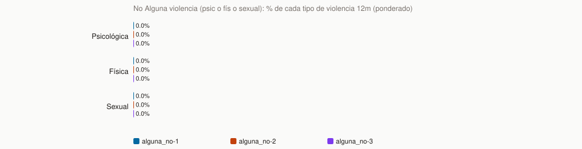

**Qué es.** Violencia 12m **después** de armar el grupo. No se usó para clusterizar.

`alguna_no-1` (n=120): psicológica 0.0%, física 0.0%, sexual 0.0%.
`alguna_no-2` (n=1,040): psicológica 0.0%, física 0.0%, sexual 0.0%.
`alguna_no-3` (n=2,076): psicológica 0.0%, física 0.0%, sexual 0.0%.

**Qué implica.** Aquí `alguna_violencia` = 0 para todas. Un % > 0 de psicológica/física/sexual es **otra** violencia, no la del filtro. Si los tres % son 0, este lado es “no reportó ninguna” (solo pasa con el filtro *alguna*).

## Violencia psicológica 12m

**Qué es.** Esta barra parte la muestra *antes* del k-medias. Sí = reportó `viol_psicologica_12m`; no = no la reportó.

**Qué implica.** El 59.7% de la N (n=5,722) entra al cluster de las que sí; el 40.3% (n=3,853) al de las que no. El algoritmo **no usa** esta Y para juntar: solo las 13 X. Si el filtro es un tipo (p. ej. física), las del “no” igual pueden tener psicológica o sexual.

### Las que sí — Violencia psicológica 12m

n = 5,722 · N = 844,334 · silueta k=3: **0.110**

| k | Silueta (sin peso) |
| ---: | ---: |
| 2 | 0.123 |
| 3 | 0.110 ← usado |
| 4 | 0.116 |

| Cluster | n | N | % psic. | % fís. | % sexual | Edad (lineal) | Toman en cuenta su opinión | Actitud: debe trabajar si falta plata | Actitud: padres deciden que deje el colegio | Actitud: padres tienen derecho a golpear | Vive con hermana/s | Vive con tío | Se queda sola sin adulto | Falta al colegio para ayudar | Peleas en casa | IE de mujeres | Se siente mal/muy mal en el colegio | Jaló un curso (2023) |
| --- | --- | --- | ---: | ---: | ---: | ---: | ---: | ---: | ---: | ---: | ---: | ---: | ---: | ---: | ---: | ---: | ---: | ---: |
| `psic_si-1` | 562 | 86,532 | 100.0% | 47.5% | 36.0% | 14.14 | 82.4% | 27.4% | 17.5% | 41.4% | 47.2% | 100.0% | 54.1% | 15.3% | 60.2% | 6.1% | 20.2% | 34.4% |
| `psic_si-2` | 2,190 | 271,919 | 100.0% | 48.0% | 34.2% | 14.07 | 82.4% | 35.5% | 23.1% | 99.7% | 58.6% | 0.0% | 69.2% | 11.6% | 62.5% | 8.2% | 18.6% | 29.7% |
| `psic_si-3` | 2,970 | 485,884 | 100.0% | 31.9% | 30.4% | 14.51 | 86.2% | 17.6% | 10.7% | 0.0% | 55.5% | 0.0% | 64.7% | 6.6% | 58.9% | 10.1% | 13.9% | 26.8% |

#### Mapa PCA

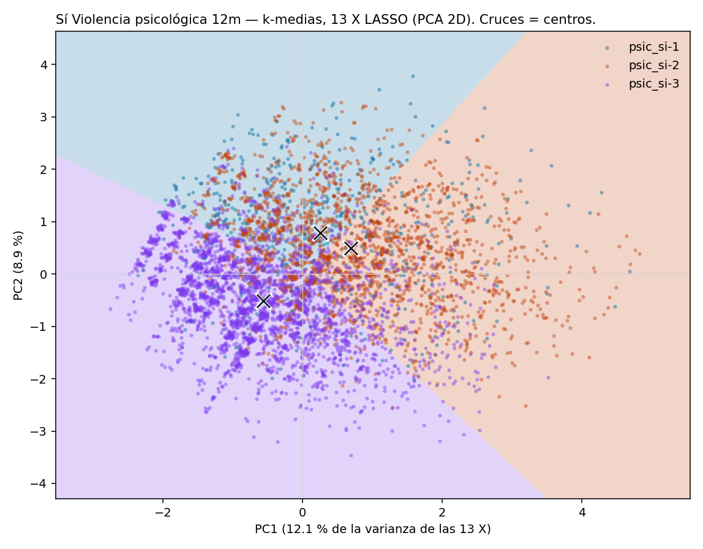

**Qué es.** Cada punto = una alumna. El k-medias las agrupó con las 13 X a la vez. Este dibujo **aplasta** esas 13 dimensiones a 2 ejes para que se vea. PC = componente principal = un eje resumen (un combo de las 13 X). No es violencia: es un resumen de casa / actitudes / colegio.

**PC1 (eje de lado a lado) significa** el combo que más diferencia a estas chicas (12 % de toda la variación de las 13 X). A la **derecha** tiende a haber más: debe trabajar, padres golpear. A la **izquierda**, más: la toman en cuenta.

**PC2 (eje de abajo a arriba) significa** el segundo combo, distinto del primero (9 %). Arriba: padres golpear. Abajo: peleas casa, edad.

**Qué implica.** PC1+PC2 solo muestran 21 % de cómo se distinguen las X. El otro 79 % no cabe en el plano: por eso los colores se mezclan. No quiere decir que los grupos no existan; quiere decir que 2D no alcanza. La cruz blanca es el centro de cada tipo. `psic_si-3` es el más grande (n=2,970).

#### Biplot (cada variable)

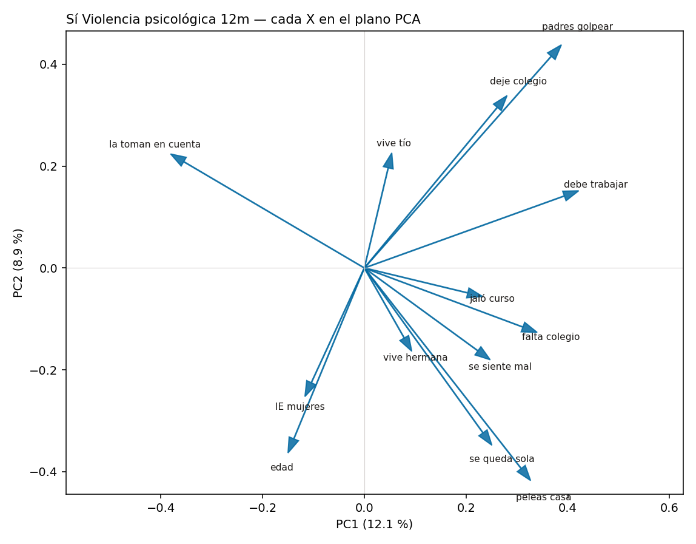

**Qué es.** Cada flecha es **una** de las 13 X. Si la alumna tiene esa X (sí = 1, o más edad), el punto se mueve hacia la flecha. Flechas juntas = esas X suelen ir a la par. Flechas opuestas = contrastan.

**PC1 implica:** un eje “debe trabajar, padres golpear vs la toman en cuenta”. Las que más pesan: debe trabajar (suma al PC1), padres golpear (suma al PC1), la toman en cuenta (resta al PC1). Ejemplo: si “la toman en cuenta” apunta al revés de “peleas / se siente mal”, tener voz en casa y vivir peleas no tiran para el mismo lado.

**PC2 implica:** un segundo eje “padres golpear vs peleas casa, edad”. Pesan: padres golpear (suma al PC2), peleas casa (resta al PC2), edad (resta al PC2).

#### Una barra por variable

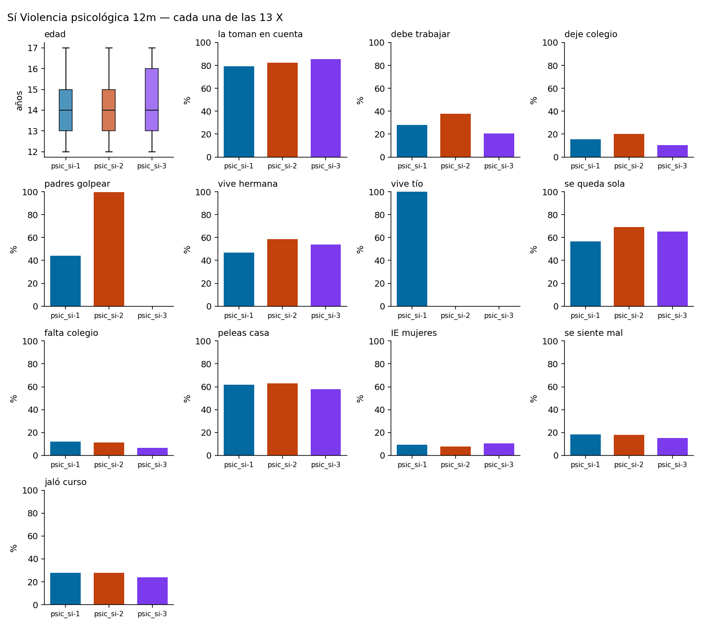

**Qué es.** Un panel por cada X del LASSO. Edad en años; el resto = % del cluster que tiene esa X.

**vive tío:** `psic_si-1` tiene 100.0% y `psic_si-2` 0.0%. Eso implica que el k-medias usó esta X para apartar esos dos tipos.

**padres golpear:** `psic_si-2` tiene 99.7% y `psic_si-3` 0.0%. Eso implica que el k-medias usó esta X para apartar esos dos tipos.

**edad:** `psic_si-3` tiene 14.5 años y `psic_si-2` 14.1 años. Eso implica que el k-medias usó esta X para apartar esos dos tipos.

**debe trabajar:** `psic_si-2` tiene 35.5% y `psic_si-3` 17.6%. Eso implica que el k-medias usó esta X para apartar esos dos tipos.

`psic_si-1` es casi 100 % “vive con tío”. `psic_si-2` es casi 100 % “padres tienen derecho a golpear”: otra vez un corte por una dummy, no un perfil mixto.

#### Barras de las 13 X juntas

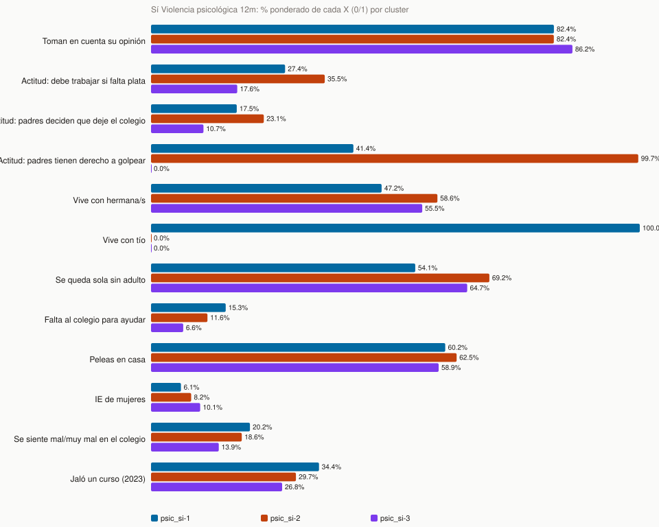

**Qué es.** Un panel por cada X del LASSO. Edad en años; el resto = % del cluster que tiene esa X.

**vive tío:** `psic_si-1` tiene 100.0% y `psic_si-2` 0.0%. Eso implica que el k-medias usó esta X para apartar esos dos tipos.

**padres golpear:** `psic_si-2` tiene 99.7% y `psic_si-3` 0.0%. Eso implica que el k-medias usó esta X para apartar esos dos tipos.

**edad:** `psic_si-3` tiene 14.5 años y `psic_si-2` 14.1 años. Eso implica que el k-medias usó esta X para apartar esos dos tipos.

**debe trabajar:** `psic_si-2` tiene 35.5% y `psic_si-3` 17.6%. Eso implica que el k-medias usó esta X para apartar esos dos tipos.

`psic_si-1` es casi 100 % “vive con tío”. `psic_si-2` es casi 100 % “padres tienen derecho a golpear”: otra vez un corte por una dummy, no un perfil mixto.

#### Edad

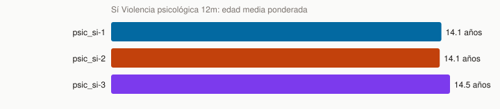

**Qué es.** Edad media de cada tipo (años). El k-medias sí usó `edad` (estandarizada).

`psic_si-2` = 14.07 años; `psic_si-3` = 14.51 (brecha 0.44). Implica que `psic_si-2` es un poco más joven. Eso no es automáticamente “más violencia”: mira el gráfico de las tres Y.

#### Cruce con los tres tipos de violencia

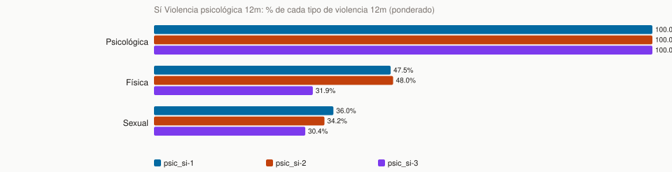

**Qué es.** Violencia 12m **después** de armar el grupo. No se usó para clusterizar.

`psic_si-1` (n=562): psicológica 100.0%, física 47.5%, sexual 36.0%.
`psic_si-2` (n=2,190): psicológica 100.0%, física 48.0%, sexual 34.2%.
`psic_si-3` (n=2,970): psicológica 100.0%, física 31.9%, sexual 30.4%.

**Qué implica.** Aquí **todas** ya tienen `viol_psicologica_12m` = 1 (por el filtro). Si un grupo tiene más física o más sexual que otro, ese tipo de casa/actitud se junta más con violencia **superpuesta**, no con “descubrir” el filtro.

### Las que no — Violencia psicológica 12m

n = 3,853 · N = 571,049 · silueta k=3: **0.164**

| k | Silueta (sin peso) |
| ---: | ---: |
| 2 | 0.116 |
| 3 | 0.164 ← usado |
| 4 | 0.126 |

| Cluster | n | N | % psic. | % fís. | % sexual | Edad (lineal) | Toman en cuenta su opinión | Actitud: debe trabajar si falta plata | Actitud: padres deciden que deje el colegio | Actitud: padres tienen derecho a golpear | Vive con hermana/s | Vive con tío | Se queda sola sin adulto | Falta al colegio para ayudar | Peleas en casa | IE de mujeres | Se siente mal/muy mal en el colegio | Jaló un curso (2023) |
| --- | --- | --- | ---: | ---: | ---: | ---: | ---: | ---: | ---: | ---: | ---: | ---: | ---: | ---: | ---: | ---: | ---: | ---: |
| `psic_no-1` | 801 | 107,463 | 0.0% | 9.0% | 13.8% | 14.79 | 94.4% | 100.0% | 10.4% | 54.1% | 59.9% | 7.9% | 52.1% | 5.2% | 37.0% | 0.0% | 3.7% | 27.4% |
| `psic_no-2` | 2,637 | 398,736 | 0.0% | 6.6% | 8.6% | 14.51 | 96.2% | 0.0% | 9.7% | 25.0% | 57.0% | 7.6% | 49.6% | 3.4% | 31.5% | 0.0% | 2.4% | 22.1% |
| `psic_no-3` | 415 | 64,851 | 0.0% | 4.9% | 7.6% | 14.56 | 97.1% | 11.7% | 15.5% | 22.7% | 59.6% | 7.7% | 42.1% | 1.5% | 34.9% | 100.0% | 3.2% | 27.4% |

#### Mapa PCA

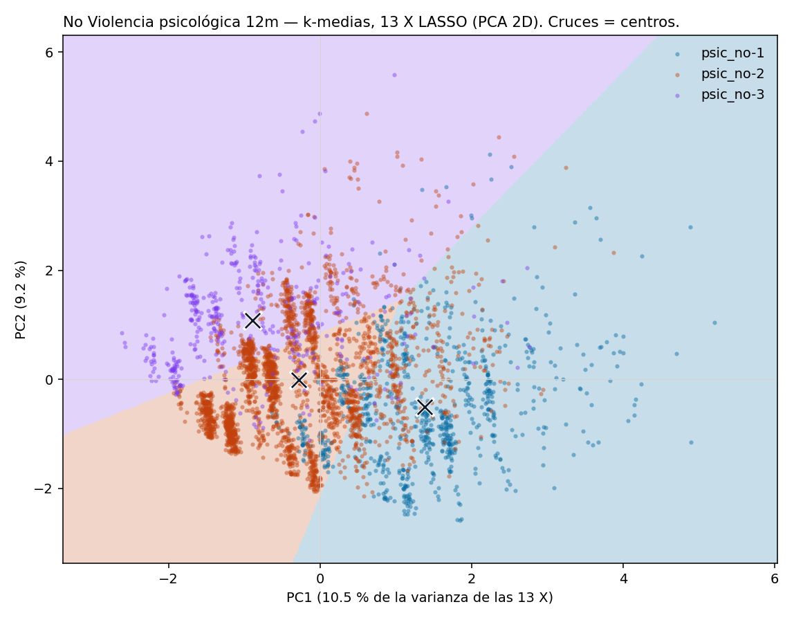

**Qué es.** Cada punto = una alumna. El k-medias las agrupó con las 13 X a la vez. Este dibujo **aplasta** esas 13 dimensiones a 2 ejes para que se vea. PC = componente principal = un eje resumen (un combo de las 13 X). No es violencia: es un resumen de casa / actitudes / colegio.

**PC1 (eje de lado a lado) significa** el combo que más diferencia a estas chicas (11 % de toda la variación de las 13 X). A la **derecha** tiende a haber más: debe trabajar, padres golpear. A la **izquierda**, más: la toman en cuenta.

**PC2 (eje de abajo a arriba) significa** el segundo combo, distinto del primero (9 %). Arriba: peleas casa, se queda sola, se siente mal. Abajo: —.

**Qué implica.** PC1+PC2 solo muestran 20 % de cómo se distinguen las X. El otro 80 % no cabe en el plano: por eso los colores se mezclan. No quiere decir que los grupos no existan; quiere decir que 2D no alcanza. La cruz blanca es el centro de cada tipo. `psic_no-2` es el más grande (n=2,637).

#### Biplot (cada variable)

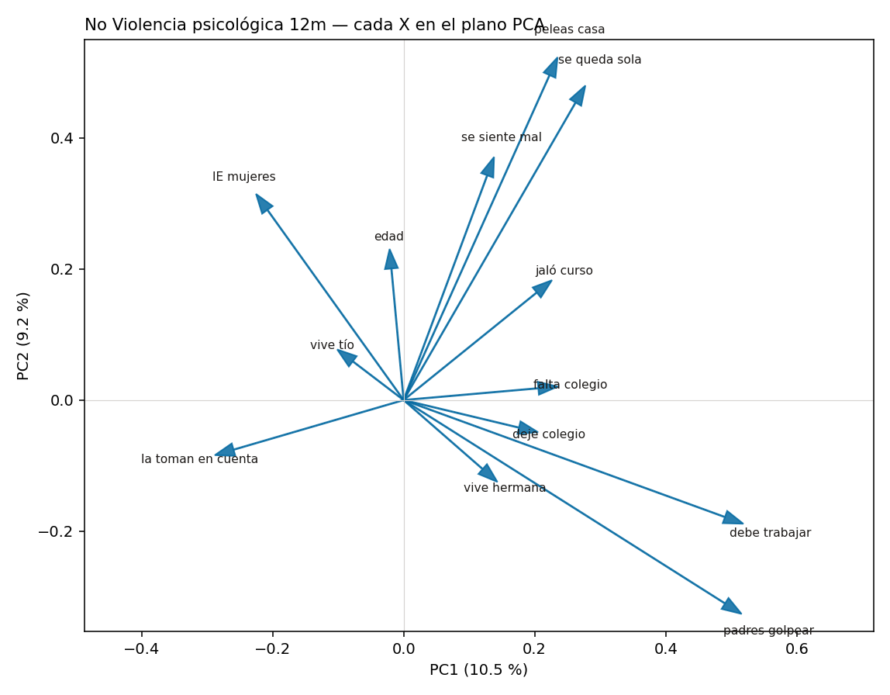

**Qué es.** Cada flecha es **una** de las 13 X. Si la alumna tiene esa X (sí = 1, o más edad), el punto se mueve hacia la flecha. Flechas juntas = esas X suelen ir a la par. Flechas opuestas = contrastan.

**PC1 implica:** un eje “debe trabajar, padres golpear vs la toman en cuenta”. Las que más pesan: debe trabajar (suma al PC1), padres golpear (suma al PC1), la toman en cuenta (resta al PC1). Ejemplo: si “la toman en cuenta” apunta al revés de “peleas / se siente mal”, tener voz en casa y vivir peleas no tiran para el mismo lado.

**PC2 implica:** un segundo eje “peleas casa, se queda sola, se siente mal vs —”. Pesan: peleas casa (suma al PC2), se queda sola (suma al PC2), se siente mal (suma al PC2).

#### Una barra por variable

**Qué es.** Un panel por cada X del LASSO. Edad en años; el resto = % del cluster que tiene esa X.

**debe trabajar:** `psic_no-1` tiene 100.0% y `psic_no-2` 0.0%. Eso implica que el k-medias usó esta X para apartar esos dos tipos.

**IE mujeres:** `psic_no-3` tiene 100.0% y `psic_no-1` 0.0%. Eso implica que el k-medias usó esta X para apartar esos dos tipos.

**padres golpear:** `psic_no-1` tiene 54.1% y `psic_no-3` 22.7%. Eso implica que el k-medias usó esta X para apartar esos dos tipos.

**edad:** `psic_no-1` tiene 14.8 años y `psic_no-2` 14.5 años. Eso implica que el k-medias usó esta X para apartar esos dos tipos.

`psic_no-1` es casi 100 % “debe trabajar si falta plata”. `psic_no-3` es casi 100 % IE de mujeres: el algoritmo encontró el colegio de señoritas, no un “tipo de casa”.

#### Barras de las 13 X juntas

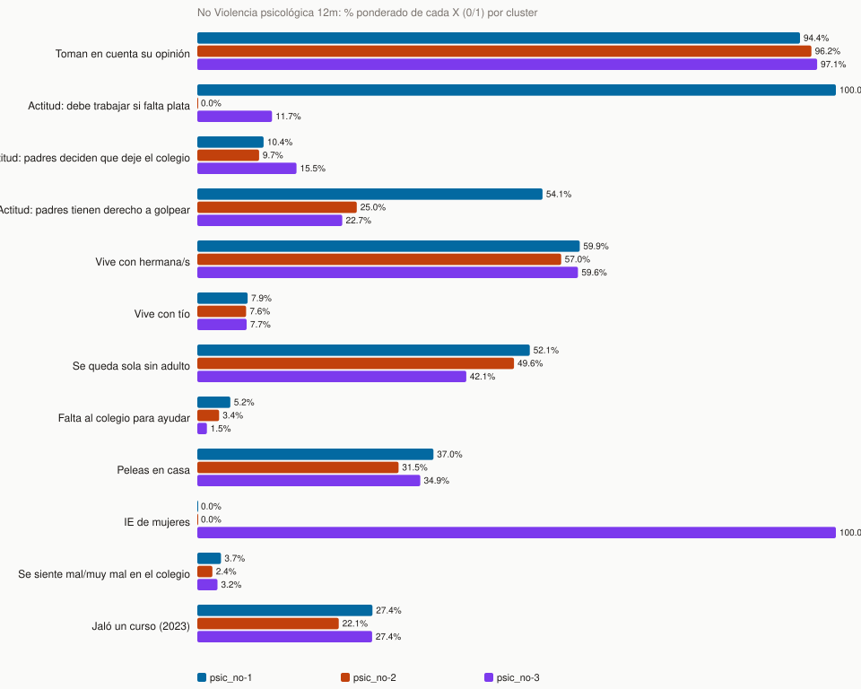

**Qué es.** Un panel por cada X del LASSO. Edad en años; el resto = % del cluster que tiene esa X.

**debe trabajar:** `psic_no-1` tiene 100.0% y `psic_no-2` 0.0%. Eso implica que el k-medias usó esta X para apartar esos dos tipos.

**IE mujeres:** `psic_no-3` tiene 100.0% y `psic_no-1` 0.0%. Eso implica que el k-medias usó esta X para apartar esos dos tipos.

**padres golpear:** `psic_no-1` tiene 54.1% y `psic_no-3` 22.7%. Eso implica que el k-medias usó esta X para apartar esos dos tipos.

**edad:** `psic_no-1` tiene 14.8 años y `psic_no-2` 14.5 años. Eso implica que el k-medias usó esta X para apartar esos dos tipos.

`psic_no-1` es casi 100 % “debe trabajar si falta plata”. `psic_no-3` es casi 100 % IE de mujeres: el algoritmo encontró el colegio de señoritas, no un “tipo de casa”.

#### Edad

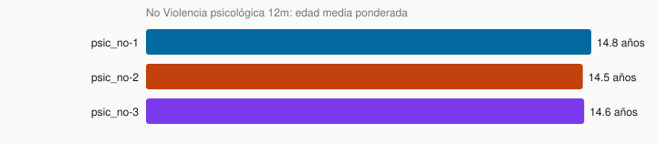

**Qué es.** Edad media de cada tipo (años). El k-medias sí usó `edad` (estandarizada).

`psic_no-2` = 14.51 años; `psic_no-1` = 14.79 (brecha 0.28). Casi no implica nada: la edad no es lo que parte estos tipos.

#### Cruce con los tres tipos de violencia

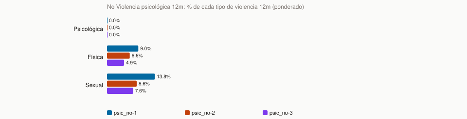

**Qué es.** Violencia 12m **después** de armar el grupo. No se usó para clusterizar.

`psic_no-1` (n=801): psicológica 0.0%, física 9.0%, sexual 13.8%.
`psic_no-2` (n=2,637): psicológica 0.0%, física 6.6%, sexual 8.6%.
`psic_no-3` (n=415): psicológica 0.0%, física 4.9%, sexual 7.6%.

**Qué implica.** Aquí `viol_psicologica_12m` = 0 para todas. Un % > 0 de psicológica/física/sexual es **otra** violencia, no la del filtro. Si los tres % son 0, este lado es “no reportó ninguna” (solo pasa con el filtro *alguna*).

## Violencia física 12m

**Qué es.** Esta barra parte la muestra *antes* del k-medias. Sí = reportó `viol_fisica_12m`; no = no la reportó.

**Qué implica.** El 25.8% de la N (n=2,598) entra al cluster de las que sí; el 74.2% (n=6,977) al de las que no. El algoritmo **no usa** esta Y para juntar: solo las 13 X. Si el filtro es un tipo (p. ej. física), las del “no” igual pueden tener psicológica o sexual.

### Las que sí — Violencia física 12m

n = 2,598 · N = 365,429 · silueta k=3: **0.114**

| k | Silueta (sin peso) |
| ---: | ---: |
| 2 | 0.102 |
| 3 | 0.114 ← usado |
| 4 | 0.121 |

| Cluster | n | N | % psic. | % fís. | % sexual | Edad (lineal) | Toman en cuenta su opinión | Actitud: debe trabajar si falta plata | Actitud: padres deciden que deje el colegio | Actitud: padres tienen derecho a golpear | Vive con hermana/s | Vive con tío | Se queda sola sin adulto | Falta al colegio para ayudar | Peleas en casa | IE de mujeres | Se siente mal/muy mal en el colegio | Jaló un curso (2023) |
| --- | --- | --- | ---: | ---: | ---: | ---: | ---: | ---: | ---: | ---: | ---: | ---: | ---: | ---: | ---: | ---: | ---: | ---: |
| `fis_si-1` | 276 | 43,853 | 93.7% | 100.0% | 45.2% | 13.75 | 79.8% | 27.9% | 23.4% | 50.3% | 47.3% | 100.0% | 66.4% | 19.3% | 70.7% | 4.4% | 23.4% | 39.4% |
| `fis_si-2` | 760 | 91,202 | 89.2% | 100.0% | 38.6% | 14.15 | 74.2% | 100.0% | 23.1% | 58.5% | 59.5% | 0.0% | 73.4% | 16.2% | 73.0% | 7.0% | 19.6% | 39.5% |
| `fis_si-3` | 1,562 | 230,375 | 88.5% | 100.0% | 38.1% | 13.98 | 80.2% | 0.0% | 13.8% | 40.4% | 55.3% | 0.0% | 73.0% | 9.0% | 67.5% | 10.4% | 18.8% | 28.9% |

#### Mapa PCA

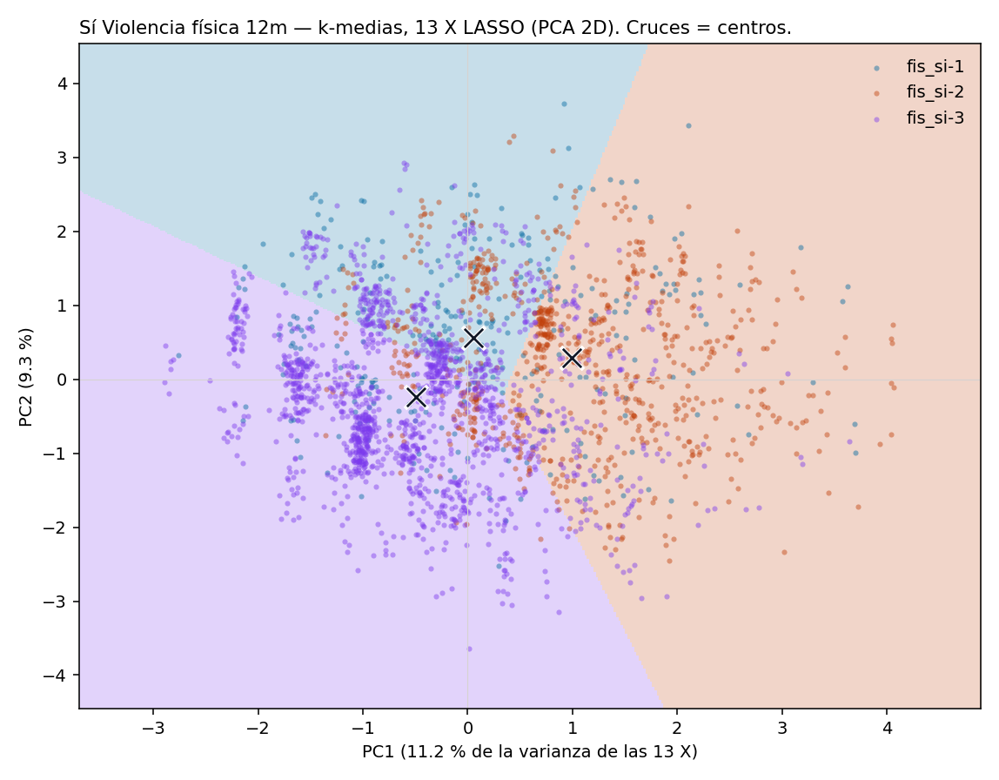

**Qué es.** Cada punto = una alumna. El k-medias las agrupó con las 13 X a la vez. Este dibujo **aplasta** esas 13 dimensiones a 2 ejes para que se vea. PC = componente principal = un eje resumen (un combo de las 13 X). No es violencia: es un resumen de casa / actitudes / colegio.

**PC1 (eje de lado a lado) significa** el combo que más diferencia a estas chicas (11 % de toda la variación de las 13 X). A la **derecha** tiende a haber más: debe trabajar, falta colegio, padres golpear. A la **izquierda**, más: esas X de la izquierda.

**PC2 (eje de abajo a arriba) significa** el segundo combo, distinto del primero (9 %). Arriba: padres golpear, la toman en cuenta. Abajo: se siente mal.

**Qué implica.** PC1+PC2 solo muestran 20 % de cómo se distinguen las X. El otro 80 % no cabe en el plano: por eso los colores se mezclan. No quiere decir que los grupos no existan; quiere decir que 2D no alcanza. La cruz blanca es el centro de cada tipo. `fis_si-3` es el más grande (n=1,562).

#### Biplot (cada variable)

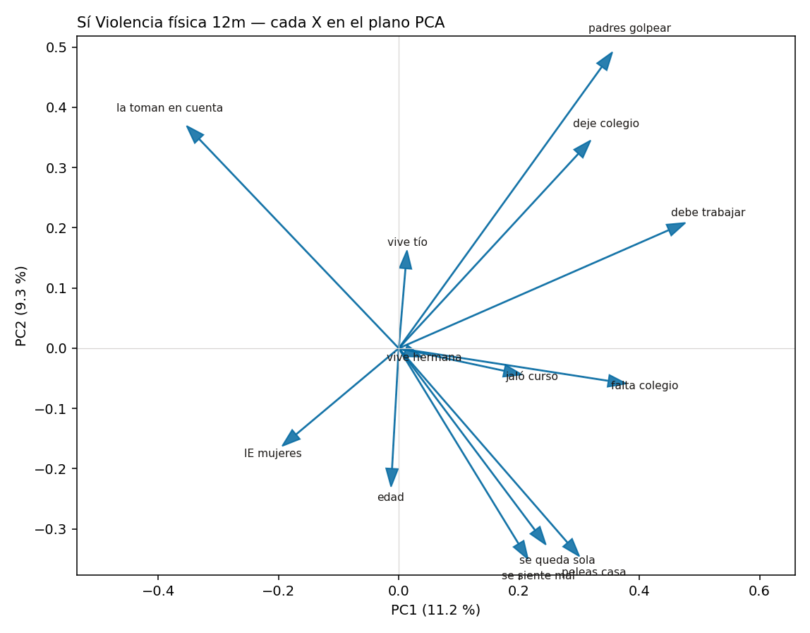

**Qué es.** Cada flecha es **una** de las 13 X. Si la alumna tiene esa X (sí = 1, o más edad), el punto se mueve hacia la flecha. Flechas juntas = esas X suelen ir a la par. Flechas opuestas = contrastan.

**PC1 implica:** un eje “debe trabajar, falta colegio, padres golpear vs —”. Las que más pesan: debe trabajar (suma al PC1), falta colegio (suma al PC1), padres golpear (suma al PC1). Ejemplo: si “la toman en cuenta” apunta al revés de “peleas / se siente mal”, tener voz en casa y vivir peleas no tiran para el mismo lado.

**PC2 implica:** un segundo eje “padres golpear, la toman en cuenta vs se siente mal”. Pesan: padres golpear (suma al PC2), la toman en cuenta (suma al PC2), se siente mal (resta al PC2).

#### Una barra por variable

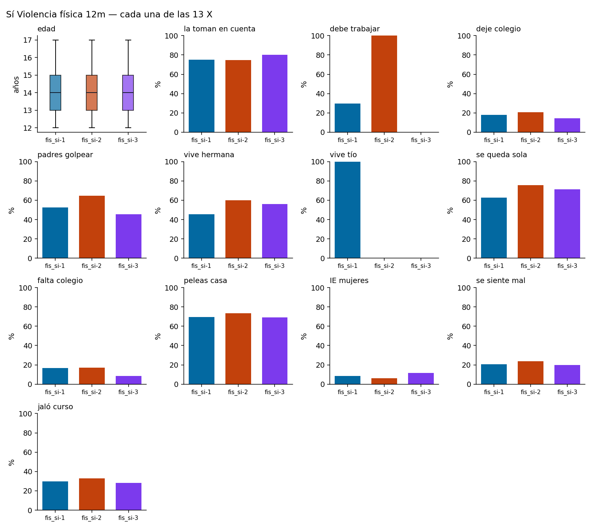

**Qué es.** Un panel por cada X del LASSO. Edad en años; el resto = % del cluster que tiene esa X.

**debe trabajar:** `fis_si-2` tiene 100.0% y `fis_si-3` 0.0%. Eso implica que el k-medias usó esta X para apartar esos dos tipos.

**vive tío:** `fis_si-1` tiene 100.0% y `fis_si-2` 0.0%. Eso implica que el k-medias usó esta X para apartar esos dos tipos.

**edad:** `fis_si-2` tiene 14.2 años y `fis_si-1` 13.7 años. Eso implica que el k-medias usó esta X para apartar esos dos tipos.

**padres golpear:** `fis_si-2` tiene 58.5% y `fis_si-3` 40.4%. Eso implica que el k-medias usó esta X para apartar esos dos tipos.

`fis_si-1` es casi 100 % “vive con tío”. `fis_si-2` es casi 100 % “debe trabajar si falta plata”.

#### Barras de las 13 X juntas

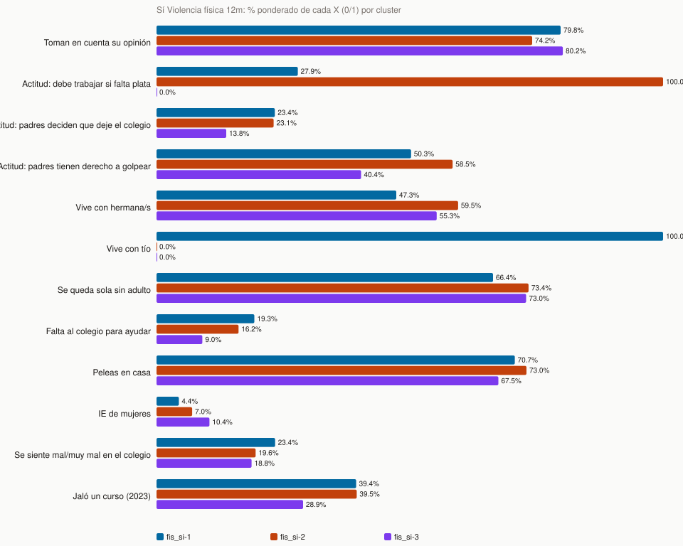

**Qué es.** Un panel por cada X del LASSO. Edad en años; el resto = % del cluster que tiene esa X.

**debe trabajar:** `fis_si-2` tiene 100.0% y `fis_si-3` 0.0%. Eso implica que el k-medias usó esta X para apartar esos dos tipos.

**vive tío:** `fis_si-1` tiene 100.0% y `fis_si-2` 0.0%. Eso implica que el k-medias usó esta X para apartar esos dos tipos.

**edad:** `fis_si-2` tiene 14.2 años y `fis_si-1` 13.7 años. Eso implica que el k-medias usó esta X para apartar esos dos tipos.

**padres golpear:** `fis_si-2` tiene 58.5% y `fis_si-3` 40.4%. Eso implica que el k-medias usó esta X para apartar esos dos tipos.

`fis_si-1` es casi 100 % “vive con tío”. `fis_si-2` es casi 100 % “debe trabajar si falta plata”.

#### Edad

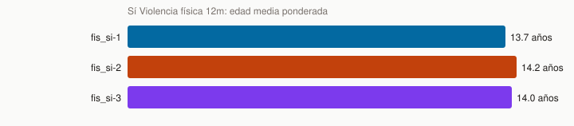

**Qué es.** Edad media de cada tipo (años). El k-medias sí usó `edad` (estandarizada).

`fis_si-1` = 13.75 años; `fis_si-2` = 14.15 (brecha 0.41). Implica que `fis_si-1` es un poco más joven. Eso no es automáticamente “más violencia”: mira el gráfico de las tres Y.

#### Cruce con los tres tipos de violencia

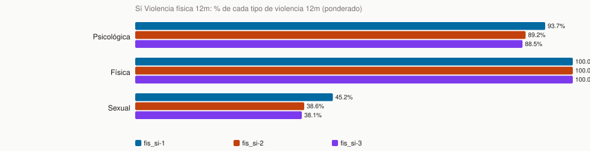

**Qué es.** Violencia 12m **después** de armar el grupo. No se usó para clusterizar.

`fis_si-1` (n=276): psicológica 93.7%, física 100.0%, sexual 45.2%.
`fis_si-2` (n=760): psicológica 89.2%, física 100.0%, sexual 38.6%.
`fis_si-3` (n=1,562): psicológica 88.5%, física 100.0%, sexual 38.1%.

**Qué implica.** Aquí **todas** ya tienen `viol_fisica_12m` = 1 (por el filtro). Si un grupo tiene más física o más sexual que otro, ese tipo de casa/actitud se junta más con violencia **superpuesta**, no con “descubrir” el filtro.

### Las que no — Violencia física 12m

n = 6,977 · N = 1,049,954 · silueta k=3: **0.158**

| k | Silueta (sin peso) |
| ---: | ---: |
| 2 | 0.141 |
| 3 | 0.158 ← usado |
| 4 | 0.126 |

| Cluster | n | N | % psic. | % fís. | % sexual | Edad (lineal) | Toman en cuenta su opinión | Actitud: debe trabajar si falta plata | Actitud: padres deciden que deje el colegio | Actitud: padres tienen derecho a golpear | Vive con hermana/s | Vive con tío | Se queda sola sin adulto | Falta al colegio para ayudar | Peleas en casa | IE de mujeres | Se siente mal/muy mal en el colegio | Jaló un curso (2023) |
| --- | --- | --- | ---: | ---: | ---: | ---: | ---: | ---: | ---: | ---: | ---: | ---: | ---: | ---: | ---: | ---: | ---: | ---: |
| `fis_no-1` | 1,507 | 202,912 | 51.8% | 0.0% | 21.4% | 14.67 | 88.3% | 100.0% | 13.6% | 50.6% | 58.3% | 9.4% | 59.3% | 7.6% | 46.1% | 0.0% | 9.7% | 28.9% |
| `fis_no-2` | 4,771 | 738,117 | 49.5% | 0.0% | 16.9% | 14.54 | 93.7% | 0.0% | 11.2% | 25.0% | 56.6% | 8.0% | 53.1% | 4.5% | 40.7% | 0.0% | 7.2% | 22.8% |
| `fis_no-3` | 699 | 108,925 | 43.4% | 0.0% | 13.2% | 14.63 | 95.5% | 13.6% | 15.1% | 21.5% | 56.3% | 7.7% | 49.3% | 3.8% | 44.8% | 100.0% | 5.7% | 26.9% |

#### Mapa PCA

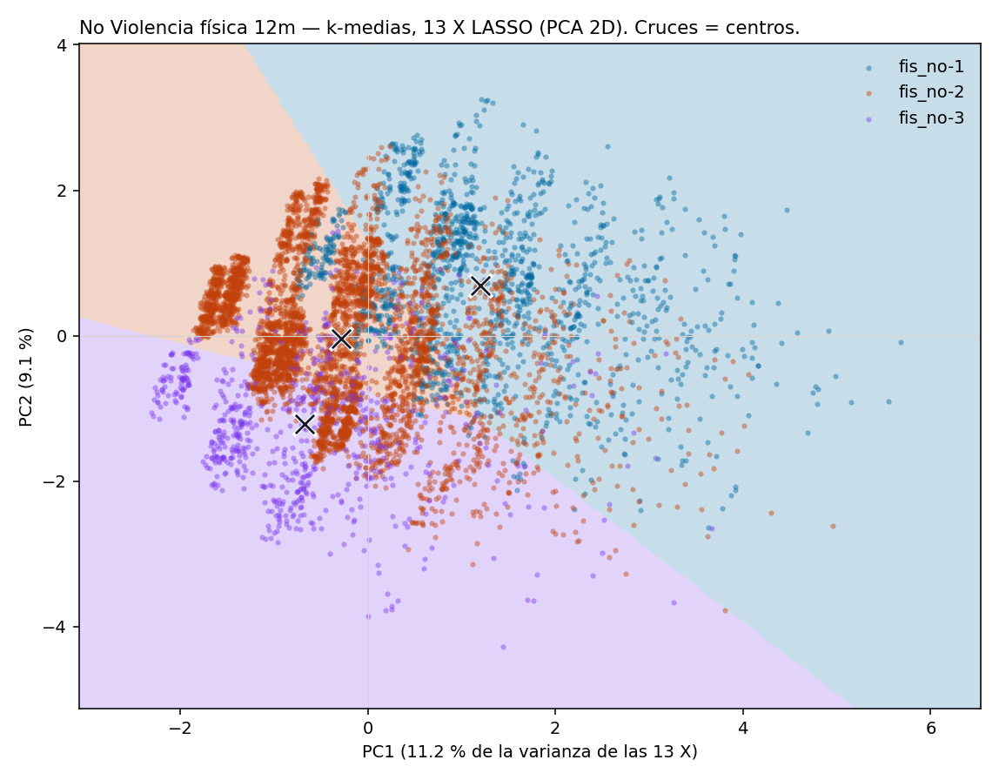

**Qué es.** Cada punto = una alumna. El k-medias las agrupó con las 13 X a la vez. Este dibujo **aplasta** esas 13 dimensiones a 2 ejes para que se vea. PC = componente principal = un eje resumen (un combo de las 13 X). No es violencia: es un resumen de casa / actitudes / colegio.

**PC1 (eje de lado a lado) significa** el combo que más diferencia a estas chicas (11 % de toda la variación de las 13 X). A la **derecha** tiende a haber más: debe trabajar, padres golpear. A la **izquierda**, más: la toman en cuenta.

**PC2 (eje de abajo a arriba) significa** el segundo combo, distinto del primero (9 %). Arriba: padres golpear. Abajo: peleas casa, se queda sola.

**Qué implica.** PC1+PC2 solo muestran 20 % de cómo se distinguen las X. El otro 80 % no cabe en el plano: por eso los colores se mezclan. No quiere decir que los grupos no existan; quiere decir que 2D no alcanza. La cruz blanca es el centro de cada tipo. `fis_no-2` es el más grande (n=4,771).

#### Biplot (cada variable)

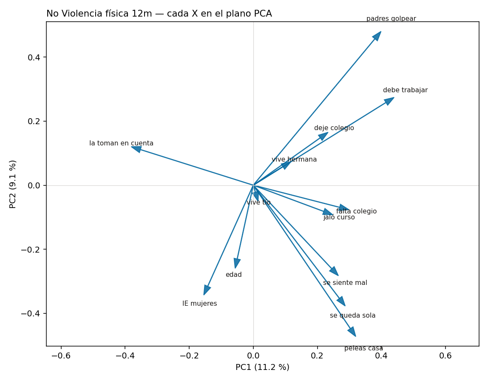

**Qué es.** Cada flecha es **una** de las 13 X. Si la alumna tiene esa X (sí = 1, o más edad), el punto se mueve hacia la flecha. Flechas juntas = esas X suelen ir a la par. Flechas opuestas = contrastan.

**PC1 implica:** un eje “debe trabajar, padres golpear vs la toman en cuenta”. Las que más pesan: debe trabajar (suma al PC1), padres golpear (suma al PC1), la toman en cuenta (resta al PC1). Ejemplo: si “la toman en cuenta” apunta al revés de “peleas / se siente mal”, tener voz en casa y vivir peleas no tiran para el mismo lado.

**PC2 implica:** un segundo eje “padres golpear vs peleas casa, se queda sola”. Pesan: padres golpear (suma al PC2), peleas casa (resta al PC2), se queda sola (resta al PC2).

#### Una barra por variable

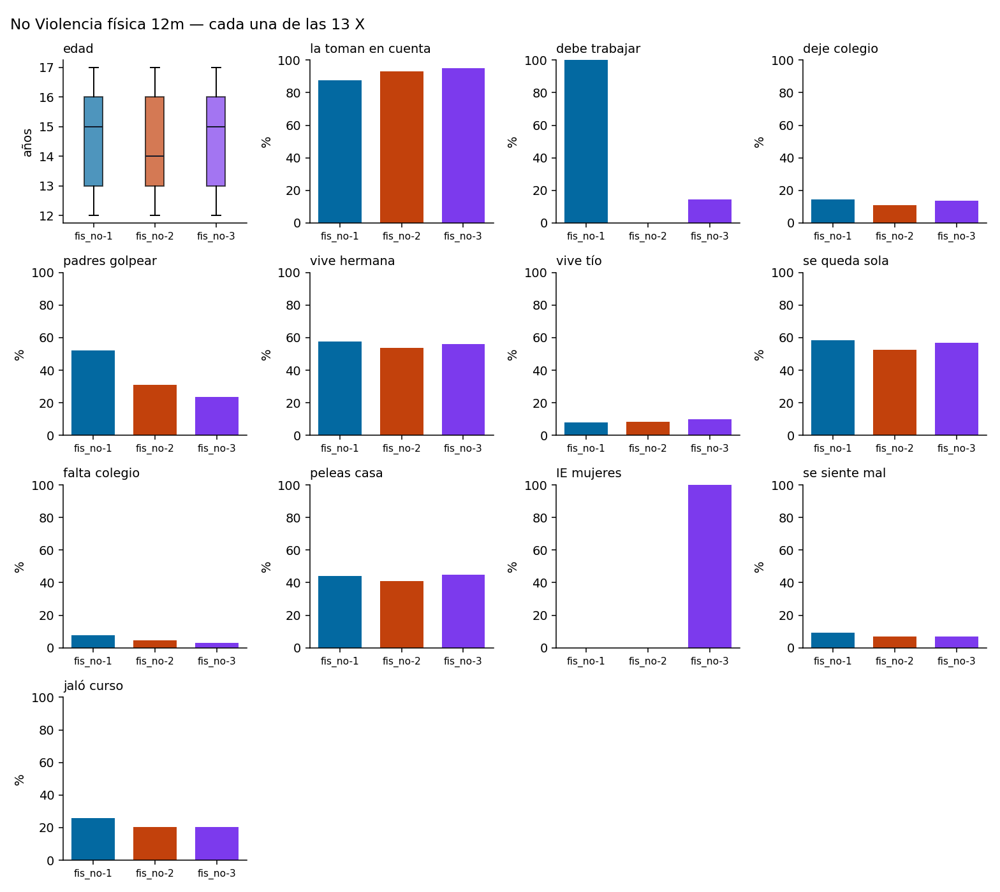

**Qué es.** Un panel por cada X del LASSO. Edad en años; el resto = % del cluster que tiene esa X.

**debe trabajar:** `fis_no-1` tiene 100.0% y `fis_no-2` 0.0%. Eso implica que el k-medias usó esta X para apartar esos dos tipos.

**IE mujeres:** `fis_no-3` tiene 100.0% y `fis_no-1` 0.0%. Eso implica que el k-medias usó esta X para apartar esos dos tipos.

**padres golpear:** `fis_no-1` tiene 50.6% y `fis_no-3` 21.5%. Eso implica que el k-medias usó esta X para apartar esos dos tipos.

**edad:** `fis_no-1` tiene 14.7 años y `fis_no-2` 14.5 años. Eso implica que el k-medias usó esta X para apartar esos dos tipos.

`fis_no-1` es casi 100 % “debe trabajar si falta plata”. `fis_no-3` es casi 100 % IE de mujeres: el algoritmo encontró el colegio de señoritas, no un “tipo de casa”.

#### Barras de las 13 X juntas

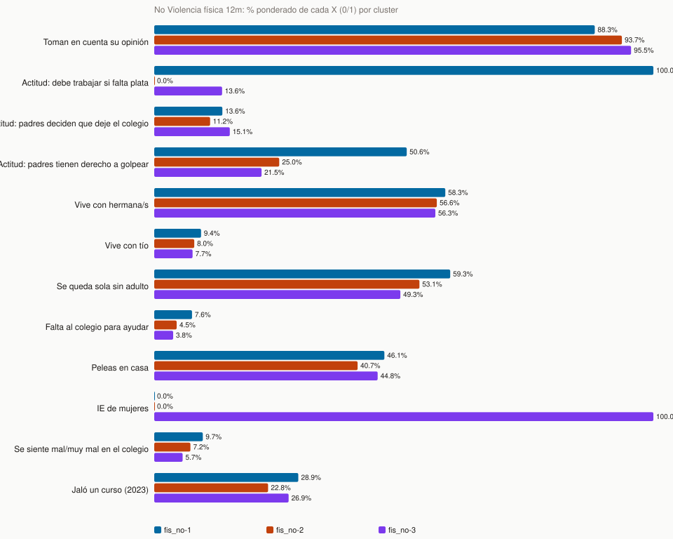

**Qué es.** Un panel por cada X del LASSO. Edad en años; el resto = % del cluster que tiene esa X.

**debe trabajar:** `fis_no-1` tiene 100.0% y `fis_no-2` 0.0%. Eso implica que el k-medias usó esta X para apartar esos dos tipos.

**IE mujeres:** `fis_no-3` tiene 100.0% y `fis_no-1` 0.0%. Eso implica que el k-medias usó esta X para apartar esos dos tipos.

**padres golpear:** `fis_no-1` tiene 50.6% y `fis_no-3` 21.5%. Eso implica que el k-medias usó esta X para apartar esos dos tipos.

**edad:** `fis_no-1` tiene 14.7 años y `fis_no-2` 14.5 años. Eso implica que el k-medias usó esta X para apartar esos dos tipos.

`fis_no-1` es casi 100 % “debe trabajar si falta plata”. `fis_no-3` es casi 100 % IE de mujeres: el algoritmo encontró el colegio de señoritas, no un “tipo de casa”.

#### Edad

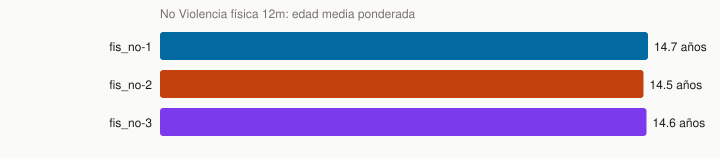

**Qué es.** Edad media de cada tipo (años). El k-medias sí usó `edad` (estandarizada).

`fis_no-2` = 14.54 años; `fis_no-1` = 14.67 (brecha 0.13). Casi no implica nada: la edad no es lo que parte estos tipos.

#### Cruce con los tres tipos de violencia

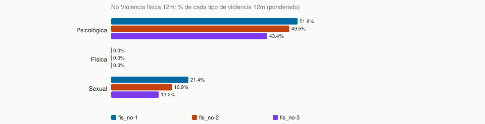

**Qué es.** Violencia 12m **después** de armar el grupo. No se usó para clusterizar.

`fis_no-1` (n=1,507): psicológica 51.8%, física 0.0%, sexual 21.4%.
`fis_no-2` (n=4,771): psicológica 49.5%, física 0.0%, sexual 16.9%.
`fis_no-3` (n=699): psicológica 43.4%, física 0.0%, sexual 13.2%.

**Qué implica.** Aquí `viol_fisica_12m` = 0 para todas. Un % > 0 de psicológica/física/sexual es **otra** violencia, no la del filtro. Si los tres % son 0, este lado es “no reportó ninguna” (solo pasa con el filtro *alguna*).

## Violencia sexual 12m

**Qué es.** Esta barra parte la muestra *antes* del k-medias. Sí = reportó `viol_sexual_12m`; no = no la reportó.

**Qué implica.** El 23.0% de la N (n=2,093) entra al cluster de las que sí; el 77.0% (n=7,482) al de las que no. El algoritmo **no usa** esta Y para juntar: solo las 13 X. Si el filtro es un tipo (p. ej. física), las del “no” igual pueden tener psicológica o sexual.

### Las que sí — Violencia sexual 12m

n = 2,093 · N = 325,545 · silueta k=3: **0.128**

| k | Silueta (sin peso) |
| ---: | ---: |
| 2 | 0.151 |
| 3 | 0.128 ← usado |
| 4 | 0.114 |

| Cluster | n | N | % psic. | % fís. | % sexual | Edad (lineal) | Toman en cuenta su opinión | Actitud: debe trabajar si falta plata | Actitud: padres deciden que deje el colegio | Actitud: padres tienen derecho a golpear | Vive con hermana/s | Vive con tío | Se queda sola sin adulto | Falta al colegio para ayudar | Peleas en casa | IE de mujeres | Se siente mal/muy mal en el colegio | Jaló un curso (2023) |
| --- | --- | --- | ---: | ---: | ---: | ---: | ---: | ---: | ---: | ---: | ---: | ---: | ---: | ---: | ---: | ---: | ---: | ---: |
| `sex_si-1` | 600 | 83,120 | 82.1% | 47.7% | 100.0% | 14.33 | 78.0% | 99.8% | 23.5% | 55.3% | 58.8% | 14.2% | 68.6% | 15.0% | 67.7% | 0.0% | 22.3% | 40.2% |
| `sex_si-2` | 1,316 | 217,009 | 84.3% | 42.5% | 100.0% | 14.49 | 86.0% | 0.0% | 13.3% | 30.7% | 53.3% | 9.8% | 66.7% | 8.9% | 61.3% | 0.0% | 14.8% | 27.2% |
| `sex_si-3` | 177 | 25,417 | 80.7% | 43.3% | 100.0% | 14.33 | 79.3% | 21.0% | 20.6% | 38.5% | 53.1% | 7.4% | 66.1% | 6.5% | 53.7% | 100.0% | 12.1% | 31.7% |

#### Mapa PCA

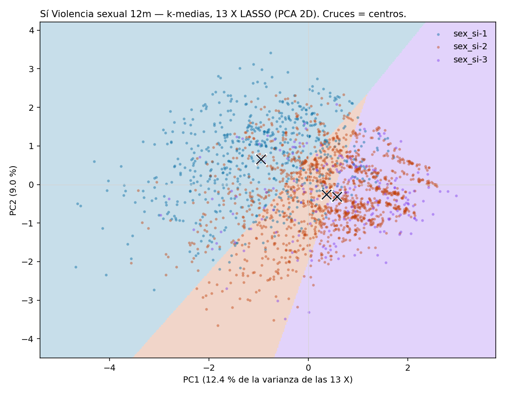

**Qué es.** Cada punto = una alumna. El k-medias las agrupó con las 13 X a la vez. Este dibujo **aplasta** esas 13 dimensiones a 2 ejes para que se vea. PC = componente principal = un eje resumen (un combo de las 13 X). No es violencia: es un resumen de casa / actitudes / colegio.

**PC1 (eje de lado a lado) significa** el combo que más diferencia a estas chicas (12 % de toda la variación de las 13 X). A la **derecha** tiende a haber más: la toman en cuenta. A la **izquierda**, más: padres golpear, debe trabajar.

**PC2 (eje de abajo a arriba) significa** el segundo combo, distinto del primero (9 %). Arriba: padres golpear, la toman en cuenta, debe trabajar. Abajo: —.

**Qué implica.** PC1+PC2 solo muestran 21 % de cómo se distinguen las X. El otro 79 % no cabe en el plano: por eso los colores se mezclan. No quiere decir que los grupos no existan; quiere decir que 2D no alcanza. La cruz blanca es el centro de cada tipo. `sex_si-2` es el más grande (n=1,316). `sex_si-3` tiene n=177: es un cajón chico, no un perfil para armar política.

#### Biplot (cada variable)

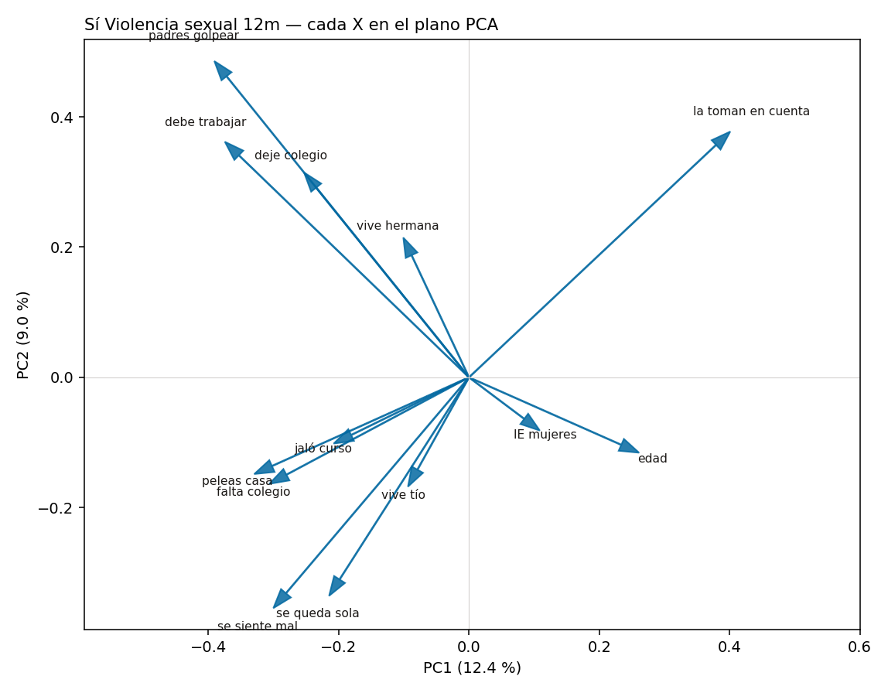

**Qué es.** Cada flecha es **una** de las 13 X. Si la alumna tiene esa X (sí = 1, o más edad), el punto se mueve hacia la flecha. Flechas juntas = esas X suelen ir a la par. Flechas opuestas = contrastan.

**PC1 implica:** un eje “la toman en cuenta vs padres golpear, debe trabajar”. Las que más pesan: la toman en cuenta (suma al PC1), padres golpear (resta al PC1), debe trabajar (resta al PC1). Ejemplo: si “la toman en cuenta” apunta al revés de “peleas / se siente mal”, tener voz en casa y vivir peleas no tiran para el mismo lado.

**PC2 implica:** un segundo eje “padres golpear, la toman en cuenta, debe trabajar vs —”. Pesan: padres golpear (suma al PC2), la toman en cuenta (suma al PC2), debe trabajar (suma al PC2).

#### Una barra por variable

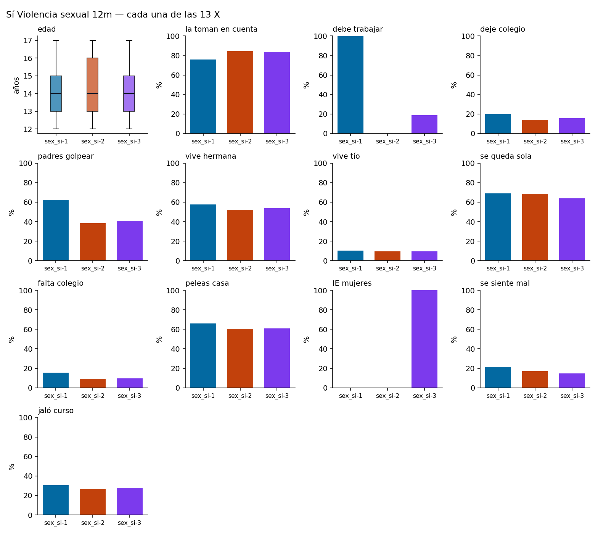

**Qué es.** Un panel por cada X del LASSO. Edad en años; el resto = % del cluster que tiene esa X.

**IE mujeres:** `sex_si-3` tiene 100.0% y `sex_si-1` 0.0%. Eso implica que el k-medias usó esta X para apartar esos dos tipos.

**debe trabajar:** `sex_si-1` tiene 99.8% y `sex_si-2` 0.0%. Eso implica que el k-medias usó esta X para apartar esos dos tipos.

**padres golpear:** `sex_si-1` tiene 55.3% y `sex_si-2` 30.7%. Eso implica que el k-medias usó esta X para apartar esos dos tipos.

**edad:** `sex_si-2` tiene 14.5 años y `sex_si-1` 14.3 años. Eso implica que el k-medias usó esta X para apartar esos dos tipos.

`sex_si-1` es casi 100 % “debe trabajar si falta plata”. `sex_si-3` es casi 100 % IE de mujeres: el algoritmo encontró el colegio de señoritas, no un “tipo de casa”.

#### Barras de las 13 X juntas

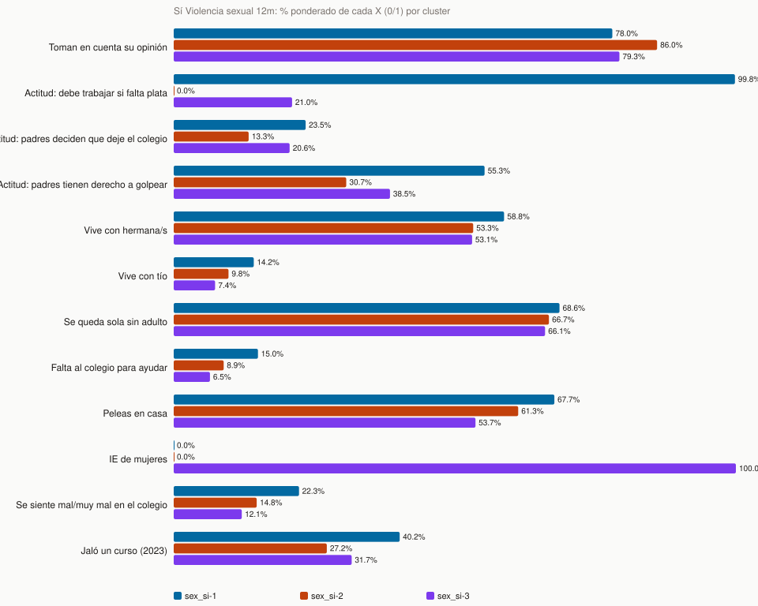

**Qué es.** Un panel por cada X del LASSO. Edad en años; el resto = % del cluster que tiene esa X.

**IE mujeres:** `sex_si-3` tiene 100.0% y `sex_si-1` 0.0%. Eso implica que el k-medias usó esta X para apartar esos dos tipos.

**debe trabajar:** `sex_si-1` tiene 99.8% y `sex_si-2` 0.0%. Eso implica que el k-medias usó esta X para apartar esos dos tipos.

**padres golpear:** `sex_si-1` tiene 55.3% y `sex_si-2` 30.7%. Eso implica que el k-medias usó esta X para apartar esos dos tipos.

**edad:** `sex_si-2` tiene 14.5 años y `sex_si-1` 14.3 años. Eso implica que el k-medias usó esta X para apartar esos dos tipos.

`sex_si-1` es casi 100 % “debe trabajar si falta plata”. `sex_si-3` es casi 100 % IE de mujeres: el algoritmo encontró el colegio de señoritas, no un “tipo de casa”.

#### Edad

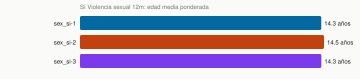

**Qué es.** Edad media de cada tipo (años). El k-medias sí usó `edad` (estandarizada).

`sex_si-1` = 14.33 años; `sex_si-2` = 14.49 (brecha 0.16). Casi no implica nada: la edad no es lo que parte estos tipos.

#### Cruce con los tres tipos de violencia

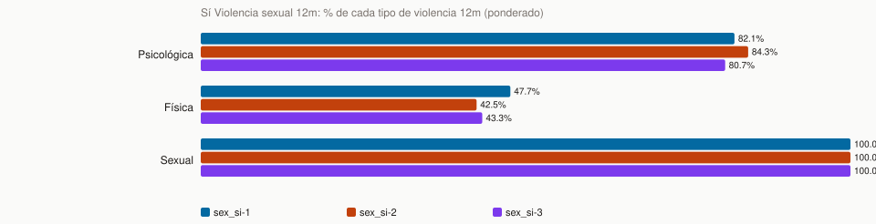

**Qué es.** Violencia 12m **después** de armar el grupo. No se usó para clusterizar.

`sex_si-1` (n=600): psicológica 82.1%, física 47.7%, sexual 100.0%.
`sex_si-2` (n=1,316): psicológica 84.3%, física 42.5%, sexual 100.0%.
`sex_si-3` (n=177): psicológica 80.7%, física 43.3%, sexual 100.0%.

**Qué implica.** Aquí **todas** ya tienen `viol_sexual_12m` = 1 (por el filtro). Si un grupo tiene más física o más sexual que otro, ese tipo de casa/actitud se junta más con violencia **superpuesta**, no con “descubrir” el filtro.

### Las que no — Violencia sexual 12m

n = 7,482 · N = 1,089,838 · silueta k=3: **0.121**

| k | Silueta (sin peso) |
| ---: | ---: |
| 2 | 0.141 |
| 3 | 0.121 ← usado |
| 4 | 0.117 |

| Cluster | n | N | % psic. | % fís. | % sexual | Edad (lineal) | Toman en cuenta su opinión | Actitud: debe trabajar si falta plata | Actitud: padres deciden que deje el colegio | Actitud: padres tienen derecho a golpear | Vive con hermana/s | Vive con tío | Se queda sola sin adulto | Falta al colegio para ayudar | Peleas en casa | IE de mujeres | Se siente mal/muy mal en el colegio | Jaló un curso (2023) |
| --- | --- | --- | ---: | ---: | ---: | ---: | ---: | ---: | ---: | ---: | ---: | ---: | ---: | ---: | ---: | ---: | ---: | ---: |
| `sex_no-1` | 658 | 95,597 | 57.9% | 25.2% | 0.0% | 14.31 | 89.0% | 21.6% | 12.0% | 35.9% | 47.6% | 100.0% | 44.4% | 9.1% | 48.8% | 8.8% | 10.7% | 32.0% |
| `sex_no-2` | 2,574 | 323,388 | 55.4% | 26.9% | 0.0% | 14.24 | 88.2% | 34.6% | 18.4% | 99.8% | 62.9% | 0.0% | 59.6% | 7.5% | 46.9% | 7.9% | 11.0% | 25.6% |
| `sex_no-3` | 4,250 | 670,853 | 50.4% | 16.6% | 0.0% | 14.53 | 92.5% | 14.9% | 9.7% | 0.0% | 55.6% | 0.0% | 56.1% | 4.5% | 43.9% | 12.2% | 7.7% | 24.2% |

#### Mapa PCA

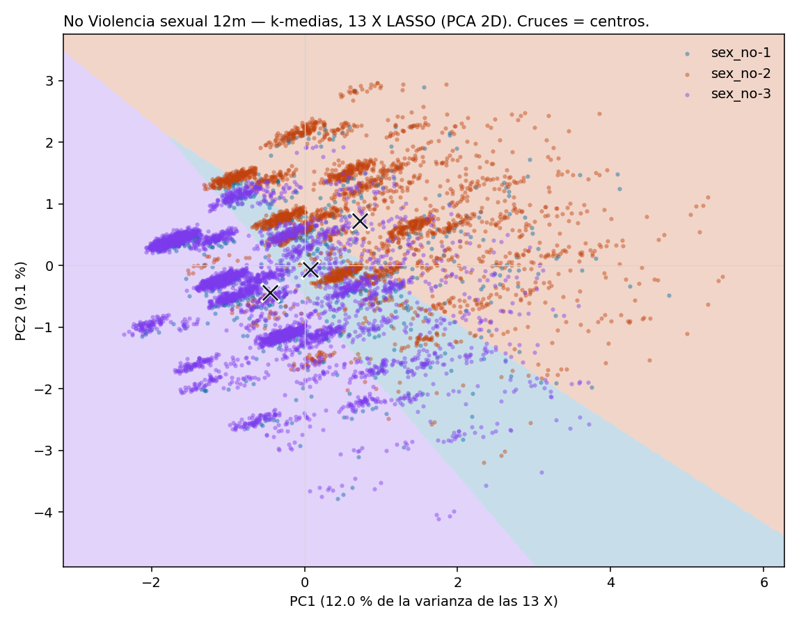

**Qué es.** Cada punto = una alumna. El k-medias las agrupó con las 13 X a la vez. Este dibujo **aplasta** esas 13 dimensiones a 2 ejes para que se vea. PC = componente principal = un eje resumen (un combo de las 13 X). No es violencia: es un resumen de casa / actitudes / colegio.

**PC1 (eje de lado a lado) significa** el combo que más diferencia a estas chicas (12 % de toda la variación de las 13 X). A la **derecha** tiende a haber más: debe trabajar, peleas casa. A la **izquierda**, más: la toman en cuenta.

**PC2 (eje de abajo a arriba) significa** el segundo combo, distinto del primero (9 %). Arriba: padres golpear. Abajo: peleas casa, IE mujeres.

**Qué implica.** PC1+PC2 solo muestran 21 % de cómo se distinguen las X. El otro 79 % no cabe en el plano: por eso los colores se mezclan. No quiere decir que los grupos no existan; quiere decir que 2D no alcanza. La cruz blanca es el centro de cada tipo. `sex_no-3` es el más grande (n=4,250).

#### Biplot (cada variable)

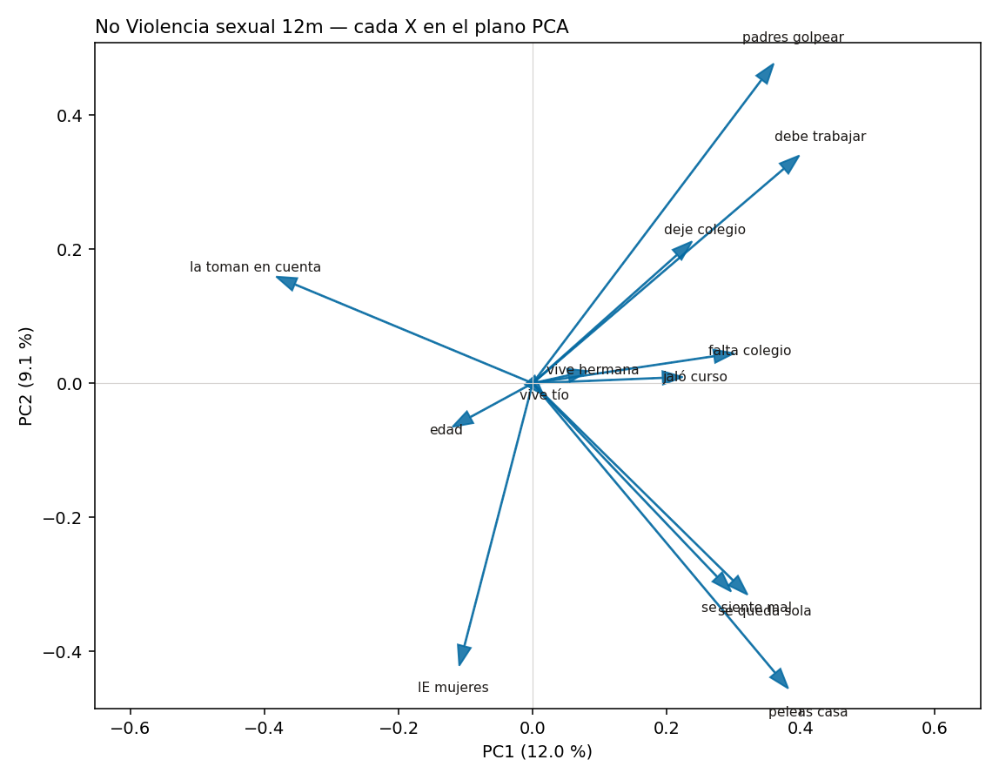

**Qué es.** Cada flecha es **una** de las 13 X. Si la alumna tiene esa X (sí = 1, o más edad), el punto se mueve hacia la flecha. Flechas juntas = esas X suelen ir a la par. Flechas opuestas = contrastan.

**PC1 implica:** un eje “debe trabajar, peleas casa vs la toman en cuenta”. Las que más pesan: debe trabajar (suma al PC1), la toman en cuenta (resta al PC1), peleas casa (suma al PC1). Ejemplo: si “la toman en cuenta” apunta al revés de “peleas / se siente mal”, tener voz en casa y vivir peleas no tiran para el mismo lado.

**PC2 implica:** un segundo eje “padres golpear vs peleas casa, IE mujeres”. Pesan: padres golpear (suma al PC2), peleas casa (resta al PC2), IE mujeres (resta al PC2).

#### Una barra por variable

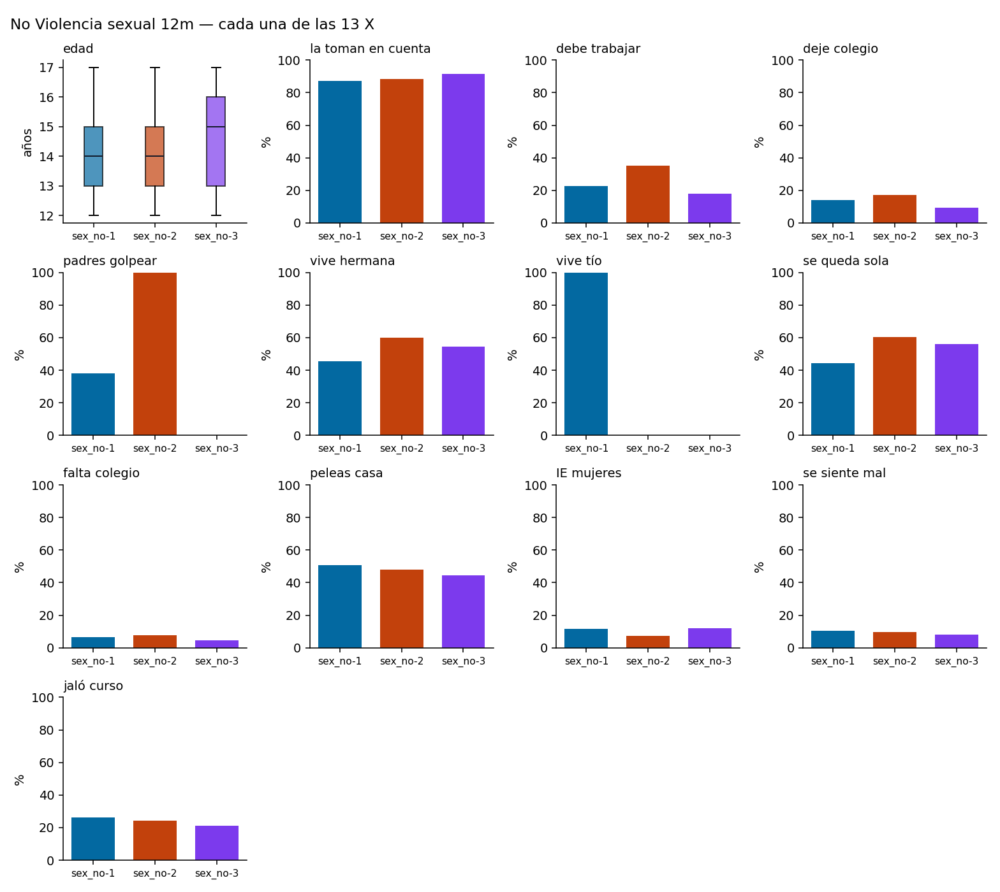

**Qué es.** Un panel por cada X del LASSO. Edad en años; el resto = % del cluster que tiene esa X.

**vive tío:** `sex_no-1` tiene 100.0% y `sex_no-2` 0.0%. Eso implica que el k-medias usó esta X para apartar esos dos tipos.

**padres golpear:** `sex_no-2` tiene 99.8% y `sex_no-3` 0.0%. Eso implica que el k-medias usó esta X para apartar esos dos tipos.

**edad:** `sex_no-3` tiene 14.5 años y `sex_no-2` 14.2 años. Eso implica que el k-medias usó esta X para apartar esos dos tipos.

**debe trabajar:** `sex_no-2` tiene 34.6% y `sex_no-3` 14.9%. Eso implica que el k-medias usó esta X para apartar esos dos tipos.

`sex_no-1` es casi 100 % “vive con tío”. `sex_no-2` es casi 100 % “padres tienen derecho a golpear”: otra vez un corte por una dummy, no un perfil mixto.

#### Barras de las 13 X juntas

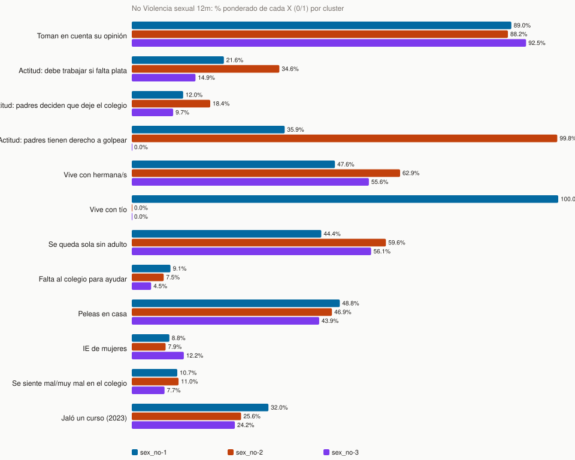

**Qué es.** Un panel por cada X del LASSO. Edad en años; el resto = % del cluster que tiene esa X.

**vive tío:** `sex_no-1` tiene 100.0% y `sex_no-2` 0.0%. Eso implica que el k-medias usó esta X para apartar esos dos tipos.

**padres golpear:** `sex_no-2` tiene 99.8% y `sex_no-3` 0.0%. Eso implica que el k-medias usó esta X para apartar esos dos tipos.

**edad:** `sex_no-3` tiene 14.5 años y `sex_no-2` 14.2 años. Eso implica que el k-medias usó esta X para apartar esos dos tipos.

**debe trabajar:** `sex_no-2` tiene 34.6% y `sex_no-3` 14.9%. Eso implica que el k-medias usó esta X para apartar esos dos tipos.

`sex_no-1` es casi 100 % “vive con tío”. `sex_no-2` es casi 100 % “padres tienen derecho a golpear”: otra vez un corte por una dummy, no un perfil mixto.

#### Edad

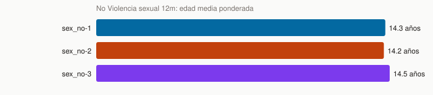

**Qué es.** Edad media de cada tipo (años). El k-medias sí usó `edad` (estandarizada).

`sex_no-2` = 14.24 años; `sex_no-3` = 14.53 (brecha 0.29). Casi no implica nada: la edad no es lo que parte estos tipos.

#### Cruce con los tres tipos de violencia

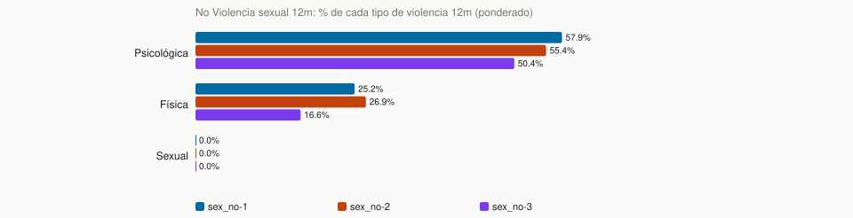

**Qué es.** Violencia 12m **después** de armar el grupo. No se usó para clusterizar.

`sex_no-1` (n=658): psicológica 57.9%, física 25.2%, sexual 0.0%.
`sex_no-2` (n=2,574): psicológica 55.4%, física 26.9%, sexual 0.0%.
`sex_no-3` (n=4,250): psicológica 50.4%, física 16.6%, sexual 0.0%.

**Qué implica.** Aquí `viol_sexual_12m` = 0 para todas. Un % > 0 de psicológica/física/sexual es **otra** violencia, no la del filtro. Si los tres % son 0, este lado es “no reportó ninguna” (solo pasa con el filtro *alguna*).

Asignación: `data/perfiles_kmeans_crs04_asig.csv` (columnas `filtro`, `universo`, `cluster`).
