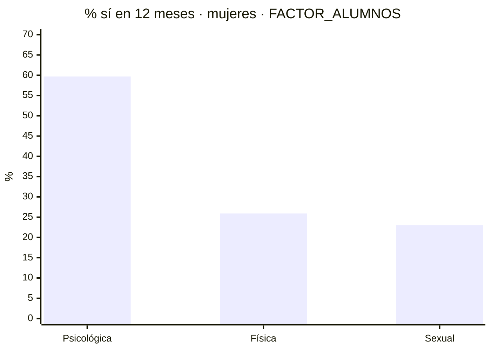

# Violencia CRS04: sí / no y missing

Solo mujeres (`SEXO = 1`) · n muestra = 9,608 · N expandida = 1,419,491 con `FACTOR_ALUMNOS` · se excluyen 9,199 hombres · 12–17 años · ENARES 2024.

Tabla: `analisis.crs04_adolescentes`. Catálogo de ítems: [violencia_por_cuestionario.md](violencia_por_cuestionario.md).

| Psicológica 12m (sí, ponderado) | Física 12m (sí, ponderado) | Sexual 12m (sí, ponderado) | Missing en ítems madre |
|---:|---:|---:|---:|
| **59.7%** | **25.9%** | **23.0%** | **0** |

Conteos y % son población expandida: `SUM(FACTOR_ALUMNOS)`. El factor no tiene null (mín 2.1, máx 5,194). `n = 9,608` es el número de entrevistas.

---

## Cómo leer los missing

En esta base hay tres tipos de vacío. Solo el primero sería un problema de calidad; en mujeres no aparece.

| Qué miras | Tipo de vacío | Casos / N expandida | Códigos observados | ¿Sesga el indicador? | Qué hacer |
|---|---|---|---|---|---|
| 58 ítems madre (201, 205, 223, 227, 248) | No-respuesta real | 0 / 0 | solo 1 = sí, 2 = no | No. Completos. | 1 → sí, 2 → no. No hay NS/NR. |
| Filtros 12m CAP200 (`C3P203`, `207`, `225`, `229`) | Skip del flujo | 3,394–8,056 / 514 mil–1.19 mill. | NULL, 1, 2 | No, si NULL = 0 | NULL = no le preguntaron porque no hubo sí de por vida. |
| `C4P248C_1` … `_16` (sexual 12m) | Skip del flujo | igual al no del ítem | NULL, 1, 2 | No, si NULL = 0 | Lleno solo si ese `C4P248_i = 1`. Cero huecos. |
| Frecuencia (`C3P204`, `208`, `226`, `230`, `C4P251`) | Skip + “no sabe” | NULL + código 3 | NULL, 1, 2, 3, 4 | Sí, si las usas como 12m | No son el filtro temporal. Código 4 no está en el diccionario. |
| `RFINAL = 2` (encuesta incompleta) | Estado de la encuesta | 1,195 / 306,689 (21.6%) | 1 o 2 | No por missing de ítem | Los 58 ítems siguen llenos. El peso de incompletas es más alto que su n (12.4% de casos). |

**Regla corta:** missing real de los targets = 0. Los NULL de 12 meses son skip: trátalos como 0 (no violencia en el año). El riesgo no es imputar mal un missing; es usar `P204` / `P208` / `P234` como si fueran el filtro de 12 meses.

---

## Distribución sí / no de los tres targets (12 meses)

Denominador = 1,419,491 alumnas expandidas. No hay categoría “missing”: cada fila es sí o no.

| Indicador | Sí (N) | % sí | No (N) | % no | Missing |
|---|---:|---:|---:|---:|---:|
| `viol_psicologica_12m` | 847,389 | 59.7% | 572,102 | 40.3% | 0 |
| `viol_fisica_12m` | 367,572 | 25.9% | 1,051,919 | 74.1% | 0 |
| `viol_sexual_12m` | 325,900 | 23.0% | 1,093,592 | 77.0% | 0 |



### Por ámbito (casa vs colegio)

Sí = algún ítem del bloque = 1 **y** filtro 12m = 1. Sexual usa `C4P248C_i`. Ponderado `FACTOR_ALUMNOS`.

| Bloque | Sí 12m (N) | % | No (N) | Missing ítems | NULL filtro (N) |
|---|---:|---:|---:|---:|---|
| Psicológica hogar (`C3P201` + `C3P203`) | 549,841 | 38.7% | 869,650 | 0 | 531,681 skip |
| Psicológica colegio (`C3P223` + `C3P225`) | 636,673 | 44.9% | 782,818 | 0 | 514,495 skip |
| Física hogar (`C3P205` + `C3P207`) | 289,076 | 20.4% | 1,130,415 | 0 | 683,626 skip |
| Física colegio (`C3P227` + `C3P229`) | 144,992 | 10.2% | 1,274,499 | 0 | 1,192,580 skip |
| Sexual (`C4P248` + `C4P248C`) | 325,900 | 23.0% | 1,093,592 | 0 | skip por ítem |

Psicológica es la más frecuente, sobre todo en colegio (44.9%) frente a casa (38.7%). Física más alta en casa (20.4%) que en colegio (10.2%). Sexual 23.0%.

---

## Qué situaciones pesan más (ítem = sí de por vida)

En CAP200 el 12 meses es del **bloque**, no del ítem. Estos % son lifetime ponderados. Missing = 0. Sexual sí tiene 12 meses por ítem (`C4P248C`).

### Psicológica hogar — top sí

| Ítem | Sí (N) | No (N) | % sí |
|---|---:|---:|---:|
| `C3P201_1` insultos / lisuras | 598,976 | 820,515 | 42.2% |
| `C3P201_5` humillación | 503,452 | 916,039 | 35.5% |
| `C3P201_3` todo lo que haces está mal | 423,449 | 996,042 | 29.8% |
| `C3P201_2` apodos | 241,372 | 1,178,119 | 17.0% |
| `C3P201_6` amenaza de golpe / abandono | 226,621 | 1,192,870 | 16.0% |

### Física hogar — top sí

| Ítem | Sí (N) | No (N) | % sí |
|---|---:|---:|---:|
| `C3P205_4` golpes con objeto | 574,911 | 844,580 | 40.5% |
| `C3P205_1` jalar cabello / orejas | 434,016 | 985,475 | 30.6% |
| `C3P205_2` cachetadas / nalgadas | 275,253 | 1,144,238 | 19.4% |
| `C3P205_3` patadas / puñetazos | 90,148 | 1,329,343 | 6.4% |
| `C3P205_6` ataque con arma | 16,457 | 1,403,035 | 1.2% |

### Psicológica colegio — top sí

| Ítem | Sí (N) | No (N) | % sí |
|---|---:|---:|---:|
| `C3P223_8` chismes | 592,376 | 827,116 | 41.7% |
| `C3P223_1` insultos / burlas | 399,981 | 1,019,511 | 28.2% |
| `C3P223_2` apodos | 359,429 | 1,060,063 | 25.3% |
| `C3P223_5` exclusión / no te dejan jugar | 344,828 | 1,074,664 | 24.3% |
| `C3P223_3` te dicen que otras son mejores | 290,120 | 1,129,371 | 20.4% |

### Física colegio — top sí

| Ítem | Sí (N) | No (N) | % sí |
|---|---:|---:|---:|
| `C3P227_1` jalar cabello / orejas | 94,898 | 1,324,593 | 6.7% |
| `C3P227_2` cachetadas / cocachos | 81,841 | 1,337,650 | 5.8% |
| `C3P227_6` daño con lápiz / regla | 62,615 | 1,356,876 | 4.4% |
| `C3P227_3` patadas / puñetazos | 43,408 | 1,376,083 | 3.1% |
| `C3P227_5` ahorcamiento / asfixia | 20,408 | 1,399,084 | 1.4% |

### Sexual — sí en 12 meses (ítem = 1 y `248C` = 1)

| Ítem | Sí 12m (N) | % de N | Sí lifetime (N) | De esos, no en 12m |
|---|---:|---:|---:|---:|
| `C4P248_2` comentarios / bromas sexuales | 173,431 | 12.2% | 262,946 | 89,516 |
| `C4P248_14` mensajes sexuales | 87,319 | 6.2% | 184,744 | 97,425 |
| `C4P248_1` mirar partes íntimas | 78,571 | 5.5% | 145,664 | 67,092 |
| `C4P248_6` tocamientos incómodos | 54,554 | 3.8% | 221,201 | 166,647 |
| `C4P248_13` grooming | 47,972 | 3.4% | 113,631 | 65,658 |
| `C4P248_11` obligar a relaciones sexuales | 12,580 | 0.9% | 36,395 | 23,815 |

---

## Cuántos tipos a la vez (índice 0–3)

Suma de los tres binarios 12m, ponderada. Cada componente es 0/1 sin missing, así que el índice tampoco.

**65.8%** con al menos un tipo (N = 934,649).

| Índice | Significado | N expandida | % | Missing |
|---:|---|---:|---:|---:|
| 0 | Ningún tipo en 12m | 484,842 | 34.2% | 0 |
| 1 | Un solo tipo | 465,436 | 32.8% | 0 |
| 2 | Dos tipos | 332,215 | 23.4% | 0 |
| 3 | Los tres tipos | 136,998 | 9.7% | 0 |

Entre quienes tienen un solo tipo, 82.5% son solo psicológica (N = 384,075). Solo física = 33,207. Solo sexual = 48,154. Los tres a la vez = 136,998 (9.7%).

---

## Corrección de columnas (construcción)

Tres errores en la tabla inicial de indicadores:

1. CAP200 en CRS04 usa **`C3P`**, no `C4P`.
2. `P204` y `P208` son **frecuencia**, no 12 meses.
3. `P234` es si **vio agresión a una compañera**, no el filtro de física en colegio (ese es `C3P229`).

| Indicador | Ítems reales | Tabla (incorrecto) | Filtro 12m correcto | Esa columna en la tabla |
|---|---|---|---|---|
| `viol_psicologica_hogar` | `C3P201_1` … `_11` | `C4P201_*` | `C3P203 = 1` | P204 (frecuencia) |
| `viol_fisica_hogar` | `C3P205_1` … `_7` | `C4P205_*` | `C3P207 = 1` | P208 (frecuencia) |
| `viol_psicologica_colegio` | `C3P223_1` … `_14` | `C4P223_*` | `C3P225 = 1` | “ítem asociado a P223” |
| `viol_fisica_colegio` | `C3P227_1` … `_10` | `C4P227_*` | `C3P229 = 1` | P234 (testigo) |
| `viol_sexual_12m` | `C4P248_1` … `_16` | `C4P248_*` | `C4P248C_i = 1` | 248C (correcto) |

### Vida vs últimos 12 meses

Si omites el filtro de 12 meses, inflas la prevalencia. Eso no es missing: es lifetime vs año.

| Bloque | Algún sí de por vida | Algún sí en últimos 12 meses |
|---|---:|---:|
| Psic. hogar | 887,811 | 549,841 |
| Fís. hogar | 735,865 | 289,076 |
| Psic. colegio | 904,996 | 636,673 |
| Fís. colegio | 226,911 | 144,992 |
| Sexual | 569,769 | 325,900 |

### Skip del filtro 12m, fila por fila

NULL + sí + no = 1,419,491. Sí 12m + no 12m = sí lifetime. Hueco = 0.

| Filtro | Bloque | NULL skip (N) | 1 = sí 12m | 2 = no 12m | Sí lifetime | Hueco |
|---|---|---:|---:|---:|---:|---:|
| `C3P203` | Psic. hogar | 531,681 | 549,841 | 337,969 | 887,811 | 0 |
| `C3P207` | Fís. hogar | 683,626 | 289,076 | 446,789 | 735,865 | 0 |
| `C3P225` | Psic. colegio | 514,495 | 636,673 | 268,323 | 904,996 | 0 |
| `C3P229` | Fís. colegio | 1,192,580 | 144,992 | 81,919 | 226,911 | 0 |

### Si usas las columnas equivocadas

| Si filtras con… | Qué es en realidad | N que marca 1 | N correcto 12m | Error |
|---|---|---:|---:|---|
| `C3P204 = 1` | Frecuencia “pocas veces” | 98,157 | 549,841 | Pierdes 82% |
| `C3P208 = 1` | Frecuencia “pocas veces” | 74,254 | 289,076 | Pierdes 74% |
| `C3P234 = 1` | Vio agresión a una compañera | 763,511 | 144,992 | Inflas 5.3× |

### Frecuencia (no entra al binario)

| Columna | NULL skip | 1 | 2 | 3 no sabe | 4 no doc. |
|---|---:|---:|---:|---:|---:|
| `C3P204` psic hogar | 869,650 | 98,157 | 347,754 | 103,251 | 679 |
| `C3P208` fís hogar | 1,130,415 | 74,254 | 181,350 | 32,002 | 1,470 |
| `C3P226` psic colegio | 782,818 | 154,133 | 373,929 | 104,536 | 4,075 |
| `C3P230` fís colegio | 1,274,499 | 45,528 | 82,407 | 16,668 | 390 |
| `C4P251` sexual | 849,722 | 237,310 | 282,328 | 48,487 | 1,644 |

---

## Regla para SQL

Filtra `SEXO = 1`. Ítem 1 = sí, 2 = no. Filtro 12m NULL = 0. Une ámbitos con `OR` / `GREATEST`, no con promedios. Prevalencia = `SUM(FACTOR_ALUMNOS * indicador) / SUM(FACTOR_ALUMNOS)`.

```sql
-- analisis.crs04_adolescentes, solo mujeres
WHERE SEXO = 1

psic_hogar_12m = (máx C3P201_1…11 = 1) AND C3P203 = 1
fis_hogar_12m  = (máx C3P205_1…7  = 1) AND C3P207 = 1
psic_col_12m   = (máx C3P223_1…14 = 1) AND C3P225 = 1
fis_col_12m    = (máx C3P227_1…10 = 1) AND C3P229 = 1
sexual_12m     = OR_i (C4P248_i = 1 AND C4P248C_i = 1)

viol_psicologica_12m = psic_hogar_12m OR psic_col_12m
viol_fisica_12m      = fis_hogar_12m  OR fis_col_12m
viol_sexual_12m      = sexual_12m
indice_0_3           = psic + fis + sexual
```
