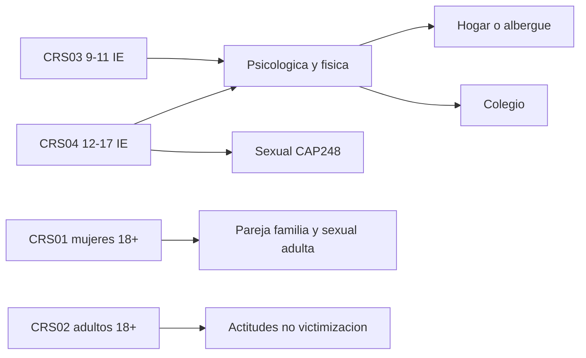

# Catálogo de preguntas de violencia por cuestionario

ENARES 2024. Inventario extraído de los diccionarios PDF en `datos_dev/`.

**Sí se pregunta por tipos de violencia en colegios**, no solo a mujeres de 18+. Lo que cambia es el tipo de violencia y el ámbito, no si se pregunta o no.

| Cuestionario | Universo | Victimización actual | Qué cubre |
|---|---|---|---|
| CRS03 | Niñas y niños 9–11, institución educativa | Sí | Psicológica y física en casa y en colegio. **No** hay módulo sexual. |
| CRS04 | Adolescentes 12–17, institución educativa | Sí | Mismo bloque psicológico/físico que CRS03 **más** violencia sexual (`CAP248`). |
| CRS01 | Mujeres 18+, vivienda | Sí | Pareja/expareja, otras personas desde los 18, recuerdo de infancia. Otro universo que el escolar. |
| CRS02 | Hombres y mujeres 18+, vivienda | Casi no | Actitudes sobre violencia y un bloque retrospectivo de infancia. |

Lo único que no se pregunta a niñas y niños de 9–11 es **violencia sexual**. Eso empieza en CRS04 (12–17), no en las de 18+.

---

## CRS03 — niñas y niños 9–11 (IE)

Fuente: [Diccionario de variables 17_CRS.03_CAP200.pdf](../datos_dev/976-Modulo1957/976-Modulo1957/Diccionario%20de%20variables%2017_CRS.03_CAP200.pdf)

Tabla: `raw.crs03_cap200` / `analisis.crs03_ninos`. Prefijo `C3P`. **No existe CAP248.**

### Violencia psicológica en casa — P201

`C3P201_1` a `C3P201_11`. Sí/No. Follow-ups por ítem: `201A–F` (quién, vive contigo, es adulto, es como padre/madre, otro adulto, ese otro adulto es como padre/madre).

| Variable | Situación |
|---|---|
| `C3P201_1` | Insultos o lisuras que te hacen sentir mal |
| `C3P201_2` | Apodos que te hacen sentir mal |
| `C3P201_3` | Te dicen que todo lo que haces o dices está mal |
| `C3P201_4` | Se burlan de ti |
| `C3P201_5` | Cosas que te hacen sentir avergonzada/o o humillada/o |
| `C3P201_6` | Amenazas de golpearte o abandonarte |
| `C3P201_7` | Amenazas de matarte |
| `C3P201_8` | Te han encerrado en algún lugar |
| `C3P201_9` | Te han botado o amenazado con botarte de casa/albergue |
| `C3P201_10` | Te prohíben jugar con amigas/os, primas/os u otras/os niñas/os |
| `C3P201_11` | Otra situación parecida |

- `C3P202`: edad de inicio
- `C3P203`: últimos 12 meses
- `C3P204`: frecuencia (pocas / muchas / no sabe)

### Violencia física en casa — P205

`C3P205_1` a `C3P205_7`. Follow-ups `205A–F` (mismo esquema que 201).

| Variable | Situación |
|---|---|
| `C3P205_1` | Jalar cabello u orejas |
| `C3P205_2` | Cachetadas o nalgadas |
| `C3P205_3` | Patadas, mordidas o puñetazos |
| `C3P205_4` | Golpes o intento de golpes con correa, soga, palo, madera u otros |
| `C3P205_5` | Quemaduras |
| `C3P205_6` | Ataque o intento de ataque con cuchillo, armas u otros |
| `C3P205_7` | Otra situación parecida |

- `C3P206`: edad de inicio
- `C3P207`: últimos 12 meses
- `C3P208`: frecuencia

### Ayuda y creencias (casa)

- `C3P209`: acudió a alguien por insultos o golpes
- `C3P210_1` a `_21`: a quién pidió ayuda
- `C3P211`, `C3P212_*`, `C3P213`: si ayudaron, cómo, por qué no
- `C3P214`, `C3P215_1` a `_11`: fue a una institución (comisaría, DEMUNA, CEM, etc.)
- `C3P216_1` a `_13`: por qué cree que las niñas/os son maltratados

### Autolesión, huida, miedo, explotación — P216A–C

- `C3P216A_1` a `_6` (+ sufijo `C` últimos 12 meses): daño con objeto, sustancia para hacerse daño, dormir fuera sin permiso, irse más de un día, consumir licor, otra
- `C3P216B_1`–`_2` (+ `C` frecuencia): miedo a que alguien entre a hacerle daño; no puede dormir por miedo
- `C3P216C_1` a `_5` (+ `C` 12 meses): un adulto le pidió robar, fumar, vender cosas dañinas, llevar cosas dañinas, ir a lugares peligrosos

### Colegio (contexto) — P217–P222

- `C3P217`: cómo se siente en el colegio
- `C3P218`–`C3P220`: jaló curso, repitió, expulsión
- `C3P221`: mejores amigas/os en este colegio
- `C3P222`: lugares del colegio a los que no va por miedo

### Violencia psicológica / bullying en colegio — P223

`C3P223_1` a `C3P223_14`. Follow-ups A–E: compañero de salón, edad relativa, otro alumno del colegio, otro colegio.

| Variable | Situación |
|---|---|
| `C3P223_1` | Insultos, burlas o desprecio |
| `C3P223_2` | Apodos o chapas que te hacen sentir mal |
| `C3P223_3` | Te dicen que otras/os niñas/os son mejores que tú |
| `C3P223_4` | Te dicen que todo lo que haces o dices está mal |
| `C3P223_5` | Te dejan de hablar, te rechazan o no te dejan jugar |
| `C3P223_6` | Rompieron o trataron de romper tus cosas |
| `C3P223_7` | Esconden tus cosas |
| `C3P223_8` | Chismes que te hacen sentir mal |
| `C3P223_9` | Fotos o videos tuyos en internet/Facebook que te avergüenzan |
| `C3P223_10` | Mensajes de texto ofensivos (virtuales o escritos) |
| `C3P223_11` | Encierro (baño, salones, etc.) |
| `C3P223_12` | Amenazas de pegarte o hacerte daño físico |
| `C3P223_13` | Amenazas de matarte |
| `C3P223_14` | Otra situación parecida |

- `C3P224`: edad de inicio
- `C3P225`: últimos 12 meses
- `C3P226`: frecuencia

### Violencia física en colegio — P227

`C3P227_1` a `C3P227_10`. Follow-ups A–E (mismo esquema que 223).

| Variable | Situación |
|---|---|
| `C3P227_1` | Jalar cabello u orejas |
| `C3P227_2` | Cachetadas, cocachos, pellizcos o nalgadas |
| `C3P227_3` | Patadas, puñetazos, codazos o rodillazos |
| `C3P227_4` | Golpes con correas, sogas, palos, piedras u otros |
| `C3P227_5` | Ahorcamiento o intento de asfixia |
| `C3P227_6` | Daño con lápiz, lapicero o regla |
| `C3P227_7` | Quemaduras |
| `C3P227_8` | Ataque con cuchillo, navaja u objeto filudo |
| `C3P227_9` | Ataque con pistola |
| `C3P227_10` | Otra situación parecida |

- `C3P228`: edad de inicio
- `C3P229`: últimos 12 meses
- `C3P230`: frecuencia
- `C3P231_*`: dónde (salón, patio, baño, pasillos, otro, fuera del colegio) y cuándo (entrada, clases, recreo, salida)
- `C3P232_1` a `_14`: por qué cree que le tratan así
- `C3P233_*`: si ha golpeado, insultado o excluido a otros
- `C3P234`, `C3P235_*`: testigo de agresión y qué hizo

### Ayuda y consecuencias (colegio)

- `C3P236`–`C3P242_*`: pidió ayuda, a quién, si ayudaron, institución
- `C3P243_1` a `_6` (+ `T` atención médica): moretones, heridas/cicatrices, fracturas/dientes rotos, sangrado, quemaduras, otra
- `C3P246`, `C3P247`: conoce / ha ido a DEMUNA

---

## CRS04 — adolescentes 12–17 (IE)

Fuentes:

- [Diccionario de variables 20_CRS.04_CAP200.pdf](../datos_dev/976-Modulo1960/976-Modulo1960/Diccionario%20de%20variables%2020_CRS.04_CAP200.pdf)
- [Diccionario de variables 21_CRS.04_CAP248.pdf](../datos_dev/976-Modulo1961/976-Modulo1961/Diccionario%20de%20variables%2021_CRS.04_CAP248.pdf)

Tablas: `raw.crs04_cap200`, `raw.crs04_cap248` / `analisis.crs04_adolescentes`.

QC de sí/no, missing y construcción de indicadores (solo mujeres, ponderado): [violencia_crs04_si_no_missing.md](violencia_crs04_si_no_missing.md).

### CAP200 — psicológica y física (casa y colegio)

Mismo diseño que CRS03. El prefijo de estas preguntas también es `C3P` (`C3P201_*`, `C3P205_*`, `C3P223_*`, `C3P227_*`, etc.).

### CAP248 — violencia sexual

`C4P248_1` a `C4P248_16`. Sí/No. Follow-ups por ítem:

- `C4P248A_*_*`: quién (28 categorías: familia, albergue, director/profesor/adulto del colegio, pareja o expareja, alumno del colegio, alumno de otro colegio, otra persona)
- `C4P248B_*`: edad de inicio
- `C4P248C_*`: últimos 12 meses

| Variable | Situación |
|---|---|
| `C4P248_1` | Te miran o te han mirado tus partes íntimas y te hicieron sentir mal |
| `C4P248_2` | Comentarios o bromas de tipo sexual |
| `C4P248_3` | Obligada/o a ver personas desnudas o teniendo relaciones (revistas, fotos, internet) |
| `C4P248_4` | Trataron o te quitaron la ropa en contra de tu voluntad |
| `C4P248_5` | Obligada/o a realizar tocamientos o manoseos al cuerpo de otra persona |
| `C4P248_6` | Tocamientos incómodos en alguna parte de tu cuerpo |
| `C4P248_7` | Alguien se ha masturbado delante de ti |
| `C4P248_8` | Te obligan o te han obligado a masturbarte |
| `C4P248_9` | Alguien te muestra o te ha mostrado sus genitales |
| `C4P248_10` | Amenazas para tener relaciones sexuales |
| `C4P248_11` | Te han obligado o te obligan a tener relaciones sexuales |
| `C4P248_12` | Otra situación parecida (`C4P248_O_12` texto) |
| `C4P248_13` | Alguien se ganó tu confianza y luego intentó aprovecharse sexualmente |
| `C4P248_14` | Llamadas o mensajes privados de tipo sexual |
| `C4P248_15` | Amenazas de publicar fotos y/o videos de tus partes íntimas |
| `C4P248_16` | Compartieron fotos y/o videos de tus partes íntimas sin tu permiso |

### Ayuda (sexual) — P251–P260

- `C4P251`: frecuencia
- `C4P252`–`C4P256`: pidió ayuda a alguien cercano, a quién, si ayudaron, cómo, por qué no
- `C4P257`–`C4P260_*`: fue a una institución, cuál, si ayudaron, cómo

---

## CRS01 — mujeres 18+ (vivienda)

Universo distinto al escolar: pareja, familia, otras personas desde los 18, y recuerdo de infancia. Prefijo `C1P` / `CAP`.

Tablas: `raw.crs01_cap400`, `raw.crs01_cap402`, `raw.crs01_cap405`, `raw.crs01_cap411` / `analisis.crs01_mujeres` (402/405/411 quedan como vistas satélite).

### CAP400 — pareja, embarazo, infancia, disciplina

Fuente: [Diccionario de variables 04_CRS.01_CAP400.pdf](../datos_dev/976-Modulo1944/976-Modulo1944/Diccionario%20de%20variables%2004_CRS.01_CAP400.pdf)

- `C1P401_*`: calidad de relación con esposo/conviviente actual (cariño, tiempo, consulta, respeta deseos/derechos)
- `C1P406_*`: cuánto tiempo después de casarse/unirse empezó a recibir golpes
- `C1P416`, `C1P417_*`: agresión física en embarazo (pareja actual) y quién
- `C1P418_*`, `C1P423_*`, `C1P433`, `C1P434_*`: mismo bloque para último esposo/conviviente
- `C1P434A`: tiene pareja (novio, enamorado o pareja sexual)
- `C1P440`, `C1P441_*`: agresión en embarazo (sin esposo/conviviente actual) y quién
- `CAP441A_1` a `_6`: recuerdo de infancia (hasta 11 años): insultos en el hogar, golpes, padres que se golpeaban, madre insultada/golpeada/abusada por su pareja
- `CAP441B`, `CAP442`, `C1P443_*`: si tiene hijas/os menores de 6 y de qué manera las/los ha castigado (palmadas/golpes, gritos/encierro, privar de alimento, prohibir algo, otra)

### CAP402 — control y violencia psicológica de pareja

Fuente: [Diccionario de variables 05_CRS.01_CAP402.pdf](../datos_dev/976-Modulo1945/976-Modulo1945/Diccionario%20de%20variables%2005_CRS.01_CAP402.pdf)

`C1P402_*` (+ `A` últimos 12 meses, `B` frecuencia). Empieza con celos si conversa con otro hombre, acusación de infidelidad, y sigue con otros actos de control/pareja.

### CAP405 — consecuencias de golpes de esposo/conviviente

Fuente: [Diccionario de variables 06_CRS.01_CAP405.pdf](../datos_dev/976-Modulo1946/976-Modulo1946/Diccionario%20de%20variables%2006_CRS.01_CAP405.pdf)

`C1P405_*` (+ `A` atención médica, `B` dónde, `C` por qué no buscó). Empieza con moretones e hinchazones.

### CAP411 — agresiones desde los 18 por otra persona

Fuente: [Diccionario de variables 07_CRS.01_CAP411.pdf](../datos_dev/976-Modulo1947/976-Modulo1947/Diccionario%20de%20variables%2007_CRS.01_CAP411.pdf)

`C1P411_*`: desde los 18 años, alguna vez otra persona **que no sea** el esposo/conviviente actual. Empieza con jalar el cabello. Follow-up `411A` (quién: madre/padre, expareja, suegros, hijas/os, etc.).

---

## CRS02 — hombres y mujeres 18+ (vivienda)

Fuente: [Diccionario de variables 14_CRS.02_CAP400.pdf](../datos_dev/976-Modulo1954/976-Modulo1954/Diccionario%20de%20variables%2014_CRS.02_CAP400.pdf)

Tabla: `raw.crs02_cap400` / `analisis.crs02_adultos`. Prefijo `C2P`.

No hay batería de tipos de victimización actual comparable a CRS01/03/04.

### Actitudes — P401, P401A, P402

- `C2P401_1` a `_22`: opiniones sobre violencia contra la mujer, acoso, violación, celos, roles de género
- `C2P401A_1` a `_15`: opiniones sobre autoridad del esposo, control, denuncia, celular/redes
- `C2P402_1` a `_10`: opiniones sobre abuso sexual y castigo físico a NNA

### Recuerdo de infancia — P441A

`C2P441A_1` a `_6`: mismo bloque retrospectivo que CRS01 (`CAP441A_*`): insultos, golpes, padres que se golpeaban, violencia contra la madre (psicológica, física, sexual) hasta los 11 años.
